# Link Project CI/CD Pipeline Flowchart

## Overview
Your CI/CD pipeline follows a sophisticated orchestrator architecture with three main components:
- **CI Orchestrator**: Testing & Validation
- **CD Orchestrator**: Deployment & Rollout  
- **Monitoring Orchestrator**: Observability & Alerts

## Master Pipeline Flow

```mermaid
graph TB
    %% Triggers
    A[Push to main/develop] --> B[Master Pipeline]
    C[Pull Request] --> B
    D[Manual Trigger] --> B
    E[Daily Schedule 2AM UTC] --> B
    
    %% Master Pipeline Orchestration
    B --> F{Event Type?}
    F -->|Push/PR| G[CI Orchestrator]
    F -->|Push to main/develop| H[CI Orchestrator]
    
    %% CI Orchestrator Flow
    G --> G1[CI Strategy Planning]
    G1 --> G2[Detect Changes]
    G2 --> G3{Changes Detected?}
    
    G3 -->|Backend| G4[Backend Tests]
    G3 -->|Frontend| G5[Frontend Tests] 
    G3 -->|Both| G6[Parallel Testing]
    
    G6 --> G7[Code Quality & Security]
    G6 --> G8[Unit Tests]
    G6 --> G9[Integration Tests]
    G6 --> G10[E2E Tests]
    
    G7 --> G11[Unified Testing Suite]
    G8 --> G11
    G9 --> G11
    G10 --> G11
    
    G11 --> G12[CI Summary & Results]
    G12 --> G13{CI Success?}
    
    %% CD Orchestrator Flow (only if CI passes)
    G13 -->|Yes & not PR| H[CD Orchestrator]
    G13 -->|No| END1[❌ Pipeline Failed]
    
    H --> H1[Deployment Strategy]
    H1 --> H2{Target Environment?}
    
    H2 -->|Staging| H3[Staging Flow]
    H2 -->|Production| H4[Production Flow]
    
    %% Staging Deployment Flow
    H3 --> H5[Secrets Validation]
    H5 --> H6[Pre-deployment Load Test]
    H6 --> H7[Infrastructure Setup]
    H7 --> H8[Database Setup]
    H8 --> H9[Monitoring Setup]
    H9 --> H10[Progressive Deployment]
    H10 --> H11[Post-deployment Tests]
    H11 --> H12[Deployment Validation]
    H12 --> H13{Staging Success?}
    
    %% Production Flow (requires approval)
    H4 --> H14[Production Approval Gate]
    H14 --> H15{Approved?}
    H15 -->|Yes| H16[Production Infrastructure]
    H15 -->|No| END2[🚫 Deployment Cancelled]
    
    H16 --> H17[Canary Deployment]
    H17 --> H18[Canary Analysis]
    H18 --> H19{Canary Healthy?}
    H19 -->|Yes| H20[Full Rollout]
    H19 -->|No| H21[🚨 Emergency Rollback]
    
    H20 --> H22[Production Validation]
    H22 --> H23{Production Success?}
    H23 -->|Yes| I[Monitoring Orchestrator]
    H23 -->|No| H21
    
    %% Monitoring Orchestrator
    I --> I1[Health Checks]
    I1 --> I2[Performance Monitoring]
    I2 --> I3[Security Monitoring]
    I3 --> I4[Alert Management]
    I4 --> I5[Notification System]
    
    %% Final Results
    H13 -->|Yes| I
    I5 --> END3[✅ Pipeline Complete]
    H21 --> END4[🔄 Rollback Complete]
    
    %% Styling
    classDef triggerClass fill:#e1f5fe,stroke:#01579b,stroke-width:2px
    classDef ciClass fill:#f3e5f5,stroke:#4a148c,stroke-width:2px
    classDef cdClass fill:#e8f5e8,stroke:#1b5e20,stroke-width:2px
    classDef monitorClass fill:#fff3e0,stroke:#ef6c00,stroke-width:2px
    classDef approvalClass fill:#ffebee,stroke:#c62828,stroke-width:2px
    classDef successClass fill:#e8f5e8,stroke:#2e7d32,stroke-width:3px
    classDef failClass fill:#ffebee,stroke:#d32f2f,stroke-width:3px
    
    class A,C,D,E triggerClass
    class G,G1,G2,G3,G4,G5,G6,G7,G8,G9,G10,G11,G12,G13 ciClass
    class H,H1,H2,H3,H4,H5,H6,H7,H8,H9,H10,H11,H12,H13,H16,H17,H18,H19,H20,H22,H23 cdClass
    class I,I1,I2,I3,I4,I5 monitorClass
    class H14,H15 approvalClass
    class END3 successClass
    class END1,END2,END4,H21 failClass
```



## Detailed CI Orchestrator Flow

```mermaid
graph TB
    A[CI Trigger] --> B[CI Strategy Planning]
    B --> C[Change Detection]
    
    C --> D{Which Components?}
    D -->|Backend| E[Backend Services Detection]
    D -->|Frontend| F[Frontend Changes]
    D -->|Infrastructure| G[Infrastructure Changes]
    
    E --> E1[Service-Specific Tests]
    E1 --> E2{Which Services?}
    E2 -->|user-svc| E3[User Service Tests]
    E2 -->|chat-svc| E4[Chat Service Tests]
    E2 -->|ai-svc| E5[AI Service Tests]
    E2 -->|discovery-svc| E6[Discovery Service Tests]
    E2 -->|search-svc| E7[Search Service Tests]
    E2 -->|feature-svc| E8[Feature Service Tests]
    E2 -->|api-gateway| E9[Gateway Tests]
    
    %% Parallel Test Execution
    F --> H[Frontend Test Suite]
    H --> H1[Unit Tests]
    H --> H2[Component Tests]
    H --> H3[Integration Tests]
    H --> H4[E2E Tests]
    H --> H5[Quality Checks]
    
    %% Code Quality Gates
    E3 --> I[Code Quality & Security]
    E4 --> I
    E5 --> I
    E6 --> I
    E7 --> I
    E8 --> I
    E9 --> I
    H5 --> I
    
    I --> I1[ESLint/Prettier]
    I --> I2[Go Lint/Format]
    I --> I3[Security Scanning]
    I --> I4[Dependency Audit]
    I --> I5[SAST Analysis]
    
    %% Unified Testing
    I1 --> J[Unified Test Suite]
    I2 --> J
    I3 --> J
    I4 --> J
    I5 --> J
    
    J --> J1[Security Tests]
    J --> J2[Smoke Tests]
    J --> J3[Integration Tests]
    
    J1 --> K[CI Summary]
    J2 --> K
    J3 --> K
    
    K --> L{All Tests Pass?}
    L -->|Yes| M[✅ CI Success]
    L -->|No| N[❌ CI Failure]
    
    classDef testClass fill:#e3f2fd,stroke:#1976d2,stroke-width:2px
    classDef qualityClass fill:#f9fbe7,stroke:#827717,stroke-width:2px
    classDef successClass fill:#e8f5e8,stroke:#2e7d32,stroke-width:3px
    classDef failClass fill:#ffebee,stroke:#d32f2f,stroke-width:3px
    
    class E1,E2,E3,E4,E5,E6,E7,E8,E9,H,H1,H2,H3,H4,H5 testClass
    class I,I1,I2,I3,I4,I5,J,J1,J2,J3 qualityClass
    class M successClass
    class N failClass
```



## CD Orchestrator Deployment Flow

```mermaid
graph TB
    A[CD Orchestrator Trigger] --> B[Deployment Strategy]
    B --> C{Environment Target?}
    
    %% Staging Path
    C -->|Staging| D[Staging Deployment]
    D --> D1[Secrets Validation]
    D1 --> D2[Pre-deployment Load Test]
    D2 --> D3{Load Test Pass?}
    D3 -->|No| D4[❌ Deployment Blocked]
    D3 -->|Yes| D5[Infrastructure Deployment]
    
    D5 --> D6[Database HA Setup]
    D6 --> D7[Monitoring Setup]
    D7 --> D8[Progressive App Deployment]
    
    D8 --> D9{Deployment Strategy?}
    D9 -->|Rolling| D10[Rolling Update]
    D9 -->|Canary| D11[Canary Deployment]
    
    D10 --> D12[Health Checks]
    D11 --> D13[Canary Analysis]
    D13 --> D14{Canary Healthy?}
    D14 -->|Yes| D15[Promote Canary]
    D14 -->|No| D16[Rollback Canary]
    
    D15 --> D12
    D12 --> D17[Post-deployment Tests]
    D17 --> D18[Integration Tests]
    D18 --> D19{Tests Pass?}
    D19 -->|Yes| D20[✅ Staging Success]
    D19 -->|No| D21[❌ Staging Failed]
    
    %% Production Path
    C -->|Production| E[Production Deployment]
    D20 --> E  %% Can promote from staging
    E --> E1[🚨 Production Approval Gate]
    E1 --> E2{Manual Approval?}
    E2 -->|No| E3[🚫 Deployment Cancelled]
    E2 -->|Yes| E4[Production Infrastructure]
    
    E4 --> E5[Secret Rotation]
    E5 --> E6[Database Migrations]
    E6 --> E7[Canary Deployment]
    E7 --> E8[Traffic Routing 10%]
    E8 --> E9[Canary Monitoring]
    
    E9 --> E10{Canary Metrics OK?}
    E10 -->|No| E11[🚨 Emergency Rollback]
    E10 -->|Yes| E12[Increase Traffic 25%]
    E12 --> E13[Monitor & Validate]
    E13 --> E14{Continue Rollout?}
    E14 -->|Yes| E15[Full Traffic 100%]
    E14 -->|No| E11
    
    E15 --> E16[Production Validation]
    E16 --> E17[Smoke Tests]
    E17 --> E18[Service Endpoint Tests]
    E18 --> E19{All Healthy?}
    E19 -->|Yes| E20[✅ Production Success]
    E19 -->|No| E11
    
    E11 --> E21[Rollback Complete]
    E21 --> E22[🔄 Previous Version Active]
    
    classDef stagingClass fill:#e8f5e8,stroke:#388e3c,stroke-width:2px
    classDef productionClass fill:#fff3e0,stroke:#f57c00,stroke-width:2px
    classDef approvalClass fill:#ffebee,stroke:#d32f2f,stroke-width:2px
    classDef canaryClass fill:#f3e5f5,stroke:#7b1fa2,stroke-width:2px
    classDef successClass fill:#e8f5e8,stroke:#2e7d32,stroke-width:3px
    classDef failClass fill:#ffebee,stroke:#d32f2f,stroke-width:3px
    
    class D,D1,D2,D5,D6,D7,D8,D10,D12,D17,D18 stagingClass
    class E,E4,E5,E6,E15,E16,E17,E18 productionClass
    class E1,E2 approvalClass
    class D11,D13,D14,D15,E7,E8,E9,E10,E12,E13,E14 canaryClass
    class D20,E20,E22 successClass
    class D4,D16,D21,E3,E11 failClass
```

## Progressive Deployment Strategy

```mermaid
graph TB
    A[Code Changes] --> B{Change Detection}
    
    B -->|Backend Services| C[Service-Specific Build]
    B -->|Frontend| D[Frontend Build]
    B -->|Infrastructure| E[Terraform Plan]
    
    C --> C1[Docker Image Build]
    D --> D1[React App Build]
    E --> E1[Infrastructure Validation]
    
    C1 --> F[Image Registry Push]
    D1 --> F
    E1 --> G[Infrastructure Deployment]
    
    F --> H{Environment?}
    
    H -->|Staging| I[Staging Deployment]
    I --> I1[ArgoCD App Sync]
    I1 --> I2[Kubernetes Deployment]
    I2 --> I3[Service Mesh (Linkerd)]
    I3 --> I4[Health Checks]
    I4 --> I5{Health OK?}
    I5 -->|No| I6[❌ Staging Failed]
    I5 -->|Yes| I7[Integration Tests]
    I7 --> I8{Tests Pass?}
    I8 -->|No| I6
    I8 -->|Yes| J[Ready for Production]
    
    H -->|Production| K[Production Approval]
    J --> K
    K --> K1{Approved?}
    K1 -->|No| K2[🚫 Cancelled]
    K1 -->|Yes| L[Production Canary]
    
    L --> L1[Deploy Canary Version]
    L1 --> L2[Route 10% Traffic]
    L2 --> L3[Monitor Metrics]
    L3 --> L4{Metrics OK?}
    
    L4 -->|No| L5[Rollback Canary]
    L4 -->|Yes| L6[Increase to 25%]
    L6 --> L7[Continue Monitoring]
    L7 --> L8{Still Healthy?}
    L8 -->|No| L5
    L8 -->|Yes| L9[Full Rollout 100%]
    
    L9 --> M[Production Validation]
    M --> M1[End-to-End Tests]
    M1 --> M2[Performance Tests]
    M2 --> M3[Security Validation]
    M3 --> M4{All Pass?}
    M4 -->|Yes| M5[✅ Deployment Complete]
    M4 -->|No| M6[🚨 Emergency Rollback]
    
    L5 --> L10[Previous Version Active]
    M6 --> L10
    
    classDef buildClass fill:#e3f2fd,stroke:#1565c0,stroke-width:2px
    classDef stagingClass fill:#e8f5e8,stroke:#2e7d32,stroke-width:2px
    classDef canaryClass fill:#f3e5f5,stroke:#7b1fa2,stroke-width:2px
    classDef prodClass fill:#fff3e0,stroke:#ef6c00,stroke-width:2px
    classDef successClass fill:#e8f5e8,stroke:#2e7d32,stroke-width:3px
    classDef failClass fill:#ffebee,stroke:#d32f2f,stroke-width:3px
    
    class C1,D1,E1,F buildClass
    class I,I1,I2,I3,I4,I7 stagingClass  
    class L,L1,L2,L3,L6,L7,L9 canaryClass
    class M,M1,M2,M3 prodClass
    class J,M5 successClass
    class I6,K2,L5,L10,M6 failClass
```

## Key Features & Components

### 1. **Orchestrator Architecture**
- **Master Pipeline**: Coordinates the three specialized orchestrators
- **CI Orchestrator**: Handles all testing and validation (backend, frontend, security)
- **CD Orchestrator**: Manages infrastructure and application deployment
- **Monitoring Orchestrator**: Provides observability and alerting

### 2. **Smart Change Detection**
- Automatically detects which services changed (user-svc, chat-svc, ai-svc, etc.)
- Only runs tests and deployments for affected components
- Supports manual overrides for full deployments

### 3. **Progressive Deployment Strategy**
- **Staging First**: All changes deploy to staging automatically
- **Canary Deployments**: Production uses canary analysis with Flagger
- **Traffic Splitting**: Gradual rollout (10% → 25% → 100%)
- **Automatic Rollback**: Emergency rollback on failure

### 4. **Security & Quality Gates**
- Pre-deployment secret validation
- Security scanning and SAST analysis
- Load testing before deployment
- Post-deployment validation

### 5. **Infrastructure as Code**
- **ArgoCD**: GitOps-based deployment management
- **Helm Charts**: Templated Kubernetes deployments
- **Terraform**: Infrastructure provisioning
- **Linkerd**: Service mesh for mTLS and observability

### 6. **Approval Gates**
- Production deployments require manual approval
- Environment-specific configurations
- Emergency deployment capabilities

### 7. **Monitoring & Alerting**
- Health checks at each stage
- Performance monitoring with load tests
- Slack notifications for deployment status
- Comprehensive logging and metrics

This architecture provides a robust, secure, and scalable CI/CD pipeline with automated testing, progressive deployments, and comprehensive monitoring capabilities.