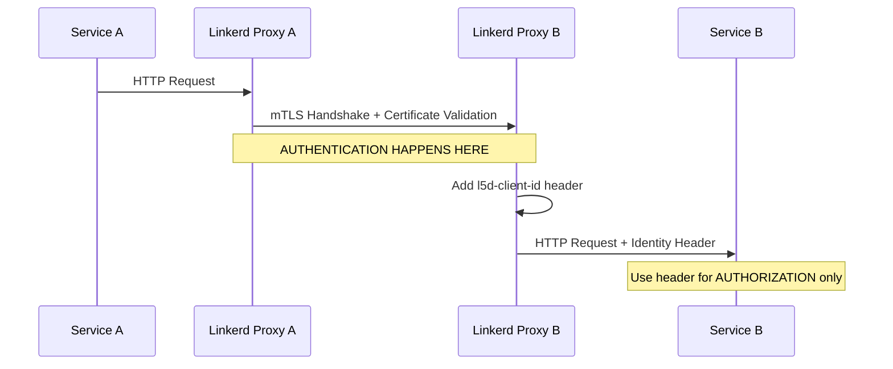

# Corrected Linkerd Implementation Summary

## 🔧 What Was Wrong in My Initial Implementation

### **Critical Misunderstanding**
I treated Linkerd's `l5d-client-id` header like a JWT token that needed validation, completely missing the fundamental difference between **authentication** and **authorization** in a service mesh.

### **Over-Engineering Issues**
1. **Unnecessary Validation**: My code tried to "validate" the service identity, but Linkerd already did this at the mTLS level
2. **Complex Parsing**: Over-complicated service name extraction when it should be simple mapping
3. **Missing the Point**: Failed to understand that if a request reaches your service, it's already authenticated

## ✅ Corrected Understanding

### **How Linkerd Actually Works**



### **Key Insights**

1. **Authentication**: Handled completely by Linkerd proxies via mTLS certificates
2. **Authorization**: Application uses `l5d-client-id` header to make access decisions
3. **No Validation Needed**: If request arrives, certificate was already validated
4. **Header is Informational**: Tells you WHO made the authenticated request

## 🔧 Corrected Implementation

### **Before (Wrong) - Over-Engineered**
```go
// ❌ Treating l5d-client-id like a JWT that needs validation
serviceIdentity := extractLinkerdServiceIdentity(c)
if serviceIdentity == "" {
    return unauthorized // Missing the point!
}
serviceName, err := validateLinkerdServiceIdentity(serviceIdentity)
if err != nil {
    return unauthorized // Over-engineering!
}
```

### **After (Correct) - Simple**
```go
// ✅ Just use the header for authorization decisions
clientID := c.GetHeader("l5d-client-id")
connectionSecure := c.GetHeader("l5d-connection-secure")

if clientID != "" && connectionSecure == "true" {
    // If we're here, Linkerd ALREADY authenticated the service
    serviceName := extractServiceNameFromLinkerdID(clientID) 
    // Use serviceName for authorization decisions only
    c.Set("service_name", serviceName)
}
```

## 📁 Files Corrected

### **API Gateway Middleware**
- **File**: `backend/api-gateway/internal/middleware/linkerd_service_auth.go`
- **Changes**:
  - Removed unnecessary validation logic
  - Simplified to just extract identity for authorization
  - Added proper understanding of authentication vs authorization

### **Service Client Library**  
- **File**: `backend/shared-libs/service-client/linkerd_client.go`
- **Changes**:
  - Simplified to just make normal HTTP calls
  - Removed complex authentication logic
  - Added examples showing how simple it really is

### **Documentation**
- **Files**: `docs/security/iam-architecture.md` and `docs/security/authentication.md`
- **Changes**:
  - Added clear explanation of authentication vs authorization
  - Corrected examples to show proper usage
  - Emphasized the simplicity of the Linkerd model

## 🎯 The Beautiful Simplicity

### **Service-to-Service Calls Are Now Trivial**
```go
// That's literally it - no auth code needed!
resp, err := http.Get("http://user-svc.link-services.svc.cluster.local:8080/api/v1/users/123")
```

### **What Linkerd Handles Automatically**
- ✅ Certificate provisioning and rotation (24h)
- ✅ mTLS handshake and validation
- ✅ Service identity verification  
- ✅ Traffic encryption
- ✅ Adding identity headers
- ✅ Load balancing
- ✅ Retries and circuit breaking
- ✅ Observability metrics

### **What Your Application Does**
- ✅ Read `l5d-client-id` header
- ✅ Make authorization decisions
- ✅ That's it!

## 🔐 Security Benefits Realized

### **Compared to JWT Tokens**
- **No token storage** - Certificates managed by Linkerd
- **No token expiry** - Auto-rotation handles this
- **Cannot be stolen** - mTLS certificates are cryptographically bound to pods
- **Cannot be replayed** - Each connection is individually authenticated
- **No application vulnerabilities** - No token parsing/validation code

### **Defense in Depth**
1. **Network Level**: Only meshed traffic allowed
2. **Transport Level**: mTLS encryption for all communication  
3. **Application Level**: Authorization based on authenticated identity

## 🧪 Testing the Corrected Implementation

### **Verify Service Mesh Identity**
```bash
# Check that services have Linkerd injection
kubectl get pods -n link-services -o jsonpath='{.items[*].metadata.annotations.linkerd\.io/inject}'

# Verify mTLS is working
linkerd viz stat -n link-services

# Check service-to-service calls work
kubectl exec -n link-services deployment/api-gateway -- \
  curl -H "Accept: application/json" http://user-svc:8080/health
```

### **Verify Identity Headers**
```bash
# Tap traffic to see l5d-client-id headers
linkerd viz tap -n link-services deployment/user-svc --output json | \
  jq '.requestInit.http.requestInit.headers | select(has("l5d-client-id"))'
```

## 💡 Key Takeaway

The beauty of Linkerd is its **simplicity**. By handling authentication at the infrastructure level with mTLS, it eliminates all the complexity of token-based authentication. Your application code becomes simpler, more secure, and easier to maintain.

**The golden rule**: If a request reaches your service through Linkerd, it's already authenticated. Just use the identity information for authorization decisions.