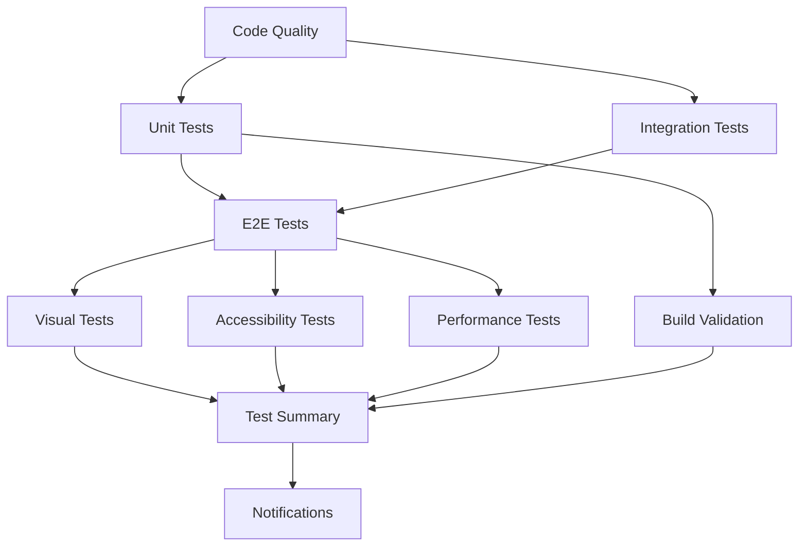

# CI/CD Testing Guide for Link Frontend

This guide provides comprehensive information about the improved CI/CD pipeline with advanced testing integration for the Link frontend application.

## 🎯 Overview

Our CI/CD pipeline now includes:

- **Comprehensive Testing Strategy**: Unit, Integration, E2E, Visual, Accessibility, Performance
- **Multi-Browser Testing**: Chrome, Firefox, Edge support
- **Advanced Reporting**: Test dashboards, coverage tracking, failure notifications
- **Performance Optimization**: Parallel execution, intelligent caching, fail-fast strategies
- **Quality Gates**: Coverage thresholds, performance budgets, security scanning

## 🔧 Workflow Structure

### Primary Workflows

1. **`frontend-ci.yml`** - Main CI/CD pipeline
2. **`test-summary.yml`** - Test result aggregation and reporting
3. **`e2e.yml`** - Legacy E2E workflow (being replaced)

### Pipeline Stages



## 📋 Test Categories

### 1. Code Quality & Types (🔍)

**Purpose**: Lint code and verify TypeScript types
**Duration**: ~2-3 minutes
**Triggers**: All PRs and pushes

```yaml
Jobs:
- ESLint validation
- TypeScript type checking
- Code style enforcement
```

**Quality Gates**:
- Zero TypeScript errors
- ESLint warnings < 200 (legacy allowance)

### 2. Unit & Integration Tests (🧪)

**Purpose**: Test individual components and component interactions
**Duration**: ~5-10 minutes per matrix job
**Triggers**: All PRs and pushes

```yaml
Matrix Strategy:
- test-type: [unit, integration]
- Coverage thresholds: 60% (unit), 40% (integration)
```

**Test Patterns**:
- Unit: `src/**/__tests__/**/*.test.{ts,tsx}`
- Integration: `src/**/*integration*.test.{ts,tsx}`

**Quality Gates**:
- Unit tests: 60% line coverage minimum
- Integration tests: 40% line coverage minimum
- Zero test failures

### 3. End-to-End Tests (🎭)

**Purpose**: Test complete user workflows
**Duration**: ~15-20 minutes per browser/suite combination
**Triggers**: All PRs and pushes

```yaml
Matrix Strategy:
- browser: [chrome, firefox, edge]
- test-suite: [auth, discovery, core]
- Selective execution to optimize resources
```

**Test Suites**:
- **Auth**: Login, signup, logout flows
- **Discovery**: User search, profile viewing, interactions
- **Core**: Chat, friend management, core features

**Quality Gates**:
- All critical user paths pass
- Cross-browser compatibility verified

### 4. Visual Regression Tests (👀)

**Purpose**: Detect unintended UI changes
**Duration**: ~10-15 minutes
**Triggers**: Pull requests only

```yaml
Features:
- Percy visual diffing
- Automated screenshot comparison
- Branch-based comparison
- Parallel processing
```

**Quality Gates**:
- No unauthorized visual changes
- UI consistency across builds

### 5. Accessibility Tests (♿)

**Purpose**: Ensure WCAG compliance and usability
**Duration**: ~5-8 minutes
**Triggers**: All PRs and pushes

```yaml
Tools:
- axe-core automated testing
- Color contrast validation
- Keyboard navigation checks
```

**Quality Gates**:
- Zero accessibility violations
- WCAG 2.1 AA compliance
- Keyboard navigation functional

### 6. Performance Tests (⚡)

**Purpose**: Monitor and enforce performance standards
**Duration**: ~10-12 minutes
**Triggers**: All PRs and pushes

```yaml
Metrics:
- Lighthouse scores (Performance, A11y, Best Practices, SEO)
- Bundle size analysis
- Core Web Vitals
- Loading performance
```

**Quality Gates**:
- Performance score ≥ 80
- Accessibility score ≥ 90
- Bundle size ≤ 2MB
- LCP ≤ 3s, FCP ≤ 2s

### 7. Build Validation (🏗️)

**Purpose**: Validate builds for all environments
**Duration**: ~3-5 minutes per build mode
**Triggers**: After successful tests

```yaml
Build Modes:
- demo: Development/testing builds
- preview: Staging builds  
- production: Production builds
```

**Quality Gates**:
- All build modes succeed
- No build errors or warnings
- Output validation passes

### 8. Security Audit (🔒)

**Purpose**: Identify security vulnerabilities
**Duration**: ~2-3 minutes
**Triggers**: All PRs and pushes

```yaml
Checks:
- npm audit for dependencies
- High/critical vulnerability detection
- Security advisory monitoring
```

**Quality Gates**:
- Zero critical vulnerabilities
- High vulnerabilities flagged for review

## 🚀 Running Tests Locally

### Prerequisites

```bash
cd frontend
npm ci
```

### Quick Test Commands

```bash
# Run all unit tests
npm run test:unit

# Run all tests with coverage
npm run test:coverage

# Run integration tests
npm run test:integration

# Run E2E tests
npm run test:e2e:dev  # Interactive mode
npm run test:e2e      # Headless mode

# Run accessibility tests
npm run audit:a11y

# Generate test dashboard
npm run test:dashboard
```

### CI-Optimized Commands

```bash
# Run tests with CI configuration
npm run test:unit:ci
npm run test:integration:ci
npm run test:e2e:ci

# Full CI test suite
npm run test:coverage:ci
```

## 📊 Test Reporting & Dashboards

### Automated Test Dashboard

The pipeline generates a comprehensive HTML dashboard with:

- **Test Summary**: Pass/fail counts, success rates
- **Coverage Metrics**: Line, function, branch, statement coverage  
- **Performance Scores**: Lighthouse metrics
- **Accessibility Results**: Violation counts and compliance status
- **Visual Diff Status**: Screenshot comparison results

**Location**: `frontend/test-dashboard.html` (generated after test runs)

### Coverage Reports

- **HTML Report**: `frontend/coverage/lcov-report/index.html`
- **LCOV Data**: `frontend/coverage/lcov.info`
- **JSON Summary**: `frontend/coverage/coverage-summary.json`

### Test Result Files

```
frontend/
├── test-results/
│   ├── jest-results.xml          # Jest JUnit format
│   └── jest-report.html          # HTML test report
├── cypress/
│   ├── results/                  # Cypress test results
│   ├── screenshots/              # Failure screenshots
│   └── videos/                   # Test execution videos
└── .lighthouseci/               # Performance results
```

## 🔔 Notifications & Alerts

### Slack Integration

**Channels**:
- `#ci-alerts`: Immediate failure notifications
- `#dev-alerts`: Persistent failure warnings

**Notification Triggers**:
- Test failures on main branch
- Persistent failures (multiple consecutive runs)
- Security vulnerabilities detected
- Performance regression detected

### GitHub Issues

**Auto-generated Issues**:
- CI failures on main branch
- Auto-closure when tests pass
- Detailed failure context and links

### Email Notifications

- Security vulnerability alerts
- Weekly test summary reports
- Coverage trend reports

## ⚙️ Configuration Files

### Core Configuration

- **`jest.config.ci.js`**: CI-optimized Jest configuration
- **`cypress.config.ci.ts`**: CI-optimized Cypress configuration
- **`lighthouse.config.js`**: Performance testing configuration
- **`.github/workflows/frontend-ci.yml`**: Main CI pipeline

### Environment Files

```bash
# Test environment configuration
frontend/.env.test                # Local test environment
frontend/.env.test.example        # Template for test env
```

### Quality Thresholds

```yaml
Coverage Thresholds:
  Global: 60% lines, functions, statements; 50% branches
  Critical Files: 80% coverage minimum

Performance Budgets:
  Bundle Size: ≤ 2MB
  Performance Score: ≥ 80
  Accessibility Score: ≥ 90
  LCP: ≤ 3s, FCP: ≤ 2s

Security Requirements:
  Critical Vulnerabilities: 0
  High Vulnerabilities: Review required
```

## 🔧 Troubleshooting

### Common Issues

#### 1. Tests Timing Out

```bash
# Increase timeouts in CI
JEST_TIMEOUT=30000 npm run test:ci

# For Cypress
cypress run --config defaultCommandTimeout=10000
```

#### 2. Memory Issues

```bash
# Limit Jest workers
npm run test -- --maxWorkers=2

# Increase Node memory
NODE_OPTIONS="--max-old-space-size=4096" npm run test
```

#### 3. Flaky E2E Tests

```bash
# Run with retries
cypress run --config retries=2

# Enable video for debugging
cypress run --config video=true
```

#### 4. Coverage Not Meeting Thresholds

```bash
# Generate detailed coverage report
npm run test:coverage
open coverage/lcov-report/index.html

# Run specific file coverage
npm run test -- --collectCoverageFrom="src/components/**/*.{ts,tsx}"
```

### Debugging CI Failures

1. **Check Artifacts**: Download test results, screenshots, videos
2. **Review Logs**: Examine detailed GitHub Actions logs
3. **Reproduce Locally**: Use CI-equivalent commands
4. **Test Dashboard**: Review comprehensive test dashboard

### Performance Optimization

```yaml
CI Optimizations:
- Parallel job execution
- Intelligent caching (dependencies, builds)
- Fail-fast strategies
- Resource-optimized browser settings
- Selective test execution based on changes
```

## 📈 Metrics & KPIs

### Test Quality Metrics

- **Success Rate**: Target 95%+ overall pass rate
- **Test Coverage**: Target 60%+ line coverage
- **Execution Time**: Target <20 minutes total pipeline
- **Flakiness Rate**: Target <5% flaky test rate

### Performance Metrics

- **Build Time**: Target <5 minutes per build
- **Test Execution**: Target <15 minutes for full suite
- **Deployment Time**: Target <10 minutes to staging

### Quality Gates

```yaml
Mandatory Gates:
- All tests pass
- Coverage thresholds met
- No critical security vulnerabilities
- Performance budgets met
- Accessibility standards met

Advisory Gates:
- High vulnerabilities reviewed
- Performance regression alerts
- Bundle size warnings
```

## 🔄 Continuous Improvement

### Weekly Reviews

- Test execution time trends
- Coverage trend analysis
- Flaky test identification
- Performance regression tracking

### Monthly Optimizations

- Dependency updates and security patches
- Test suite optimization
- Performance benchmark updates
- Tool version upgrades

### Quarterly Assessments

- Complete testing strategy review
- Tool evaluation and upgrades
- Process improvement initiatives
- Team training and knowledge sharing

## 📚 Additional Resources

- [Jest Documentation](https://jestjs.io/docs/getting-started)
- [Cypress Best Practices](https://docs.cypress.io/guides/references/best-practices)
- [Lighthouse CI Setup](https://github.com/GoogleChrome/lighthouse-ci)
- [Percy Visual Testing](https://docs.percy.io/)
- [GitHub Actions Documentation](https://docs.github.com/en/actions)

---

**Last Updated**: December 2023  
**Maintained By**: Link Frontend Team  
**Next Review**: Q1 2024