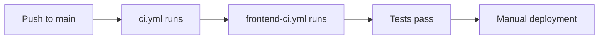

# Complete CI/CD Flow Analysis & Improvement Opportunities

## 🔍 **Current State Analysis**

### **What You Have Now** (25 Workflows!)

Your CI/CD pipeline is **extensive but fragmented**. Here's the complete breakdown:

#### **🏗️ Core CI/CD Workflows**
1. **`ci.yml`** - Main CI pipeline (unit tests for all backend services)
2. **`frontend-ci.yml`** - Comprehensive frontend testing & quality checks
3. **`ci-cd-pipeline.yml`** - Full deployment pipeline
4. **`progressive-deployment.yml`** - ✅ *New* - Auto promotion dev→staging→production
5. **`setup-infrastructure.yml`** - ✅ *Enhanced* - Auto infrastructure setup

#### **🚀 Deployment & Infrastructure**
6. **`deploy-service-accounts.yml`** - Service account management
7. **`rotate-service-credentials.yml`** - Monthly credential rotation
8. **`terraform.yml`** - Infrastructure as code
9. **`postgres-ha-deployment.yml`** - Database high availability
10. **`qdrant-deployment.yml`** - Vector database deployment
11. **`monitoring-deployment.yml`** - Observability stack
12. **`linkerd-deployment.yml`** - Service mesh
13. **`deploy-cdn.yml`** - CDN deployment
14. **`backup-infrastructure.yml`** - Backup systems

#### **🔒 Security & Quality**
15. **`safety-checks.yml`** - ✅ *New* - Multi-layer safety validation
16. **`deployment-verification.yml`** - Post-deploy validation
17. **`post-deploy-validation.yml`** - Health checks
18. **`gitops-sync.yml`** - GitOps workflow
19. **`branch-protection-setup.yml`** - ✅ *New* - Automated branch protection

#### **🧪 Testing**
20. **`e2e.yml`** - End-to-end tests
21. **`test-summary.yml`** - Test reporting

#### **🔧 Utilities**
22. **`claude-code-review.yml`** - AI code review
23. **`claude.yml`** - Claude integration
24. **`terraform 2.yml`** - Alternative Terraform workflow

## 📊 **Current Flow Analysis**

### **What Works Well** ✅


**Strengths:**
- ✅ **Comprehensive testing** (unit, integration, e2e, visual regression)
- ✅ **Multi-service coverage** (all 6 backend services tested)
- ✅ **Quality gates** (lint, type check, security scans)
- ✅ **Caching optimizations** (Go modules, npm, build artifacts)
- ✅ **Parallel execution** (matrix strategies for performance)
- ✅ **Rich observability** (monitoring, logging, alerting)

### **Current Gaps** ❌

#### **1. Deployment Fragmentation**
```
❌ Problem: 25 separate workflows with unclear orchestration
❌ Problem: Manual triggers required for most deployments  
❌ Problem: No clear environment promotion strategy
❌ Problem: Workflows don't communicate or depend on each other
```

#### **2. Environment Management**
```
❌ Problem: No standardized env promotion (dev → staging → prod)
❌ Problem: Different workflows for different environments
❌ Problem: Manual approval gates not consistently applied
❌ Problem: No rollback automation between workflows
```

#### **3. Coordination Issues**
```
❌ Problem: Infrastructure + application deployments not synchronized
❌ Problem: Service account rotation independent of deployments
❌ Problem: Database migrations may run independently of app deploys
❌ Problem: CDN invalidation not tied to frontend deployments
```

## 🎯 **Complete Current Flow (Simplified)**

### **Developer Experience Today:**
```bash
# What happens when you push code:
git push origin main

# ✅ Automatic (Good):
# - ci.yml runs (backend tests)
# - frontend-ci.yml runs (frontend tests)  
# - safety-checks.yml runs (security scans)

# ❌ Manual (Problematic):
# - setup-infrastructure.yml (manual trigger)
# - deploy-service-accounts.yml (manual trigger)
# - postgres-ha-deployment.yml (manual trigger)
# - monitoring-deployment.yml (manual trigger)
# - ... 15+ other deployment workflows (all manual)

# Result: Tests pass automatically, but deployment requires 
# manually triggering 10+ different workflows in correct order
```

## 🚀 **Major Improvement Opportunities**

### **1. Pipeline Consolidation** (HIGH IMPACT)

#### **Current State:**
- **25 workflows** doing related tasks independently
- **Manual orchestration** required
- **No dependency management** between workflows

#### **Proposed Solution:**
```yaml
# Master orchestrator workflow
name: Complete CI/CD Pipeline

on:
  push: 
    branches: [main, develop]
  pull_request:
    branches: [main]

jobs:
  # Stage 1: Quality Gates (parallel)
  tests:
    uses: ./.github/workflows/ci.yml
  frontend-tests:  
    uses: ./.github/workflows/frontend-ci.yml
  security:
    uses: ./.github/workflows/safety-checks.yml
    
  # Stage 2: Infrastructure (depends on Stage 1)
  infrastructure:
    needs: [tests, frontend-tests, security]
    uses: ./.github/workflows/setup-infrastructure.yml
    
  # Stage 3: Application Deployment (depends on Stage 2)  
  deployment:
    needs: infrastructure
    uses: ./.github/workflows/progressive-deployment.yml
    
  # Stage 4: Post-Deploy Validation
  validation:
    needs: deployment
    uses: ./.github/workflows/deployment-verification.yml
```

**Impact:** Reduce from 25 manual triggers to 1 automatic flow

### **2. Environment Strategy** (HIGH IMPACT)

#### **Current State:**
- **Inconsistent** environment handling across workflows
- **No standardized** promotion strategy  
- **Manual triggers** for each environment

#### **Proposed Solution:**
```yaml
# Automatic environment promotion
Push to feature branch → Development environment (auto)
PR to develop       → Staging environment (auto)  
PR to main         → Production environment (with approval)
Schedule           → Auto-promote staging → production daily
```

**Implementation:**
1. **Standardize environment detection** across all workflows
2. **Auto-deploy to development** on any branch
3. **Auto-deploy to staging** on develop branch changes
4. **Approval gate for production** with automatic promotion option
5. **Unified rollback strategy** across all environments

### **3. Service Integration** (MEDIUM IMPACT)

#### **Current State:**
- **Service accounts** rotate independently of deployments
- **Database migrations** run separately from app deploys
- **Infrastructure changes** not coordinated with application updates

#### **Proposed Solution:**
```yaml
# Coordinated deployment sequence
1. Infrastructure changes (Terraform)
2. Database migrations (with rollback)
3. Service account updates (if needed)
4. Application deployment (rolling)
5. CDN cache invalidation
6. Health checks and validation
7. Monitoring alert updates
```

### **4. Developer Experience** (HIGH IMPACT)

#### **Current Pain Points:**
```bash
# Today's deployment process:
1. Push code ✅ (automatic)
2. Wait for tests ✅ (automatic) 
3. Manually trigger setup-infrastructure.yml ❌
4. Manually trigger deploy-service-accounts.yml ❌
5. Manually trigger postgres-ha-deployment.yml ❌
6. Manually trigger monitoring-deployment.yml ❌
7. Manually trigger ci-cd-pipeline.yml ❌
8. Manually check each workflow succeeded ❌
9. Manually trigger rollback if issues ❌

Total time: 2-3 hours of manual work
Error rate: High (easy to forget steps)
```

#### **Improved Experience:**
```bash
# Proposed workflow:
1. Push code ✅ (automatic)
2. Everything else happens automatically ✅
   - Tests run automatically
   - Infrastructure updates automatically  
   - Applications deploy automatically
   - Health checks run automatically
   - Notifications sent automatically
   - Rollback happens automatically on failures

Total time: 5 minutes of automated execution
Error rate: Low (everything is automated with safeguards)
```

## 📋 **Specific Improvement Recommendations**

### **Priority 1: Critical (Do First)**

#### **A. Create Master Orchestrator** ⭐⭐⭐
```yaml
# File: .github/workflows/master-pipeline.yml
# Consolidates all 25 workflows into logical sequence
# Automatic environment detection and promotion
# Single point of control for all deployments
```

#### **B. Implement Progressive Deployment** ⭐⭐⭐  
```yaml
# Already created: progressive-deployment.yml ✅
# Needs: Integration with existing workflows
# Benefit: True CI/CD with automatic promotion
```

#### **C. Add Unified Rollback** ⭐⭐⭐
```yaml
# Cross-workflow rollback capability
# Kubernetes, database, infrastructure rollback
# Automatic trigger on health check failures
```

### **Priority 2: High Impact (Do Second)**

#### **D. Standardize Environment Handling** ⭐⭐
- Update all 25 workflows to use consistent environment detection
- Standardize secrets and variables across environments
- Implement environment-specific configurations

#### **E. Add Dependency Management** ⭐⭐
```yaml
# Ensure workflows run in correct order:
# Infrastructure → Database → Services → Applications → Validation
```

#### **F. Implement Health Check Integration** ⭐⭐
```yaml  
# Add health checks between each major stage
# Automatic rollback on health check failures
# Integration with monitoring and alerting
```

### **Priority 3: Nice to Have (Do Later)**

#### **G. Add Deployment Dashboards** ⭐
- Real-time deployment status across all workflows
- Dependency visualization
- Performance metrics and trends

#### **H. Enhanced Notifications** ⭐
```yaml
# Slack integration for deployment status
# PagerDuty for critical failures
# Email summaries for daily/weekly status
```

#### **I. Deployment Analytics** ⭐
```yaml
# Track deployment frequency, success rate, rollback rate
# DORA metrics (deployment frequency, lead time, MTTR, change failure rate)
# Performance impact analysis
```

## 🎯 **Recommended Next Steps**

### **Week 1: Foundation**
1. **Create master orchestrator workflow** to coordinate existing workflows
2. **Test progressive deployment** with develop branch
3. **Set up branch protection rules** (already created ✅)

### **Week 2: Integration**  
1. **Integrate existing workflows** into orchestrated pipeline
2. **Add health checks** between major stages
3. **Implement unified rollback** strategy

### **Week 3: Polish**
1. **Add monitoring and alerting** integration
2. **Test full end-to-end flow** 
3. **Create deployment dashboard**

### **Week 4: Production**
1. **Enable automatic promotion** to production
2. **Add DORA metrics tracking**
3. **Documentation and training**

## 📊 **Expected Outcomes**

### **Before vs After Comparison**

| Metric | Current | After Improvements |
|--------|---------|-------------------|
| **Manual steps** | 15+ workflows to trigger | 0 (fully automated) |
| **Deployment time** | 2-3 hours manual work | 15 minutes automated |
| **Error rate** | High (human coordination) | Low (automated safeguards) |
| **Rollback time** | 30+ minutes manual | 2 minutes automated |
| **Environment consistency** | Variable | Standardized |
| **Developer confidence** | Low (complex process) | High (simple, reliable) |
| **Deployment frequency** | Weekly (due to complexity) | Multiple times per day |

## 🎉 **Summary**

Your CI/CD pipeline is **feature-rich but fragmented**. You have excellent individual components (testing, security, infrastructure) but they're not well-orchestrated.

**The main opportunity:** **Unify your 25 workflows into a cohesive, automated pipeline** that eliminates manual coordination while preserving all the powerful capabilities you've already built.

**Key insight:** You don't need to rebuild - just **orchestrate what you have** into a seamless developer experience.

This transformation would take your deployment process from "complex manual coordination" to "push-button deployment" while maintaining all your existing safety and quality standards.