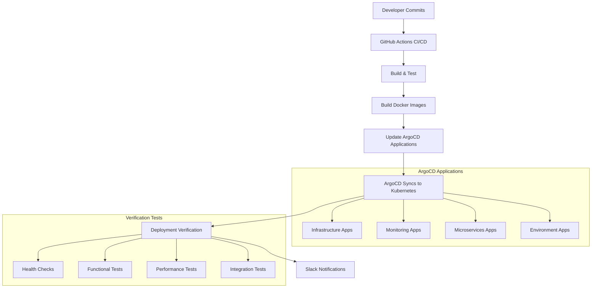

# Complete GitOps Workflow Documentation

This document describes the complete GitOps workflow integration for the Link social platform, including CI/CD pipelines, ArgoCD deployment management, and automated verification processes.

## 🏗️ Architecture Overview



## 🔄 Complete Workflow Stages

### 1. **Code Commit & CI/CD Pipeline**
- **Trigger**: Push to `main` or `develop` branches
- **File**: `.github/workflows/ci-cd-pipeline.yml`
- **Actions**:
  - Run tests for all microservices
  - Validate database migrations
  - Build Docker images
  - Push images to GitHub Container Registry
  - Update ArgoCD applications with new image tags
  - Trigger ArgoCD sync operations

### 2. **GitOps Sync Management**
- **Trigger**: Changes to ArgoCD manifests or manual workflow dispatch
- **File**: `.github/workflows/gitops-sync.yml`
- **Actions**:
  - Validate ArgoCD application manifests
  - Sync infrastructure applications
  - Sync monitoring stack
  - Sync microservices
  - Sync environment-specific applications
  - Generate health reports

### 3. **Deployment Verification**
- **Trigger**: Completion of CI/CD or GitOps workflows
- **File**: `.github/workflows/deployment-verification.yml`
- **Actions**:
  - Health check verification
  - Functional testing
  - Performance testing
  - Integration testing
  - Generate comprehensive verification reports

## 📋 Required GitHub Secrets

### ArgoCD Integration
```bash
ARGOCD_SERVER          # ArgoCD server URL (e.g., https://argocd.linkapp.com)
ARGOCD_USERNAME        # ArgoCD username (usually 'admin')
ARGOCD_PASSWORD        # ArgoCD password
GITOPS_TOKEN           # GitHub token with repo write access for GitOps updates
```

### Notifications
```bash
SLACK_WEBHOOK_URL      # Slack webhook for deployment notifications
```

### Optional (for production)
```bash
KUBECONFIG_DATA        # Base64 encoded kubeconfig for direct kubectl access
```

## 🚀 Deployment Flow by Environment

### Development Environment
- **Branch**: `develop`
- **Automatic**: ✅ Full automation
- **Image Tag**: `sha-<commit-hash>`
- **ArgoCD Apps**: `link-app-dev`
- **Verification**: Basic health checks

### Staging Environment
- **Branch**: `develop`
- **Automatic**: ✅ Full automation
- **Image Tag**: `sha-<commit-hash>`
- **ArgoCD Apps**: `link-app-staging`, `link-frontend`
- **Verification**: Full test suite
- **Database Migrations**: Automated

### Production Environment
- **Branch**: `main`
- **Automatic**: ⚠️ Manual approval required
- **Image Tag**: `v<date>-<commit-hash>`
- **ArgoCD Apps**: `link-app-production`
- **Verification**: Comprehensive testing
- **Database Migrations**: Zero-downtime strategy

## 🎯 ArgoCD Application Deployment Order

### Sync Wave -2: Prerequisites
- `link-prerequisites` - Namespaces, RBAC, secrets
- `external-secrets-operator` - External secrets management
- `cert-manager` - TLS certificate management
- `ingress-nginx` - Ingress controller

### Sync Wave -1: Database & Secrets
- `postgres-ha-operator` - CloudNativePG operator
- `postgres-ha-cluster` - PostgreSQL HA cluster
- `postgres-ha-pgbouncer` - Connection pooling

### Sync Wave 0: Infrastructure
- `redis-cluster-ha` - Redis cluster
- `redis-sentinel-ha` - Redis Sentinel
- `qdrant-cluster` - Vector database
- `qdrant-backup` - Backup jobs
- `linkerd-config` - Service mesh

### Sync Wave 1: Monitoring
- `prometheus-stack` - Metrics & alerting
- `loki-stack` - Log aggregation
- `jaeger-tracing` - Distributed tracing
- `custom-dashboards` - Grafana dashboards
- `alert-rules` - Custom alert rules

### Sync Wave 2: Microservices
- `user-svc` - User management
- `chat-svc` - Messaging service
- `ai-svc` - AI summarization
- `discovery-svc` - User discovery
- `search-svc` - Vector search

### Sync Wave 3: Applications
- `link-app-dev` - Development environment
- `link-app-staging` - Staging environment
- `link-app-production` - Production environment
- `link-frontend` - React frontend

### Sync Wave 4: Gateway
- `api-gateway` - Central API gateway

## 🛠️ Utility Scripts

### Image Tag Updates
```bash
# Update staging environment with new image tag
./scripts/update-image-tags.sh staging sha-abc1234

# Update production with specific service
./scripts/update-image-tags.sh production v1.0.0 user-svc

# Update all services in development
./scripts/update-image-tags.sh dev latest
```

### Health Monitoring
```bash
# Check all applications
./scripts/argocd-health-check.sh --server https://argocd.linkapp.com

# Watch mode with continuous monitoring
./scripts/argocd-health-check.sh --watch --interval 60

# Check only unhealthy applications
./scripts/argocd-health-check.sh --unhealthy-only --export unhealthy-report.json

# Check specific category
./scripts/argocd-health-check.sh --category microservices --format json
```

## 🔧 Manual Operations

### Trigger GitOps Sync
```bash
# Sync specific application category
gh workflow run gitops-sync.yml -f sync_target=infrastructure

# Force sync all applications
gh workflow run gitops-sync.yml -f sync_target=all -f force_sync=true
```

### Manual Deployment Verification
```bash
# Verify staging environment
gh workflow run deployment-verification.yml -f environment=staging -f test_type=all

# Run only health checks on production
gh workflow run deployment-verification.yml -f environment=production -f test_type=health
```

### Production Rollback
```bash
# Trigger rollback workflow
gh workflow run ci-cd-pipeline.yml --ref main
# Then select the 'rollback' job manually
```

## 📊 Monitoring & Alerting

### ArgoCD Application Status
- **Healthy**: ✅ Application is running correctly
- **Progressing**: ⏳ Deployment in progress
- **Degraded**: ❌ Application has issues
- **Suspended**: ⏸️ Application is paused
- **Missing**: ❓ Application not found

### Sync Status
- **Synced**: ✅ Git and cluster are in sync
- **OutOfSync**: ⚠️ Changes detected, sync required
- **Unknown**: ❔ Status cannot be determined

### Notifications
- **Slack Integration**: Deployment status updates
- **GitHub Status Checks**: PR integration
- **ArgoCD UI**: Real-time application status

## 🚨 Troubleshooting

### Common Issues

#### 1. **ArgoCD Sync Failures**
```bash
# Check application status
argocd app get <app-name>

# View sync logs
argocd app logs <app-name>

# Force refresh from Git
argocd app get <app-name> --refresh

# Manual sync with force
argocd app sync <app-name> --force
```

#### 2. **Image Pull Errors**
- Verify image exists in GitHub Container Registry
- Check image tag format matches ArgoCD application
- Ensure registry authentication is configured

#### 3. **Database Migration Issues**
```bash
# Check migration job status
kubectl get jobs -n <namespace> | grep migration

# View migration logs
kubectl logs job/<migration-job> -n <namespace>

# Manual migration run
kubectl create job --from=cronjob/database-migration manual-migration-$(date +%s) -n <namespace>
```

#### 4. **Health Check Failures**
- Review application logs: `kubectl logs -f deployment/<service> -n <namespace>`
- Check resource limits: `kubectl describe pod <pod-name> -n <namespace>`
- Verify service connectivity: `kubectl port-forward service/<service> 8080:80 -n <namespace>`

### Recovery Procedures

#### Application Rollback
1. Identify previous working revision: `argocd app history <app-name>`
2. Rollback to specific revision: `argocd app rollback <app-name> <revision-id>`
3. Monitor rollback progress: `argocd app wait <app-name> --timeout 300`

#### Database Rollback
1. Stop application traffic
2. Run rollback migration job
3. Verify database state
4. Restore application traffic

#### Full Environment Reset
1. Scale applications to zero replicas
2. Run database restoration
3. Sync ArgoCD applications to known good state
4. Scale applications back up
5. Run comprehensive verification

## 🔐 Security Considerations

### Secrets Management
- Use External Secrets Operator for cloud secret stores
- Never commit secrets to Git repository
- Rotate ArgoCD credentials regularly
- Use service accounts with minimal permissions

### RBAC Configuration
- Separate permissions for dev/staging/production
- Use GitHub teams for ArgoCD RBAC
- Audit access logs regularly
- Implement approval workflows for production

### Network Security
- mTLS enabled via Linkerd service mesh
- NetworkPolicies for service isolation
- TLS termination at ingress with cert-manager
- Secure communication between all components

## 📈 Performance Optimization

### ArgoCD Performance
- Use resource quotas for ArgoCD components
- Configure appropriate sync timeouts
- Use selective sync for large applications
- Monitor ArgoCD resource usage

### CI/CD Pipeline Optimization
- Use Docker layer caching
- Parallel job execution where possible
- Conditional job execution based on changes
- Optimize image builds with multi-stage Dockerfiles

### Deployment Efficiency
- Use rolling updates for zero-downtime deployments
- Configure appropriate readiness/liveness probes
- Implement pod disruption budgets
- Use horizontal pod autoscaling

---

## 🎉 Success Metrics

### Deployment Metrics
- **Deployment Frequency**: Multiple deployments per day
- **Lead Time**: < 30 minutes from commit to production-ready
- **MTTR (Mean Time to Recovery)**: < 15 minutes
- **Change Failure Rate**: < 5%

### GitOps Metrics
- **Sync Success Rate**: > 99%
- **Application Uptime**: > 99.9%
- **Automated Test Coverage**: > 80%
- **Security Scan Pass Rate**: 100%

This GitOps workflow provides a robust, automated, and secure deployment pipeline for the Link social platform, ensuring reliable and consistent deployments across all environments.