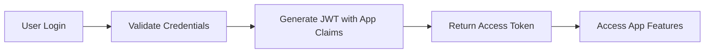
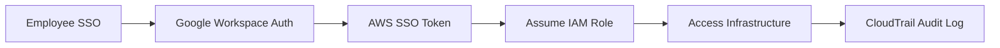
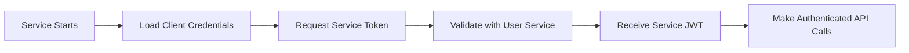

# Link IAM Architecture

## Three Distinct Authentication Systems

### 1. App Users (B2C)
- **Database**: `users` table in PostgreSQL
- **Auth Method**: Username/password or social OAuth
- **Roles**: user, premium_user, community_moderator, banned
- **Permissions**: Content-focused (create posts, send messages, moderate content)
- **Access**: Through mobile app and web app only
- **JWT Claims**: user_id, roles, app_permissions

#### App User Role Definitions

##### Standard User (`user`)
**Purpose**: Basic social app functionality
**Permissions**:
- `users.read` - View other user profiles
- `users.update` - Update own profile
- `messages.create` - Send messages
- `messages.read` - Read messages in conversations
- `discovery.search` - Search for other users

##### Premium User (`premium_user`)
**Purpose**: Enhanced features for paying subscribers
**Permissions**: All standard user permissions plus:
- `profiles.read_private` - View private profile information (with consent)
- `discovery.advanced_filters` - Use advanced search filters
- `messages.priority` - Send priority messages

##### Community Moderator (`community_moderator`)
**Purpose**: Volunteer content moderators (NOT company employees)
**Permissions**: All premium user permissions plus:
- `messages.moderate` - Moderate user-generated content
- `messages.delete_any` - Delete inappropriate messages
- `profiles.update_any` - Update profiles for moderation purposes
- `admin.users` - View user management interface (content moderation only)

##### Banned User (`banned`)
**Purpose**: Users who violated community guidelines
**Permissions**: None (cannot access any app features)

#### App User Authentication Flow


### 2. Company Employees (B2E)  
- **Database**: None - use cloud provider IAM
- **Auth Method**: SSO (Google Workspace) → AWS SSO
- **Roles**: Defined in AWS IAM (Developer, DevOps, Support)
- **Permissions**: Infrastructure-focused (kubectl, RDS access, CloudWatch)
- **Access**: Through VPN → AWS Console/CLI
- **Audit**: AWS CloudTrail

#### Employee Role Definitions

##### Developer (`link-developer`)
**Purpose**: Software engineers working on the application
**AWS Permissions**:
- Read-only access to staging environment
- Read-only access to production logs
- Cannot modify production infrastructure
- EKS cluster read-only access

##### DevOps Engineer (`link-devops`)
**Purpose**: Infrastructure and deployment management
**AWS Permissions**:
- Full access to all environments
- Can restart services and manage databases
- Emergency production access
- Full EKS cluster access

##### Support Team (`link-support`)
**Purpose**: Customer support and user assistance
**AWS Permissions**:
- Read-only access to user-facing logs
- Cannot access infrastructure
- Cannot modify system configuration
- No direct database access

#### Employee Authentication Flow


### 3. Service Accounts (M2M)
- **Database**: `service_accounts` table
- **Auth Method**: OAuth 2.0 Client Credentials
- **Roles**: service-specific (user-svc, chat-svc, etc.)
- **Permissions**: API-focused (user.read, chat.write)
- **Access**: Internal service mesh only
- **JWT Claims**: service_id, service_permissions

#### Service Account Definitions

##### API Gateway (`api-gateway`)
**Purpose**: Central request routing and authentication
**Permissions**:
- `users.validate` - Validate user tokens
- `services.route` - Route requests to backend services

##### User Service (`user-svc`)
**Purpose**: User management and authentication
**Permissions**:
- `users.create` - Create new users
- `users.read` - Read user data
- `users.update` - Update user profiles
- `auth.generate_tokens` - Generate authentication tokens

##### Chat Service (`chat-svc`)
**Purpose**: Real-time messaging functionality
**Permissions**:
- `messages.create` - Create new messages
- `messages.read` - Read message history
- `users.read` - Get user info for messaging
- `notifications.send` - Send push notifications

##### Discovery Service (`discovery-svc`)
**Purpose**: User discovery and matching
**Permissions**:
- `users.read` - Access user profiles for matching
- `location.read` - Access location data
- `preferences.read` - Read user preferences

#### Service Authentication Flow


## Security Boundaries

### Strict Separation
- **App users CANNOT access infrastructure**
- **Employees CANNOT use app user credentials**
- **Services CANNOT be accessed externally**
- **Each system has separate JWT signing keys**

### Token Isolation
```yaml
# App User JWT Example
{
  "sub": "user-123",
  "email": "user@example.com",
  "roles": ["user", "premium_user"],
  "permissions": ["users.read", "messages.create"],
  "iss": "link-user-service",
  "aud": "link-mobile-app"
}

# Service JWT Example  
{
  "sub": "api-gateway",
  "service_id": "api-gateway-prod",
  "permissions": ["users.validate", "services.route"],
  "iss": "link-service-auth",
  "aud": "link-internal-services"
}

# Employee Access (AWS IAM - no JWT needed)
# Uses AWS STS tokens with IAM policies
```

## Authentication Matrix

| User Type | Database | Auth Method | Token Type | Access Scope | Audit System |
|-----------|----------|-------------|------------|-------------|--------------|
| App Users | PostgreSQL | Password/OAuth | JWT (User) | Mobile/Web App | Application Logs |
| Employees | AWS IAM | SSO/SAML | AWS STS | Infrastructure | CloudTrail |
| Services | PostgreSQL | Client Credentials | JWT (Service) | Internal APIs | Application Logs |

## Implementation Details

### JWT Configuration
```go
// User JWT Configuration
type UserJWTConfig struct {
    Secret           string
    Issuer          string
    Audience        string
    ExpirationTime  time.Duration
    RefreshTokenTTL time.Duration
}

// Service JWT Configuration  
type ServiceJWTConfig struct {
    Secret           string // Different from user JWT secret
    Issuer          string
    Audience        string
    ExpirationTime  time.Duration // Shorter TTL for security
}
```

### Database Schema Separation
```sql
-- App Users (in user-svc database)
CREATE TABLE users (
    id UUID PRIMARY KEY,
    email VARCHAR NOT NULL UNIQUE,
    username VARCHAR NOT NULL UNIQUE
    -- No infrastructure permissions stored here
);

CREATE TABLE roles (
    id UUID PRIMARY KEY,
    name VARCHAR NOT NULL, -- Only: user, premium_user, community_moderator, banned
    description TEXT
);

-- Service Accounts (in user-svc database, separate table)
CREATE TABLE service_accounts (
    id UUID PRIMARY KEY,
    client_id VARCHAR NOT NULL UNIQUE,
    client_secret_hash VARCHAR NOT NULL,
    service_name VARCHAR NOT NULL,
    permissions TEXT[] -- Service-specific permissions
);

-- No employee table - employees exist only in AWS IAM
```

### Permission Scope Examples

#### App User Permissions (Content-Focused)
```json
{
  "user": [
    "users.read",
    "users.update_own", 
    "messages.create",
    "messages.read_own",
    "discovery.search"
  ],
  "community_moderator": [
    "messages.moderate",
    "messages.delete_inappropriate", 
    "users.view_reports",
    "admin.content_moderation"
  ]
}
```

#### Service Permissions (API-Focused)
```json
{
  "api-gateway": [
    "users.validate_token",
    "services.route_requests",
    "rate_limiting.enforce"
  ],
  "chat-svc": [
    "messages.create",
    "messages.read",
    "users.get_profile",
    "notifications.send"
  ]
}
```

#### Employee Permissions (Infrastructure-Focused)
```json
{
  "link-developer": {
    "aws_policies": [
      "EKSReadOnlyAccess",
      "CloudWatchLogsReadOnlyAccess"
    ],
    "kubernetes_rbac": [
      "developer-role"
    ]
  },
  "link-devops": {
    "aws_policies": [
      "PowerUserAccess",
      "EKSFullAccess"
    ],
    "kubernetes_rbac": [
      "cluster-admin"
    ]
  }
}
```

## Migration Strategy

### Phase 1: Audit Current System ✅
- Identified mixed admin/employee permissions in app user system
- Found security vulnerabilities in service authentication
- Documented current state in IAM_CLEANUP_PROMPT.md

### Phase 2: Clean Up App User System ✅
- Created migration 010_cleanup_user_roles.up.sql
- Renamed misleading "admin" role to "community_moderator"
- Removed infrastructure permissions from app database
- Updated all code references

### Phase 3: Implement Employee Access System ✅
- Created infrastructure/employee-access/README.md
- Documented AWS IAM role definitions
- Provided kubectl integration guide
- Established emergency access procedures

### Phase 4: Update Service Authentication ✅ (Previously Done)
- Fixed authentication bypass vulnerability
- Implemented separate JWT secrets for services
- Added proper permission validation
- Strengthened service-to-service authentication

### Phase 5: Testing & Validation (In Progress)
- Run migration on staging environment
- Verify all three authentication systems work independently
- Test that boundaries are properly enforced
- Validate audit trails are working

## Security Considerations

### Threat Model
1. **App User Privilege Escalation**: Users cannot gain infrastructure access
2. **Employee Account Compromise**: Limited by AWS IAM policies and MFA
3. **Service Account Hijacking**: Services isolated to internal network only
4. **Cross-System Access**: Each system validates its own tokens only

### Defense in Depth
1. **Network Segmentation**: Services isolated in private subnets
2. **Token Validation**: Each service validates tokens independently  
3. **Principle of Least Privilege**: Minimal permissions for each role
4. **Audit Logging**: All access attempts logged and monitored
5. **Multi-Factor Authentication**: Required for all employee access

## Monitoring & Alerting

### Key Metrics to Track
- Failed authentication attempts per system
- Cross-system access attempts (should be zero)
- Privilege escalation attempts
- Token validation errors
- Unusual access patterns

### Alert Conditions
- App user attempting infrastructure access
- Employee using app credentials
- Service authentication failures > threshold
- After-hours employee access
- Root/admin account usage

## Compliance & Governance

### Industry Standards
- **SOC 2 Type II**: Proper access controls and audit trails
- **ISO 27001**: Information security management
- **GDPR**: User data access controls and logging
- **OWASP Top 10**: Protection against common web vulnerabilities

### Regular Reviews
- Quarterly access reviews for all three systems
- Annual penetration testing
- Monthly security awareness training
- Continuous compliance monitoring

## Future Enhancements

### Planned Improvements
1. **Zero Trust Architecture**: Implement mutual TLS for all service communication
2. **Dynamic Permissions**: Runtime permission evaluation based on context
3. **Biometric Authentication**: Add biometric factors for high-privilege operations
4. **AI-Powered Anomaly Detection**: Machine learning for unusual access patterns
5. **Automated Compliance Reporting**: Regular compliance status reports

This architecture ensures clean separation between user-facing features, infrastructure management, and inter-service communication while maintaining security, auditability, and scalability.