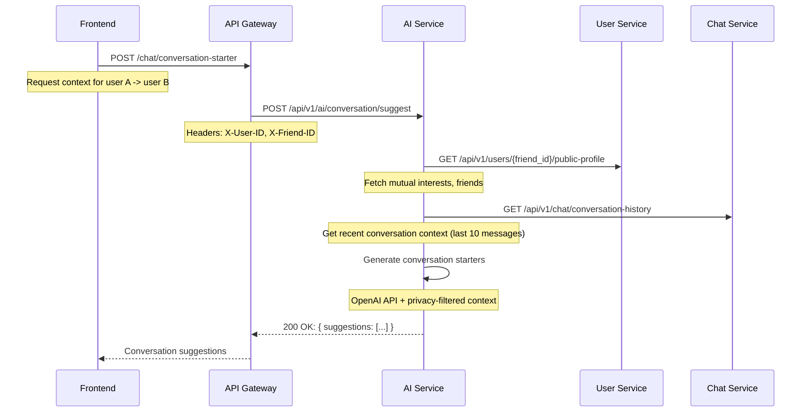
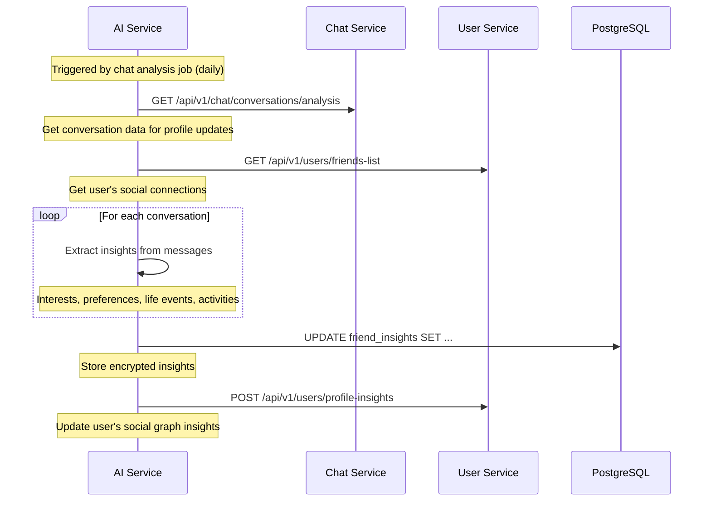

# ADR-002: AI Service Architecture and Integration

## Status
**PROPOSED** - Awaiting stakeholder review and implementation planning

## Context

As outlined in the Project Vision document, Link aims to be an AI-powered social platform that "turns proximity into possibility" by reducing friction in real-world social connections. The platform requires sophisticated AI capabilities to:

1. **Break the ice with context** - Generate conversation starters based on shared interests and mutual connections
2. **Replace catchup chats with living connections** - Curate relevant life updates and suggest social activities
3. **Never lose touch with details** - Auto-generate personalized friend profiles with key moments and preferences
4. **Enable proactive friendship building** - Provide AI-driven reminders and activity suggestions

The current microservices architecture includes:
- **API Gateway** (port 8080) - Authentication, request routing, CORS handling
- **User Service** (port 8081) - User management, authentication, friend system
- **Chat Service** - Real-time messaging with WebSocket support
- **Discovery Service** - Location-based user discovery (partial implementation)

To achieve the AI-powered vision, we need to introduce a dedicated **AI Service** that integrates with existing services while maintaining strict privacy controls and data protection standards.

## Decision

We propose creating a new **AI Service** (`ai-svc`) as a dedicated microservice within the existing architecture.

### AI Service Goals

#### Primary Objectives
1. **Contextual Communication Enhancement**
   - Generate conversation starters based on mutual interests, friends, and shared activities
   - Provide tone-aware message suggestions and translations
   - Analyze communication patterns to suggest optimal engagement timing

2. **Social Connection Intelligence**
   - Curate personalized friend profiles from chat interactions and shared activities
   - Generate activity suggestions based on mutual interests and availability
   - Provide proactive friendship maintenance reminders

3. **Privacy-First Personal AI Assistant**
   - Process user diary entries to suggest social activities and connection opportunities
   - Maintain encrypted personal insights that enhance social experiences
   - Enable intelligent search across personal social graph ("Who plays volleyball?")

4. **Social Graph Optimization**
   - Analyze social patterns to suggest connection prioritization
   - Recommend mutual introductions based on compatible interests
   - Provide insights for deepening existing relationships

#### Secondary Objectives
- Support future AR/location-based social features
- Enable integration with external event and activity platforms
- Provide analytics for user engagement and relationship health

### AI Service Architecture

#### Core Components

```
ai-svc/
├── src/
│   ├── controllers/           # HTTP request handlers
│   │   ├── conversation.go    # Conversation starters, message suggestions
│   │   ├── insights.go        # Friend profiles, relationship insights
│   │   ├── recommendations.go # Activity suggestions, social opportunities
│   │   └── diary.go          # Personal diary processing and curation
│   ├── services/             # Business logic layer
│   │   ├── nlp/              # Natural language processing
│   │   ├── matching/         # Interest and compatibility matching
│   │   ├── insights/         # Social graph analysis
│   │   └── privacy/          # Data anonymization and encryption
│   ├── models/              # Data structures and domain objects
│   ├── repositories/        # Data access layer
│   └── middleware/          # Authentication, logging, rate limiting
├── ai-models/               # ML model artifacts and configurations
├── migrations/             # Database schema migrations
└── config/                # Service configuration
```

#### Technology Stack
- **Runtime**: Go 1.21+ (consistency with existing services)
- **ML/AI Framework**: 
  - **Primary**: OpenAI GPT-4/GPT-3.5-turbo API for natural language tasks
  - **Secondary**: Local models (Ollama/LLaMA) for privacy-sensitive processing
  - **Vector Database**: Qdrant or PostgreSQL with pgvector for semantic search
- **Database**: PostgreSQL (shared with other services) + Redis for caching
- **Message Queue**: Redis Pub/Sub for event-driven communication
- **Monitoring**: Prometheus metrics, structured logging

### Data Flow Architecture

#### 1. Conversation Enhancement Flow


#### 2. Personal Diary Processing Flow
```mermaid
sequenceDiagram
    participant Frontend
    participant Gateway as API Gateway
    participant AI as AI Service
    participant User as User Service
    
    Frontend->>Gateway: POST /diary/entry
    Note over Frontend: "Going to volleyball practice tomorrow"
    
    Gateway->>AI: POST /api/v1/ai/diary/process
    Note over Gateway: Process diary entry for social opportunities
    
    AI->>User: GET /api/v1/users/friends
    Note over AI: Get user's social graph
    
    AI->>AI: Analyze diary entry + social graph
    Note over AI: Extract: activity=volleyball, timing=tomorrow
    
    AI->>AI: Match friends with similar interests
    Note over AI: Find friends interested in volleyball
    
    AI-->>Gateway: 200 OK: { 
      processed_entry: {...},
      social_opportunities: [{
        friend_id: "uuid",
        activity: "volleyball",
        confidence: 0.85
      }]
    }
    
    Gateway-->>Frontend: Processed diary + suggestions
```

#### 3. Friend Profile Generation Flow


### Privacy Constraints and Data Protection

#### Data Classification and Handling

**Public Data** (Shareable across services)
- User public profiles (username, bio, public interests)
- Mutual friend connections
- Public activity participation

**Private Data** (Requires explicit consent)
- Personal diary entries
- Direct message content
- Location data and proximity information
- Personal preferences and private notes

**Sensitive Data** (Encrypted at rest, never logged)
- Friend-specific personal insights
- Private conversation analysis
- Behavioral patterns and social graph analytics

#### Privacy-First Architecture

1. **Data Minimization**
   ```go
   // Only process necessary data for AI tasks
   type ConversationContext struct {
       MutualInterests []string `json:"mutual_interests"`
       RecentTopics    []string `json:"recent_topics"` // Last 3 topics only
       RelationshipType string  `json:"relationship_type"` // close/casual/new
       // NOTE: No full message history stored
   }
   ```

2. **Encryption at Rest**
   ```go
   // All personal insights encrypted before database storage
   type EncryptedInsight struct {
       UserID       uuid.UUID `json:"user_id"`
       FriendID     uuid.UUID `json:"friend_id"`
       EncryptedData []byte   `json:"encrypted_data"` // AES-256 encrypted
       CreatedAt    time.Time `json:"created_at"`
   }
   ```

3. **Data Retention Policies**
   - **Conversation analysis**: 30 days maximum retention
   - **Personal diary entries**: User-controlled retention (default 90 days)
   - **Friend insights**: Retained until friendship ends + 30 days
   - **AI model training**: No personal data used for model training

4. **Audit and Consent Management**
   - All AI processing logged with user consent verification
   - Users can opt-out of specific AI features
   - Complete data export and deletion capabilities
   - Regular privacy audits and compliance reporting

#### Service-to-Service Privacy Controls

```go
// Privacy-aware service communication
type PrivacyRequest struct {
    UserID      uuid.UUID `json:"user_id"`
    DataTypes   []string  `json:"data_types"` // ["public_profile", "mutual_friends"]
    Purpose     string    `json:"purpose"`    // "conversation_enhancement"
    ConsentLevel string   `json:"consent_level"` // "explicit", "implied", "public"
}

func (s *AIService) RequestUserData(req PrivacyRequest) (*UserData, error) {
    // Verify user consent for specific data types and purposes
    if !s.verifyConsent(req.UserID, req.DataTypes, req.Purpose) {
        return nil, ErrInsufficientConsent
    }
    
    // Request only minimum necessary data
    return s.userService.GetFilteredData(req)
}
```

### Integration with Existing Microservices

#### API Gateway Integration

The API Gateway will route AI-related requests and enforce authentication:

```yaml
# API Gateway routing configuration
ai_routes:
  - path: /ai/conversation/*
    service: ai-svc
    auth_required: true
    rate_limit: 10/minute
  
  - path: /ai/insights/*
    service: ai-svc
    auth_required: true
    rate_limit: 5/minute
  
  - path: /ai/diary/*
    service: ai-svc
    auth_required: true
    rate_limit: 20/minute
```

#### User Service Integration

The AI Service will consume user data through well-defined APIs:

```go
// User Service API consumed by AI Service
type UserServiceClient interface {
    GetPublicProfile(userID uuid.UUID) (*PublicProfile, error)
    GetMutualFriends(userID, friendID uuid.UUID) ([]uuid.UUID, error)
    GetUserInterests(userID uuid.UUID) ([]Interest, error)
    GetFriendsListWithPreferences(userID uuid.UUID) ([]Friend, error)
}
```

#### Chat Service Integration

For conversation analysis and context generation:

```go
// Chat Service API consumed by AI Service
type ChatServiceClient interface {
    GetConversationSummary(conversationID uuid.UUID, limit int) (*ConversationSummary, error)
    GetRecentTopics(conversationID uuid.UUID) ([]Topic, error)
    AnalyzeConversationPatterns(userID uuid.UUID) (*CommunicationPatterns, error)
}
```

#### Discovery Service Integration

For location and proximity-based AI features:

```go
// Discovery Service API consumed by AI Service
type DiscoveryServiceClient interface {
    GetNearbyUsers(userID uuid.UUID, radius int) ([]NearbyUser, error)
    GetLocationBasedActivities(location Location) ([]Activity, error)
    AnalyzeProximityPatterns(userID uuid.UUID) (*ProximityInsights, error)
}
```

### Event-Driven Architecture

The AI Service will integrate using event-driven patterns for real-time insights:

```go
// Event handlers for real-time AI processing
type EventHandlers struct {
    OnNewMessage        func(MessageEvent)        // Update conversation insights
    OnFriendshipCreated func(FriendshipEvent)     // Initialize friend profile
    OnDiaryEntry        func(DiaryEvent)          // Process for social opportunities
    OnLocationUpdate    func(LocationEvent)       // Update proximity insights
    OnUserActivity      func(ActivityEvent)       // Update activity preferences
}
```

### API Endpoints

#### Conversation Enhancement
- `POST /api/v1/ai/conversation/suggest` - Get conversation starters
- `POST /api/v1/ai/message/tone` - Adjust message tone
- `POST /api/v1/ai/message/translate` - Translate communication intent

#### Social Insights
- `GET /api/v1/ai/insights/friend/{friend_id}` - Get friend profile insights
- `POST /api/v1/ai/insights/activity-suggest` - Get activity suggestions
- `GET /api/v1/ai/insights/social-opportunities` - Get connection opportunities

#### Personal Diary
- `POST /api/v1/ai/diary/process` - Process diary entry for insights
- `GET /api/v1/ai/diary/suggestions` - Get diary-based social suggestions
- `POST /api/v1/ai/search` - Semantic search across personal social data

#### Relationship Management
- `GET /api/v1/ai/reminders/friendship` - Get friendship maintenance reminders
- `POST /api/v1/ai/priority/calculate` - Calculate relationship priority scores
- `GET /api/v1/ai/mutual-introduction/suggest` - Suggest mutual introductions

## Deployment Strategy

### Phase 1: Foundation (Current Sprint)
1. **Service Setup**: Create ai-svc with basic structure and authentication
2. **OpenAI Integration**: Implement conversation starter generation
3. **Privacy Framework**: Establish encryption and consent management
4. **API Gateway Integration**: Add routing for AI endpoints

### Phase 2: Core Features (Next Sprint)
1. **Diary Processing**: Implement personal diary analysis and social suggestions
2. **Friend Insights**: Basic friend profile generation from conversations
3. **Activity Recommendations**: Simple activity matching based on interests
4. **Event Integration**: Connect with existing chat and user events

### Phase 3: Advanced Intelligence (Future)
1. **Local AI Models**: Deploy privacy-focused local models for sensitive processing
2. **Real-time Insights**: WebSocket integration for live social suggestions
3. **Predictive Analytics**: Advanced relationship health and opportunity prediction
4. **AR Integration**: Support for location-based and augmented reality features

### Infrastructure Requirements

```yaml
# Docker configuration for AI Service
ai-svc:
  image: link/ai-svc:latest
  ports:
    - "8084:8080"
  environment:
    - DB_HOST=postgres
    - REDIS_HOST=redis
    - OPENAI_API_KEY=${OPENAI_API_KEY}
    - ENCRYPTION_KEY=${AI_ENCRYPTION_KEY}
    - USER_SERVICE_URL=http://user-svc:8080
    - CHAT_SERVICE_URL=http://chat-svc:8080
  depends_on:
    - postgres
    - redis
  volumes:
    - ./ai-models:/app/models:ro
```

## Security Considerations

### Service-to-Service Authentication
Following the security framework established in the architecture diagram:

```go
// Service authentication middleware
func ServiceAuthMiddleware() gin.HandlerFunc {
    return func(c *gin.Context) {
        serviceToken := c.GetHeader("X-Service-Token")
        if !validateServiceToken(serviceToken) {
            c.AbortWithStatus(http.StatusUnauthorized)
            return
        }
        
        // Validate user headers against service token claims
        userID := c.GetHeader("X-User-ID")
        if !validateUserContext(serviceToken, userID) {
            c.AbortWithStatus(http.StatusForbidden)
            return
        }
    }
}
```

### Data Protection Measures
1. **Encryption**: All personal insights encrypted with user-specific keys
2. **Access Control**: Role-based access with explicit consent requirements
3. **Audit Logging**: Complete audit trail for all AI data processing
4. **Rate Limiting**: Protect against abuse and ensure fair usage
5. **Data Sanitization**: Strip PII before external API calls (OpenAI)

### OpenAI API Security
```go
// Sanitize data before external API calls
func (s *AIService) SanitizeForExternalAPI(data interface{}) interface{} {
    // Remove all PII: names, emails, phone numbers, addresses
    // Replace with anonymized tokens: "User A", "Friend B"
    // Strip location data and specific personal details
    return s.privacy.AnonymizeData(data)
}
```

## Performance and Scalability

### Expected Load Patterns
- **Conversation suggestions**: ~50-100 requests/minute during peak hours
- **Diary processing**: ~10-20 entries/minute
- **Friend insights**: Batch processing during off-peak hours
- **Activity recommendations**: ~20-30 requests/minute

### Caching Strategy
```go
// Multi-level caching for AI responses
type CachingStrategy struct {
    L1 *redis.Client    // Fast response cache (5 minutes)
    L2 *postgres.DB     // Processed insights cache (24 hours)
    L3 *fileStorage     // ML model artifacts cache
}
```

### Scaling Considerations
- **Horizontal scaling**: Stateless service design for easy replication
- **Load balancing**: Round-robin distribution across AI service instances
- **External API limits**: OpenAI rate limiting and cost management
- **Database optimization**: Proper indexing for social graph queries

## Monitoring and Observability

### Key Metrics
- **AI Service Health**: Request latency, error rates, uptime
- **External API Usage**: OpenAI token consumption, rate limits
- **Privacy Compliance**: Consent verification success rates
- **User Engagement**: AI suggestion acceptance rates, feature usage

### Logging Strategy
```go
// Structured logging for AI service
type AILogger struct {
    UserID    uuid.UUID `json:"user_id,omitempty"`
    Operation string    `json:"operation"`
    Duration  int64     `json:"duration_ms"`
    Success   bool      `json:"success"`
    Privacy   bool      `json:"privacy_sanitized"`
    // Never log actual content or personal data
}
```

## Testing Strategy

### Unit Testing
- AI logic with mock external APIs
- Privacy and encryption functions
- Data sanitization and anonymization

### Integration Testing
- Service-to-service communication
- Database operations and caching
- Event handling and processing

### End-to-End Testing
- Complete user workflows with AI features
- Privacy consent and data protection flows
- Performance testing under load

## Consequences

### Positive
- **Enhanced User Experience**: AI-powered features significantly improve social connections
- **Privacy-First Architecture**: Strong data protection builds user trust
- **Scalable Foundation**: Clean service boundaries enable future AI expansion
- **Rapid Feature Development**: Dedicated AI service accelerates innovation
- **External API Integration**: Leverages best-in-class AI models while maintaining privacy

### Negative
- **Infrastructure Complexity**: Additional service increases operational overhead
- **External Dependencies**: Reliance on OpenAI API introduces potential service disruptions
- **Cost Management**: AI API usage requires careful monitoring and budgeting
- **Privacy Compliance**: Complex consent and data protection requirements
- **Performance Considerations**: AI processing adds latency to user interactions

### Mitigations
- **Circuit Breakers**: Graceful degradation when external APIs are unavailable
- **Local Models**: Fallback to local AI models for critical features
- **Caching**: Aggressive caching to reduce API costs and improve performance
- **Monitoring**: Comprehensive observability for proactive issue detection
- **Privacy by Design**: Built-in privacy controls and user consent management

## Success Metrics

### Technical Metrics
- **Response Time**: <500ms for conversation suggestions, <2s for complex insights
- **Availability**: 99.9% uptime for AI service endpoints
- **Privacy Compliance**: 100% consent verification for data processing
- **Cost Efficiency**: <$0.10 per user per month for external AI APIs

### Business Metrics
- **Engagement**: 40%+ users actively using AI-powered features
- **Connection Quality**: 25% increase in meaningful offline connections
- **User Satisfaction**: 8/10+ rating for AI suggestion relevance
- **Privacy Trust**: <1% privacy-related user complaints

## Related Decisions
- ADR-001: Domain Boundaries - Authentication vs. Profile/Onboarding Contexts
- ADR-003: Event-Driven Communication Between Services (Future)
- ADR-004: Privacy Framework and Data Protection Standards (Future)
- ADR-005: Local AI Model Integration Strategy (Future)

## References
- Project Vision document: `./Project Vision.md`
- Architecture Security Diagram: `./architecture-security-diagram.md`
- Current Backend Services: `./backend/`
- OpenAI API Documentation: https://platform.openai.com/docs
- Privacy Engineering Guidelines: Internal documentation

---

**Decision Makers**: Development Team, Product Manager, Data Protection Officer  
**Date**: 2025-01-12  
**Review Date**: 2025-03-01
