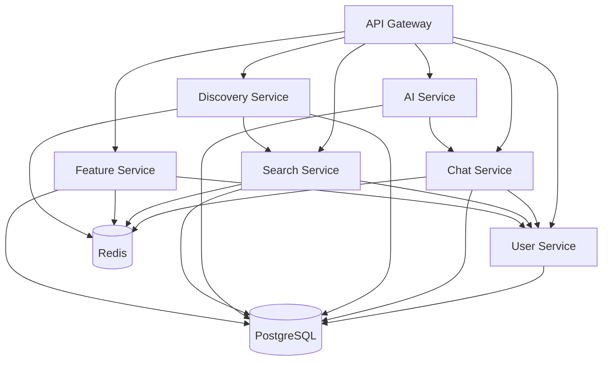

# Link Platform API Documentation

## Overview

The Link platform uses a microservices architecture with six core services, each responsible for specific functionality. All services are production-ready and communicate via an API Gateway with comprehensive authentication, rate limiting, and observability.

## Architecture

### API Gateway
- **Central Entry Point**: All client requests go through the API Gateway
- **Authentication**: JWT token validation and user context extraction
- **Rate Limiting**: Per-user and per-service rate limits
- **Service Routing**: Routes requests to appropriate backend services
- **Load Balancing**: Distributes requests across service instances

### Service Mesh
- **mTLS Security**: All service-to-service communication encrypted
- **Observability**: Distributed tracing and metrics collection
- **Service Discovery**: Automatic service registration and discovery
- **Circuit Breakers**: Fault tolerance and resilience patterns

## Services Overview

| Service | Port | Description | Primary Features |
|---------|------|-------------|------------------|
| [User Service](./services/user-service.md) | 8081 | Authentication & Profile Management | JWT auth, profiles, friends, contacts, onboarding |
| [Chat Service](./services/chat-service.md) | 8082 | Real-time Messaging | REST API, WebSocket, conversations, file uploads |
| [Discovery Service](./services/discovery-service.md) | 8084 | User Discovery & Matching | Availability tracking, location-based discovery, ranking |
| [AI Service](./services/ai-service.md) | 8085 | AI-Powered Insights | Conversation summarization, sentiment analysis, GDPR compliance |
| [Search Service](./services/search-service.md) | 8083 | Semantic User Search | OpenAI embeddings, vector similarity, natural language queries |
| [Feature Service](./services/feature-service.md) | 8086 | Feature Flags & A/B Testing | Dynamic flags, experiments, user segmentation |

### Service Dependencies



## Authentication & Authorization

### JWT Token Structure
All services use JWT tokens for authentication with the following claims:
```json
{
  "user_id": "uuid",
  "email": "user@example.com",
  "username": "username", 
  "exp": 1234567890,
  "iat": 1234567890,
  "iss": "user-svc",
  "sub": "uuid"
}
```

### API Gateway Headers
The API Gateway automatically extracts user context and sets headers for backend services:
```http
X-User-ID: user-uuid
X-User-Email: user@example.com
X-User-Name: username
X-User-Roles: premium,beta_tester
X-User-Permissions: feature_access,admin
X-Environment: production
```

### Service-to-Service Authentication
Internal services use mTLS through Linkerd service mesh for secure communication.

## Gateway Routes

### User Service Routes
- `POST /users/auth/register` → `user-svc/api/v1/auth/register`
- `POST /users/auth/login` → `user-svc/api/v1/auth/login`
- `GET /users/profile` → `user-svc/api/v1/profile`
- `PUT /users/profile` → `user-svc/api/v1/profile`
- `GET /users/friends` → `user-svc/api/v1/friends`
- `POST /users/contacts/invite` → `user-svc/api/v1/users/contacts/invite`

### Chat Service Routes  
- `GET /chat/conversations` → `chat-svc/api/v1/chat/conversations`
- `POST /chat/conversations` → `chat-svc/api/v1/chat/conversations`
- `POST /chat/messages` → `chat-svc/api/v1/chat/messages`
- `WebSocket /ws/chat/{id}` → `chat-svc/ws/chat/{id}`

### Discovery Service Routes
- `POST /discovery/availability` → `discovery-svc/api/v1/availability`
- `GET /discovery/available-users` → `discovery-svc/api/v1/available-users`
- `POST /discovery/location` → `discovery-svc/api/v1/location`
- `GET /discovery/ranking/weights` → `discovery-svc/api/v1/ranking/weights`

### AI Service Routes
- `POST /ai/summarize` → `ai-svc/api/v1/ai/summarize`
- `GET /ai/consent` → `ai-svc/api/v1/ai/consent`
- `PUT /ai/consent` → `ai-svc/api/v1/ai/consent`
- `POST /ai/sentiment` → `ai-svc/api/v1/ai/sentiment`

### Search Service Routes  
- `POST /search` → `search-svc/api/v1/search`
- `POST /search/reindex` → `search-svc/api/v1/reindex` (internal)
- `GET /search/analytics` → `search-svc/api/v1/analytics/search`

### Feature Service Routes
- `GET /features/flags/{key}/evaluate` → `feature-svc/api/v1/flags/{key}/evaluate`
- `POST /features/flags/evaluate` → `feature-svc/api/v1/flags/evaluate`  
- `GET /features/experiments/{key}/evaluate` → `feature-svc/api/v1/experiments/{key}/evaluate`
- `POST /features/events` → `feature-svc/api/v1/events`

## Rate Limiting

### Global Limits (API Gateway)
- **Authentication**: 10 requests/minute per IP
- **Standard Endpoints**: 100 requests/minute per user
- **Search Queries**: 30 requests/minute per user
- **File Uploads**: 10 uploads/minute per user

### Service-Specific Limits
- **Chat WebSocket**: 60 messages/minute per user per conversation
- **Discovery Updates**: 10 availability updates/minute per user
- **AI Summarization**: 10 requests/hour per user
- **Feature Evaluation**: 1000 requests/minute per user

### Rate Limit Headers
```http
X-RateLimit-Limit: 100
X-RateLimit-Remaining: 87
X-RateLimit-Reset: 1640995200
X-RateLimit-Type: user
X-RateLimit-Scope: endpoint_group
```

## Error Handling

### Standard Error Response Format
All services return consistent error responses:
```json
{
  "error": "ERROR_CODE",
  "message": "Human-readable error message",
  "details": {
    "field": "validation details"
  },
  "request_id": "req_123456789",
  "timestamp": "2024-01-15T10:30:00Z"
}
```

### Common HTTP Status Codes
- **200 OK**: Request successful
- **201 Created**: Resource created successfully
- **400 Bad Request**: Invalid request parameters
- **401 Unauthorized**: Invalid or expired authentication
- **403 Forbidden**: Insufficient permissions
- **404 Not Found**: Resource not found
- **409 Conflict**: Resource already exists or conflict
- **429 Too Many Requests**: Rate limit exceeded
- **500 Internal Server Error**: Server error
- **503 Service Unavailable**: Service temporarily unavailable

## Data Models

### Common Data Types

#### User Profile
```json
{
  "id": "uuid",
  "name": "string",
  "email": "string",
  "username": "string",
  "profile_picture": "string|null",
  "bio": "string",
  "interests": ["string"],
  "location": "string",
  "email_verified": "boolean",
  "created_at": "ISO8601",
  "updated_at": "ISO8601"
}
```

#### Location
```json
{
  "latitude": "number",
  "longitude": "number", 
  "accuracy": "number",
  "address": "string",
  "altitude": "number|null"
}
```

#### Pagination
```json
{
  "data": ["array of items"],
  "total": "integer",
  "limit": "integer", 
  "offset": "integer",
  "has_more": "boolean"
}
```

#### Feature Flag Result
```json
{
  "flag_key": "string",
  "enabled": "boolean",
  "value": "any",
  "variant": "string|null",
  "reason": "string",
  "evaluation_context": "object"
}
```

## Integration Patterns

### Client-Side Integration

#### JavaScript SDK Example
```javascript
class LinkAPIClient {
  constructor(baseURL, authToken) {
    this.baseURL = baseURL;
    this.authToken = authToken;
  }

  async request(endpoint, options = {}) {
    const url = `${this.baseURL}${endpoint}`;
    const config = {
      headers: {
        'Authorization': `Bearer ${this.authToken}`,
        'Content-Type': 'application/json',
        ...options.headers
      },
      ...options
    };

    const response = await fetch(url, config);
    
    if (!response.ok) {
      const error = await response.json();
      throw new APIError(error.message, response.status, error);
    }

    return response.json();
  }

  // User Service
  async getCurrentUser() {
    return this.request('/users/profile');
  }

  async updateProfile(profileData) {
    return this.request('/users/profile', {
      method: 'PUT',
      body: JSON.stringify(profileData)
    });
  }

  // Discovery Service
  async getAvailableUsers(location, options = {}) {
    const params = new URLSearchParams({
      latitude: location.latitude,
      longitude: location.longitude,
      radius: options.radius || 5,
      limit: options.limit || 10,
      ...(options.query && { q: options.query })
    });
    
    return this.request(`/discovery/available-users?${params}`);
  }

  // Feature Service
  async evaluateFeatureFlag(flagKey) {
    return this.request(`/features/flags/${flagKey}/evaluate`);
  }

  async evaluateFeatureFlags(flagKeys, userAttributes = {}) {
    return this.request('/features/flags/evaluate', {
      method: 'POST',
      body: JSON.stringify({
        flag_keys: flagKeys,
        user_attributes: userAttributes
      })
    });
  }
}
```

### Backend Service Integration

#### Go Service Client Example
```go
package linkclient

import (
    "bytes"
    "encoding/json"
    "fmt"
    "net/http"
    "time"
)

type Client struct {
    BaseURL    string
    HTTPClient *http.Client
    AuthToken  string
}

type SearchRequest struct {
    Query         string   `json:"query"`
    Limit         int      `json:"limit,omitempty"`
    UserIDs       []string `json:"user_ids,omitempty"`
    ExcludeUserID string   `json:"exclude_user_id,omitempty"`
}

func NewClient(baseURL, authToken string) *Client {
    return &Client{
        BaseURL: baseURL,
        AuthToken: authToken,
        HTTPClient: &http.Client{
            Timeout: 30 * time.Second,
        },
    }
}

func (c *Client) SearchUsers(req SearchRequest) (*SearchResponse, error) {
    jsonData, err := json.Marshal(req)
    if err != nil {
        return nil, fmt.Errorf("marshal request: %w", err)
    }

    httpReq, err := http.NewRequest("POST", c.BaseURL+"/search", bytes.NewBuffer(jsonData))
    if err != nil {
        return nil, fmt.Errorf("create request: %w", err)
    }

    httpReq.Header.Set("Content-Type", "application/json")
    httpReq.Header.Set("Authorization", "Bearer "+c.AuthToken)

    resp, err := c.HTTPClient.Do(httpReq)
    if err != nil {
        return nil, fmt.Errorf("request failed: %w", err)
    }
    defer resp.Body.Close()

    if resp.StatusCode != http.StatusOK {
        return nil, fmt.Errorf("request failed with status %d", resp.StatusCode)
    }

    var result SearchResponse
    if err := json.NewDecoder(resp.Body).Decode(&result); err != nil {
        return nil, fmt.Errorf("decode response: %w", err)
    }

    return &result, nil
}
```

## Development Workflow

### Local Development Setup
```bash
# 1. Start all backend services
./scripts/dev-workflow.sh start

# 2. Start frontend development server  
npm run dev

# 3. Check service health
curl http://localhost:8080/health  # API Gateway
curl http://localhost:8081/health  # User Service
curl http://localhost:8082/health  # Chat Service
curl http://localhost:8083/health  # Search Service
curl http://localhost:8084/health  # Discovery Service
curl http://localhost:8085/health  # AI Service
curl http://localhost:8086/health  # Feature Service
```

### Testing API Endpoints
```bash
# Register a new user
curl -X POST http://localhost:8080/users/auth/register \
  -H "Content-Type: application/json" \
  -d '{
    "name": "Test User",
    "email": "test@example.com",
    "password": "SecurePassword123!",
    "username": "testuser"
  }'

# Login and get JWT token
LOGIN_RESPONSE=$(curl -X POST http://localhost:8080/users/auth/login \
  -H "Content-Type: application/json" \
  -d '{
    "email": "test@example.com",
    "password": "SecurePassword123!"
  }')

TOKEN=$(echo $LOGIN_RESPONSE | jq -r '.accessToken')

# Test authenticated endpoints
curl -X GET http://localhost:8080/users/profile \
  -H "Authorization: Bearer $TOKEN"

curl -X GET http://localhost:8080/features/flags \
  -H "Authorization: Bearer $TOKEN"

curl -X POST http://localhost:8080/search \
  -H "Authorization: Bearer $TOKEN" \
  -H "Content-Type: application/json" \
  -d '{
    "query": "software engineer with React experience",
    "limit": 5
  }'
```

## Performance Considerations

### Response Times (95th percentile)
- **Authentication**: <100ms
- **Profile Operations**: <50ms  
- **Search Queries**: <200ms
- **Feature Flag Evaluation**: <15ms
- **Real-time Messages**: <25ms
- **AI Summarization**: <2000ms

### Caching Strategy
- **Redis**: Used by Chat, Search, Feature, and Discovery services
- **Cache TTL**: 5 minutes default, varies by service
- **Cache Invalidation**: Event-driven and manual invalidation
- **Hit Rates**: Typically 70-90% across services

### Database Optimization
- **Connection Pooling**: Configured per service
- **Read Replicas**: For read-heavy operations
- **Indexing**: Optimized for common query patterns
- **Migrations**: Automated and version-controlled

## Monitoring & Observability

### Health Check Endpoints
All services expose standardized health checks:
- `GET /health` - Basic health status
- `GET /health/live` - Kubernetes liveness probe
- `GET /health/ready` - Kubernetes readiness probe
- `GET /metrics` - Prometheus metrics

### Key Metrics
- **Request Rate**: Requests per second per service
- **Error Rate**: Error percentage by endpoint
- **Response Time**: p50, p95, p99 latencies
- **Database**: Connection pool usage, query times
- **Cache**: Hit rates, memory usage
- **Business**: User registrations, messages sent, matches made

### Distributed Tracing
- **Jaeger**: Request tracing across service boundaries
- **Correlation IDs**: Track requests across services
- **Sampling**: Configurable trace sampling rates

## Security

### Authentication & Authorization
- **JWT Tokens**: RS256 algorithm with key rotation
- **Token Expiry**: Access tokens expire in 15 minutes
- **Refresh Tokens**: 30-day expiry with secure storage
- **Service Authentication**: mTLS via Linkerd

### Data Protection
- **Encryption at Rest**: Database encryption for sensitive data
- **Encryption in Transit**: HTTPS and mTLS for all communication
- **PII Protection**: Automatic detection and encryption
- **GDPR Compliance**: Right to be forgotten, data portability

### Input Validation
- **Request Validation**: Comprehensive input sanitization
- **Rate Limiting**: Multi-level rate limiting
- **CORS**: Properly configured cross-origin policies
- **Content Security**: File upload restrictions and scanning

## API Versioning

### Versioning Strategy
- **URL Versioning**: All endpoints include `/api/v1/`
- **Backward Compatibility**: Maintained for at least 2 versions
- **Deprecation**: 90-day notice for breaking changes
- **Migration Guides**: Provided for version upgrades

### Version Support
- **v1.0**: Current stable version (all services)
- **Future Versions**: Will be added as `/api/v2/` endpoints

## Support & Troubleshooting

### Common Issues
1. **401 Unauthorized**: Check JWT token validity and expiration
2. **429 Rate Limited**: Implement exponential backoff retry logic  
3. **500 Server Error**: Check service health and logs
4. **Service Unavailable**: Verify service dependencies (database, Redis)

### Getting Help
- **Documentation**: Each service has detailed documentation
- **Health Checks**: Use health endpoints to verify service status
- **Logs**: Structured JSON logs with correlation IDs
- **Metrics**: Prometheus metrics available for all services

### Development Support
- **Postman Collection**: Available for API testing
- **OpenAPI Specs**: Machine-readable API specifications
- **SDK Libraries**: Client libraries for popular languages
- **Mock Services**: Available for frontend development

---

For detailed service-specific documentation, see the individual service pages in the [services/](./services/) directory.