# Link App - Updated Architecture with AI Service

## High-Level Architecture Diagram

```mermaid
graph TB
    %% External Services
    OpenAI[OpenAI GPT-4 API<br/>🤖 External AI]
    Maps[Maps API<br/>🗺️ Location Services]
    
    %% Frontend Layer
    Frontend[React Frontend<br/>📱 TypeScript/Vite<br/>Port: 5173]
    
    %% API Gateway Layer
    Gateway[API Gateway<br/>🛡️ Authentication & Routing<br/>Go/Gin - Port: 8080]
    
    %% Microservices Layer
    subgraph "Microservices Architecture"
        UserSvc[User Service<br/>👤 Authentication & Profiles<br/>Go - Port: 8081]
        ChatSvc[Chat Service<br/>💬 Real-time Messaging<br/>Go/WebSocket - Port: 8082]
        DiscoverySvc[Discovery Service<br/>🔍 Location & Proximity<br/>Go - Port: 8083]
        AISvc[AI Service<br/>🧠 Intelligence & Insights<br/>Go - Port: 8084]
    end
    
    %% Data Layer
    subgraph "Data Layer"
        Postgres[(PostgreSQL<br/>📊 Primary Database<br/>Port: 5432)]
        Redis[(Redis<br/>⚡ Cache & Sessions<br/>Port: 6379)]
        Vector[(Vector DB<br/>🔍 Semantic Search<br/>Qdrant/pgvector)]
    end
    
    %% External connections
    Frontend --> Gateway
    Gateway --> UserSvc
    Gateway --> ChatSvc
    Gateway --> DiscoverySvc
    Gateway --> AISvc
    
    %% Inter-service communication
    AISvc -.-> UserSvc
    AISvc -.-> ChatSvc
    AISvc -.-> DiscoverySvc
    AISvc --> OpenAI
    DiscoverySvc --> Maps
    
    %% Database connections
    UserSvc --> Postgres
    ChatSvc --> Postgres
    ChatSvc --> Redis
    DiscoverySvc --> Postgres
    AISvc --> Postgres
    AISvc --> Vector
    AISvc --> Redis
    Gateway --> Redis
    
    %% Styling
    classDef frontend fill:#e1f5fe
    classDef gateway fill:#f3e5f5
    classDef service fill:#e8f5e8
    classDef database fill:#fff3e0
    classDef external fill:#ffebee
    
    class Frontend frontend
    class Gateway gateway
    class UserSvc,ChatSvc,DiscoverySvc,AISvc service
    class Postgres,Redis,Vector database
    class OpenAI,Maps external
```



## Service Communication Patterns

### 1. Client-to-Service Communication


### 2. AI Service Integration Patterns

```mermaid
graph LR
    subgraph "AI Service Internal Architecture"
        API[API Layer<br/>🌐 REST Endpoints]
        Privacy[Privacy Layer<br/>🔒 Data Sanitization]
        AI[AI Processing<br/>🧠 NLP & Analytics]
        Cache[Caching Layer<br/>⚡ Response Cache]
    end
    
    API --> Privacy
    Privacy --> AI
    AI --> Cache
    
    subgraph "External Integrations"
        OpenAI[OpenAI API<br/>🤖 LLM Processing]
        LocalLLM[Local Models<br/>🏠 Privacy-Safe AI]
    end
    
    AI --> OpenAI
    AI --> LocalLLM
    
    subgraph "Service Dependencies"
        UserAPI[User Service API<br/>👤 Profile Data]
        ChatAPI[Chat Service API<br/>💬 Conversation Data]
        DiscoveryAPI[Discovery Service API<br/>🔍 Location Data]
    end
    
    Privacy --> UserAPI
    Privacy --> ChatAPI  
    Privacy --> DiscoveryAPI
```


## Data Flow Architecture

### Core AI Workflows

#### 1. Conversation Enhancement Workflow


#### 2. Personal Diary Processing Workflow


#### 3. Friend Profile Generation Workflow


## Security Architecture

### Trust Boundaries and Data Protection


## Privacy-First Data Architecture

### Data Classification and Handling

```mermaid
graph TD
    subgraph "Data Classification"
        Public[📢 Public Data<br/>• Public profiles<br/>• Mutual connections<br/>• Public activities]
        
        Private[🔒 Private Data<br/>• Diary entries<br/>• Message content<br/>• Location data<br/>• Preferences]
        
        Sensitive[🔐 Sensitive Data<br/>• Personal insights<br/>• Behavior patterns<br/>• Social analytics<br/>• AI-generated profiles]
    end
    
    subgraph "Processing Rules"
        PublicFlow[Direct API Access<br/>No Encryption Required]
        PrivateFlow[Consent Required<br/>Data Minimization<br/>Retention Policies]
        SensitiveFlow[User-Key Encryption<br/>Audit Logging<br/>Zero-Trust Access]
    end
    
    subgraph "Storage Strategy"
        RegularStorage[(Regular Database<br/>PostgreSQL<br/>Public + Metadata)]
        EncryptedStorage[(Encrypted Storage<br/>AES-256 per user<br/>Private + Sensitive)]
        VectorStorage[(Vector Database<br/>Anonymized Embeddings<br/>Semantic Search)]
    end
    
    Public --> PublicFlow
    Private --> PrivateFlow
    Sensitive --> SensitiveFlow
    
    PublicFlow --> RegularStorage
    PrivateFlow --> EncryptedStorage
    SensitiveFlow --> EncryptedStorage
    
    PrivateFlow -.-> VectorStorage
    SensitiveFlow -.-> VectorStorage
```



## Deployment Architecture

### Container Orchestration

```yaml
# Updated docker-compose.yml structure
version: '3.8'

services:
  # Frontend
  frontend:
    image: link/frontend:latest
    ports: ["5173:5173"]
    depends_on: [api-gateway]
  
  # API Gateway
  api-gateway:
    image: link/api-gateway:latest
    ports: ["8080:8080"]
    environment:
      - JWT_SECRET=${JWT_SECRET}
      - CORS_ORIGINS=http://localhost:5173
    depends_on: [user-svc, chat-svc, discovery-svc, ai-svc]
  
  # Microservices
  user-svc:
    image: link/user-svc:latest
    ports: ["8081:8080"]
    depends_on: [postgres, redis]
    
  chat-svc:
    image: link/chat-svc:latest  
    ports: ["8082:8080"]
    depends_on: [postgres, redis]
    
  discovery-svc:
    image: link/discovery-svc:latest
    ports: ["8083:8080"] 
    depends_on: [postgres]
    
  # NEW: AI Service
  ai-svc:
    image: link/ai-svc:latest
    ports: ["8084:8080"]
    environment:
      - OPENAI_API_KEY=${OPENAI_API_KEY}
      - AI_ENCRYPTION_KEY=${AI_ENCRYPTION_KEY}
      - USER_SERVICE_URL=http://user-svc:8080
      - CHAT_SERVICE_URL=http://chat-svc:8080
      - DISCOVERY_SERVICE_URL=http://discovery-svc:8080
    depends_on: [postgres, redis, vector-db]
    volumes:
      - ./ai-models:/app/models:ro
  
  # Data Layer
  postgres:
    image: postgres:15
    ports: ["5432:5432"]
    environment:
      - POSTGRES_DB=link_db
      - POSTGRES_USER=link_user
      - POSTGRES_PASSWORD=${DB_PASSWORD}
    volumes:
      - postgres_data:/var/lib/postgresql/data
      
  redis:
    image: redis:7-alpine
    ports: ["6379:6379"]
    volumes:
      - redis_data:/data
      
  # NEW: Vector Database for AI
  vector-db:
    image: qdrant/qdrant:latest
    ports: ["6333:6333"]
    volumes:
      - vector_data:/qdrant/storage

volumes:
  postgres_data:
  redis_data:
  vector_data:
```

## Monitoring and Observability

### Service Health Dashboard

```mermaid
graph TD
    subgraph "Metrics Collection"
        Prometheus[Prometheus<br/>📊 Metrics Aggregation]
        Grafana[Grafana<br/>📈 Visualization]
        AlertManager[Alert Manager<br/>🚨 Notifications]
    end
    
    subgraph "Application Metrics"
        APIMetrics[API Gateway<br/>• Request/Response times<br/>• Error rates<br/>• Authentication success]
        
        AIMetrics[AI Service<br/>• OpenAI API usage<br/>• Cache hit rates<br/>• Privacy compliance<br/>• Processing latency]
        
        ServiceMetrics[Other Services<br/>• Database connections<br/>• WebSocket connections<br/>• Background jobs]
    end
    
    subgraph "Infrastructure Metrics"
        ContainerMetrics[Container Stats<br/>• CPU/Memory usage<br/>• Network I/O<br/>• Storage utilization]
        
        DatabaseMetrics[Database Health<br/>• Connection pools<br/>• Query performance<br/>• Storage usage]
    end
    
    APIMetrics --> Prometheus
    AIMetrics --> Prometheus
    ServiceMetrics --> Prometheus
    ContainerMetrics --> Prometheus
    DatabaseMetrics --> Prometheus
    
    Prometheus --> Grafana
    Prometheus --> AlertManager
```



## Scalability Considerations

### Horizontal Scaling Strategy

| Service | Scaling Pattern | Bottlenecks | Solutions |
|---------|----------------|-------------|-----------|
| **Frontend** | CDN + Static Hosting | Bundle size, API calls | Code splitting, aggressive caching |
| **API Gateway** | Load balancer + multiple instances | JWT validation, routing | Redis-based session sharing |
| **User Service** | Database-read replicas | Friend graph queries | Caching, database optimization |
| **Chat Service** | WebSocket sticky sessions | Real-time connections | Redis pub/sub, horizontal scaling |
| **Discovery Service** | Geo-partitioned instances | Location queries | Spatial indexing, regional deployment |
| **AI Service** | Stateless horizontal scaling | OpenAI API limits, processing time | Caching, local models, async processing |

### Performance Targets

| Metric | Target | Monitoring |
|--------|--------|------------|
| **API Response Time** | <200ms (95th percentile) | Prometheus + Grafana |
| **AI Suggestion Latency** | <500ms (conversation starters) | Custom metrics |
| **Chat Message Delivery** | <100ms (real-time) | WebSocket monitoring |
| **Database Query Time** | <50ms (95th percentile) | PostgreSQL slow query log |
| **System Availability** | 99.9% uptime | Health checks + alerts |

## Migration and Rollout Plan

### Phase 1: Foundation (Week 1-2)
- [ ] Create AI Service boilerplate and basic structure
- [ ] Implement OpenAI API integration with basic conversation starters
- [ ] Add AI service to API Gateway routing
- [ ] Set up basic monitoring and health checks

### Phase 2: Core Features (Week 3-4)
- [ ] Implement privacy framework and data sanitization
- [ ] Add diary processing and social opportunity suggestions
- [ ] Create friend profile generation from conversation analysis
- [ ] Integrate with existing User and Chat services

### Phase 3: Production Readiness (Week 5-6)
- [ ] Implement comprehensive caching strategy
- [ ] Add local AI model support for privacy-sensitive features
- [ ] Complete security audit and penetration testing
- [ ] Performance optimization and load testing

### Phase 4: Advanced Features (Future)
- [ ] Real-time AI suggestions via WebSocket
- [ ] Advanced social graph analytics
- [ ] Integration with external event platforms
- [ ] AR and location-based AI features

---

**Document Version**: 1.0  
**Last Updated**: 2025-01-12  
**Next Review**: 2025-02-01
