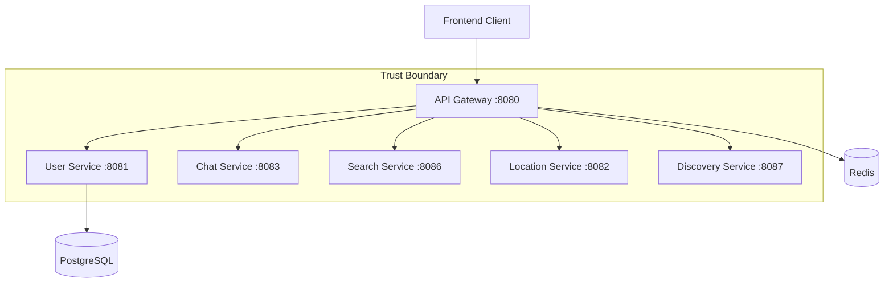
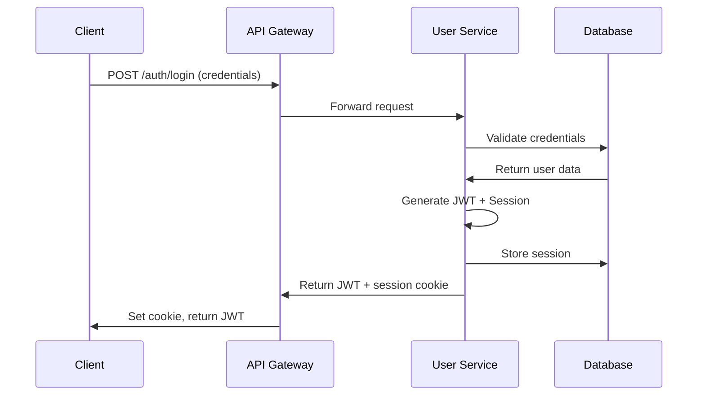
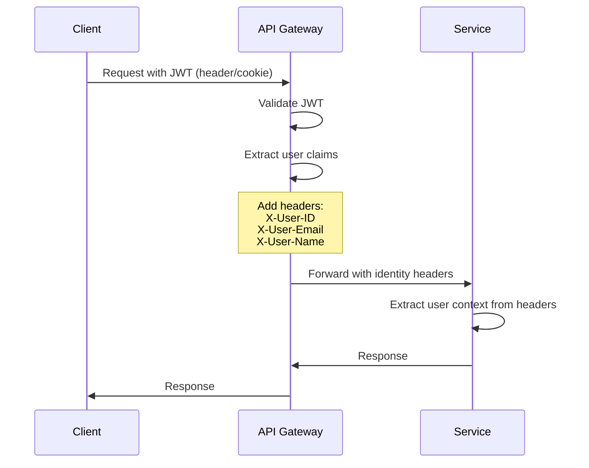

# Authentication & Authorization Flow Documentation

## Overview

This document provides a comprehensive analysis of the current authentication and authorization propagation mechanisms in the Link application microservices architecture. It traces JWT issuance, validation, and the flow of identity information from the User Service through the API Gateway to downstream services.

## Architecture Overview



## 1. JWT Issuance in User Service

### Token Generation Process

**Location:** `backend/user-svc/internal/auth/jwt_service.go`

The User Service acts as the **authentication authority** responsible for:
- User registration and login validation
- JWT token generation and signing
- Session management
- Password verification and rehashing

#### JWT Configuration
```go
type JWTConfig struct {
    Secret           string        // HMAC-SHA256 signing key
    AccessTokenTTL   time.Duration // 1 hour default
    RefreshTokenTTL  time.Duration // 30 days default  
    Issuer           string        // "user-svc"
    CookieName       string        // "link_auth"
    CookieSecure     bool          // true in production
    CookieHTTPOnly   bool          // always true
    CookieSameSite   string        // "strict"
}
```

#### Claims Structure
```go
type Claims struct {
    UserID   uuid.UUID `json:"user_id"`
    Email    string    `json:"email"`
    Username string    `json:"username"`
    jwt.RegisteredClaims
}
```

#### Token Issuance Points

**1. User Registration** (`RegisterUser`)
- Location: `backend/user-svc/internal/auth/service.go:140-144`
- Triggers: New user account creation
- Process: Password hashing → User creation → JWT generation → Response with token

**2. User Login** (`LoginUser`) 
- Location: `backend/user-svc/internal/auth/service.go:194-198`
- Triggers: Successful credential validation
- Process: Password verification → JWT generation → Session creation → Response with token

**3. Token Refresh** (`RefreshToken`)
- Location: `backend/user-svc/internal/auth/service.go:253-257`
- Triggers: Valid refresh token submission
- Process: Refresh token validation → New access token generation

### Session Management

**Session Creation:**
```go
session := &models.Session{
    UserID:    user.ID,
    Token:     tokenID, // JWT ID (JTI)
    ExpiresAt: time.Now().Add(time.Hour),
}
```

**Database Storage:** Sessions are persisted in PostgreSQL with automatic cleanup of expired sessions.

## 2. API Gateway JWT Validation Middleware

### Validation Process

**Location:** `backend/api-gateway/internal/middleware/auth.go`

The API Gateway serves as the **primary security boundary** for all incoming requests.

#### Authentication Flow
```go
func AuthMiddleware(jwtValidator *config.JWTValidator, jwtConfig *config.JWTConfig) gin.HandlerFunc {
    return func(c *gin.Context) {
        // 1. Check if endpoint is public
        if config.IsPublicEndpoint(c.Request.Method, c.Request.URL.Path) {
            c.Next()
            return
        }
        
        // 2. Extract token from Authorization header or cookie
        token := jwtValidator.ExtractTokenFromRequest(authHeader, cookieValue)
        
        // 3. Validate JWT signature and claims
        claims, err := jwtValidator.ValidateAccessToken(token)
        
        // 4. Set user context and headers
        c.Set("user_id", claims.UserID)
        c.Set("user_email", claims.Email) 
        c.Set("user_username", claims.Username)
        
        // 5. Inject identity headers for downstream services
        c.Header("X-User-ID", claims.UserID.String())
        c.Header("X-User-Email", claims.Email)
        c.Header("X-User-Name", claims.Username)
    }
}
```

#### JWT Validation Details

**Location:** `backend/api-gateway/internal/config/jwt.go:57-75`

```go
func (j *JWTValidator) ValidateAccessToken(tokenString string) (*Claims, error) {
    token, err := jwt.ParseWithClaims(tokenString, &Claims{}, func(token *jwt.Token) (interface{}, error) {
        // Verify HMAC signing method
        if _, ok := token.Method.(*jwt.SigningMethodHMAC); !ok {
            return nil, fmt.Errorf("unexpected signing method: %v", token.Header["alg"])
        }
        return []byte(j.config.Secret), nil
    }, 
    jwt.WithIssuer(j.config.Issuer),     // Validates iss="user-svc"
    jwt.WithAudience("link-app"))        // Validates aud="link-app"
    
    // Additional validation logic...
}
```

### Token Extraction Sources

1. **Authorization Header** (Primary): `Bearer <token>`
2. **HTTP Cookie** (Fallback): Cookie name from `JWT_COOKIE_NAME` env var

## 3. Gateway-Injected Identity Headers

### Header Propagation

The API Gateway **injects identity headers** into all downstream service requests after successful JWT validation:

| Header Name | Source | Format | Purpose |
|------------|--------|--------|---------|
| `X-User-ID` | JWT Claims | UUID v4 string | User identification |
| `X-User-Email` | JWT Claims | Email address | User email |
| `X-User-Name` | JWT Claims | Username string | Display name |

### Implementation
**Location:** `backend/api-gateway/internal/middleware/auth.go:58-61`

```go
// Set user context headers for downstream services
c.Header("X-User-ID", claims.UserID.String())
c.Header("X-User-Email", claims.Email)  
c.Header("X-User-Name", claims.Username)
```

## 4. Downstream Service Header Consumption

### Chat Service Authentication

**Location:** `backend/chat-svc/internal/middleware/auth.go`

**Dual Authentication Support:**
```go
func (a *AuthMiddleware) Middleware(next http.Handler) http.Handler {
    return http.HandlerFunc(func(w http.ResponseWriter, r *http.Request) {
        // Option 1: Gateway-forwarded headers (preferred)
        if userID := r.Header.Get("X-User-ID"); userID != "" {
            a.handleGatewayAuth(w, r, next)
            return
        }
        
        // Option 2: Direct JWT validation (fallback)
        token := a.extractToken(r)
        claims, err := a.validateToken(token)
        // ... process JWT directly
    })
}
```

**Header Validation:**
```go
func (a *AuthMiddleware) handleGatewayAuth(w http.ResponseWriter, r *http.Request, next http.Handler) {
    userIDStr := r.Header.Get("X-User-ID")
    userEmail := r.Header.Get("X-User-Email")
    userName := r.Header.Get("X-User-Name")
    
    // Validate UUID format
    userID, err := uuid.Parse(userIDStr)
    if err != nil {
        a.writeUnauthorized(w, "Invalid user context")
        return
    }
    
    // Set context for request processing
    ctx := context.WithValue(r.Context(), UserIDKey, userID)
    // ...
}
```

### User Service Header Consumption

**Location:** `backend/user-svc/internal/middleware/context.go`

```go
func ExtractUserContext() gin.HandlerFunc {
    return func(c *gin.Context) {
        // Extract from gateway headers
        userID := c.GetHeader("X-User-ID")
        userEmail := c.GetHeader("X-User-Email")
        userName := c.GetHeader("X-User-Name")
        
        // Set in Gin context
        if userID != "" {
            if parsedID, err := uuid.Parse(userID); err == nil {
                c.Set("user_id", parsedID)
            }
        }
    }
}
```

### Search Service Authentication

**Location:** `backend/search-svc/internal/middleware/auth.go`

**Enhanced Security Checks:**
```go
func AuthRequired() gin.HandlerFunc {
    return func(c *gin.Context) {
        userID := c.GetHeader("X-User-ID")
        userEmail := c.GetHeader("X-User-Email")
        
        // Basic validation
        if userID == "" || userEmail == "" {
            c.JSON(http.StatusUnauthorized, dto.ErrorResponse{
                Error: "UNAUTHORIZED",
                Message: "User authentication required",
            })
            c.Abort()
            return
        }
        
        // UUID format validation
        if _, err := uuid.Parse(userID); err != nil {
            c.JSON(http.StatusUnauthorized, dto.ErrorResponse{
                Error: "INVALID_USER_ID", 
                Message: "Invalid user ID format",
            })
            c.Abort()
            return
        }
        
        // Privacy safeguards (if headers present)
        visibility := c.GetHeader("X-User-Visibility")
        if visibility == "private" {
            c.JSON(http.StatusForbidden, dto.ErrorResponse{
                Error: "PRIVATE_PROFILE",
                Message: "Private profiles cannot be searched or indexed",
            })
            c.Abort()
            return
        }
    }
}
```

## 5. Service-to-Service Authentication

### HMAC-Based Service Authentication

**Location:** `backend/api-gateway/internal/middleware/service_auth.go`

To prevent header spoofing attacks, the API Gateway implements **service-to-service authentication** using HMAC signatures:

```go
func ServiceAuthMiddleware(config *ServiceAuthConfig) gin.HandlerFunc {
    return func(c *gin.Context) {
        timestamp := strconv.FormatInt(time.Now().Unix(), 10)
        
        // Create HMAC signature: HMAC-SHA256(service_id + timestamp + path, secret)
        message := fmt.Sprintf("%s%s%s", config.ServiceID, timestamp, c.Request.URL.Path)
        signature := createHMACSignature(message, config.ServiceSecret)
        
        // Inject service authentication headers
        c.Header("X-Service-ID", config.ServiceID)
        c.Header("X-Service-Timestamp", timestamp)
        c.Header("X-Service-Signature", signature)
    }
}
```

### Service Validation

Downstream services can validate incoming requests:

```go
func ValidateServiceAuthMiddleware(config *ServiceAuthConfig) gin.HandlerFunc {
    // 1. Extract service headers
    // 2. Validate timestamp (prevent replay attacks)
    // 3. Verify HMAC signature
    // 4. Allow request if valid
}
```

## 6. Security Risks & Vulnerabilities

### 🔴 Critical Risks

#### 1. Header Spoofing Without mTLS
**Risk:** Malicious services or compromised network components could inject fake identity headers.

**Impact:** Authentication bypass, unauthorized access, privilege escalation.

**Mitigation Status:** 
- ✅ HMAC-based service authentication implemented
- ⚠️  Requires deployment of shared secrets across services
- ⚠️  Consider mTLS for additional transport security

#### 2. Shared JWT Secret Vulnerability
**Risk:** Single shared secret across all services creates single point of failure.

**Evidence:**
```go
// Both API Gateway and User Service use same secret
JWT_SECRET=your-secret-key-change-this-in-production
```

**Impact:** Compromise of any service enables JWT forgery.

**Mitigation:**
- ✅ Strong secret generation recommended in security docs
- 🔄 Consider asymmetric JWT (RS256) for service separation

#### 3. Session Management Gaps
**Risk:** Sessions stored in database but limited invalidation mechanisms.

**Evidence:** Limited session cleanup and blacklisting capabilities.

**Impact:** Token reuse after logout, compromised session persistence.

### 🟡 Medium Risks  

#### 1. Direct JWT Validation Fallback
**Risk:** Services can bypass gateway authentication by validating JWTs directly.

**Evidence:** Chat Service implements dual authentication modes.

**Impact:** Inconsistent security policy enforcement.

**Recommendation:** Remove direct JWT validation, enforce gateway-only authentication.

#### 2. Insufficient Header Validation
**Risk:** Some services don't validate header formats or content.

**Evidence:** Basic UUID parsing without additional verification.

**Impact:** Potential injection attacks or malformed data processing.

#### 3. Network Traffic Interception
**Risk:** Headers transmitted in plain HTTP in internal network.

**Current State:** Internal services use HTTP, not HTTPS.

**Impact:** Credential interception in compromised network.

### 🟢 Existing Security Controls

#### 1. JWT Validation Strength
- ✅ HMAC-SHA256 signing
- ✅ Issuer validation (`iss=user-svc`)
- ✅ Audience validation (`aud=link-app`)
- ✅ Expiration validation
- ✅ Signature verification

#### 2. Cookie Security
- ✅ HttpOnly flag set
- ✅ SameSite=strict in security improvements
- ✅ Secure flag in production
- ✅ Domain scoping

#### 3. Password Security
- ✅ Bcrypt hashing (cost 12+ recommended)
- ✅ Password rehashing on login
- ✅ Argon2 support available

## 7. Authentication Flow Diagrams

### User Login Flow


### Authenticated Request Flow


## 8. Configuration Summary

### Environment Variables

| Variable | Location | Purpose | Default | Security Impact |
|----------|----------|---------|---------|-----------------|
| `JWT_SECRET` | All services | Token signing/validation | Development default | **CRITICAL** |
| `JWT_ISSUER` | Gateway, User Service | Token issuer validation | `user-svc` | Medium |
| `JWT_COOKIE_NAME` | Gateway | Cookie identification | `link_auth` | Low |
| `JWT_COOKIE_SAMESITE` | Gateway | CSRF protection | `strict` | Medium |
| `SERVICE_SECRET` | All services | Service-to-service auth | Development default | **HIGH** |
| `SERVICE_ID` | API Gateway | Service identification | `api-gateway` | Medium |

### Public Endpoints (No Authentication Required)

**API Gateway Configuration:** `backend/api-gateway/internal/config/jwt.go:93-122`

```go
publicEndpoints := map[string][]string{
    "POST": {
        "/auth/register",
        "/auth/login",
    },
    "GET": {
        "/health",
        "/users/profile/", // Public user profiles
    },
    "OPTIONS": {"*"}, // CORS preflight
}
```

## 9. Recommendations

### Immediate Actions (Week 1)

1. **Deploy Service-to-Service Authentication**
   - Generate and distribute service secrets
   - Enable HMAC signature validation on all services
   - Remove direct JWT validation fallbacks

2. **Strengthen JWT Secret Management**
   - Rotate all JWT secrets to cryptographically strong values
   - Consider migration to asymmetric signatures (RS256)
   - Implement secret rotation procedures

3. **Implement mTLS for Internal Communication**
   - Generate service certificates
   - Configure mutual TLS validation
   - Encrypt all inter-service communication

### Medium-term Improvements (Month 1-2)

1. **Enhanced Session Management**
   - Implement JWT blacklisting/revocation
   - Add session invalidation on logout
   - Implement concurrent session limits

2. **Monitoring and Alerting**
   - Log all authentication events
   - Alert on authentication failures
   - Monitor for header spoofing attempts

3. **Network Security**
   - Implement service mesh (Istio/Linkerd)
   - Network policy enforcement
   - Zero-trust networking

### Long-term Considerations (Month 3+)

1. **OAuth2/OIDC Integration**
   - External identity providers
   - Centralized authentication
   - Token introspection

2. **Hardware Security Modules**
   - HSM-based key management
   - Hardware-backed JWT signing
   - Secure secret storage

## 10. Testing & Validation

### Security Test Scenarios

1. **Header Spoofing Tests**
   ```bash
   # Test direct service access with fake headers
   curl -H "X-User-ID: fake-uuid" -H "X-User-Email: fake@test.com" http://service:8081/protected
   ```

2. **JWT Validation Tests**
   ```bash
   # Test with invalid/expired tokens
   curl -H "Authorization: Bearer invalid.jwt.token" http://gateway:8080/protected
   ```

3. **Service Authentication Tests**
   ```bash
   # Test service-to-service without proper signatures
   curl -H "X-Service-ID: malicious" http://service:8081/internal
   ```

### Monitoring Indicators

- Failed authentication rates
- Invalid header format attempts  
- Service signature validation failures
- Concurrent session violations
- Unusual authentication patterns

---

**Document Version:** 1.0  
**Last Updated:** 2024-01-XX  
**Classification:** Internal Security Documentation  

**Next Review:** Quarterly security assessment  
**Responsible Team:** Platform Security Team
