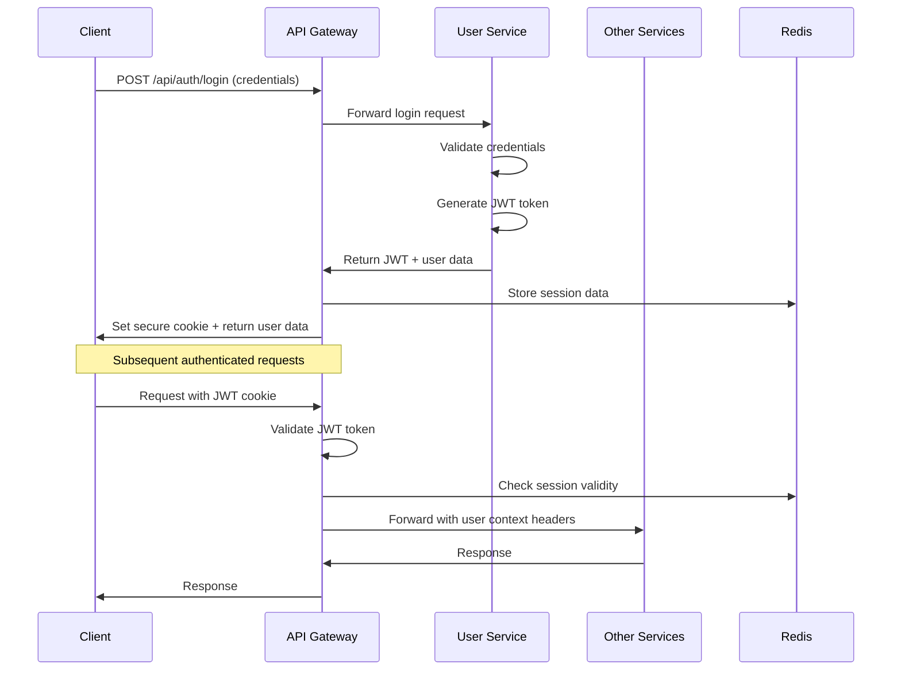

# Authentication & Authorization Implementation

This document details the authentication and authorization implementation in the Link platform.

## 🔐 Authentication Architecture

### JWT-Based Authentication Flow



### Token Types

#### User Authentication Tokens
- **Purpose**: Authenticate end users
- **Issuer**: User Service (`user-svc`)
- **Algorithm**: HMAC-SHA256
- **Secret**: `JWT_SECRET` environment variable
- **Lifetime**: 1 hour (configurable)
- **Storage**: Secure HTTP-only cookies

#### Service Authentication Tokens
- **Purpose**: Authenticate service-to-service calls
- **Issuer**: API Gateway
- **Algorithm**: HMAC-SHA256
- **Secret**: `SERVICE_JWT_SECRET` (separate from user tokens)
- **Lifetime**: 24 hours
- **Storage**: Authorization header

## 🏗️ Implementation Details

### User Service JWT Generation

**Location**: `backend/user-svc/internal/auth/jwt_service.go`

```go
type JWTConfig struct {
    Secret           string        // HMAC-SHA256 signing key
    AccessTokenTTL   time.Duration // 1 hour default
    RefreshTokenTTL  time.Duration // 30 days default  
    Issuer           string        // "user-svc"
    CookieName       string        // "link_auth"
    SecureCookie     bool          // true in production
}

type Claims struct {
    UserID    string `json:"user_id"`
    Email     string `json:"email"`
    Name      string `json:"name"`
    Roles     []string `json:"roles,omitempty"`
    SessionID string `json:"session_id"`
    jwt.RegisteredClaims
}
```

### API Gateway Token Validation

**Location**: `backend/api-gateway/internal/middleware/auth.go`

```go
func (m *AuthMiddleware) ValidateToken(token string) (*Claims, error) {
    parsedToken, err := jwt.ParseWithClaims(token, &Claims{}, func(token *jwt.Token) (interface{}, error) {
        if _, ok := token.Method.(*jwt.SigningMethodHMAC); !ok {
            return nil, fmt.Errorf("unexpected signing method: %v", token.Header["alg"])
        }
        return []byte(m.config.JWTSecret), nil
    })

    if err != nil {
        return nil, err
    }

    if claims, ok := parsedToken.Claims.(*Claims); ok && parsedToken.Valid {
        // Additional validation checks
        if claims.ExpiresAt.Time.Before(time.Now()) {
            return nil, fmt.Errorf("token expired")
        }
        return claims, nil
    }

    return nil, fmt.Errorf("invalid token")
}
```

### User Context Propagation

The API Gateway propagates user identity to downstream services via HTTP headers:

```go
// Headers added by API Gateway
headers := map[string]string{
    "X-User-ID":       claims.UserID,
    "X-User-Email":    claims.Email,
    "X-User-Name":     claims.Name,
    "X-User-Roles":    strings.Join(claims.Roles, ","),
    "X-Session-ID":    claims.SessionID,
    "X-Authenticated": "true",
}
```

## 🔑 Authentication Endpoints

### User Registration
```http
POST /api/auth/register
Content-Type: application/json

{
    "email": "user@example.com",
    "password": "secure_password",
    "full_name": "John Doe"
}
```

**Response**:
```json
{
    "user": {
        "id": "uuid",
        "email": "user@example.com",
        "full_name": "John Doe",
        "created_at": "2024-01-01T00:00:00Z"
    },
    "access_token": "jwt_token_here"
}
```

### User Login
```http
POST /api/auth/login
Content-Type: application/json

{
    "email": "user@example.com",
    "password": "secure_password"
}
```

**Response**: Same as registration, plus secure cookie set.

### Token Refresh
```http
POST /api/auth/refresh
Content-Type: application/json
Cookie: link_auth=jwt_token

{
    "refresh_token": "refresh_token_here"
}
```

### User Logout
```http
POST /api/auth/logout
Cookie: link_auth=jwt_token
```

**Response**: Cookie cleared, session invalidated.

## 🛡️ Authorization Implementation

### Role-Based Access Control (RBAC)

#### User Roles
- **user**: Standard user with basic permissions
- **premium**: Premium user with enhanced features
- **moderator**: Content moderation capabilities
- **admin**: Full system administration access

#### Permission Matrix
| Endpoint | user | premium | moderator | admin |
|----------|------|---------|-----------|-------|
| `/api/users/profile` | ✅ (own) | ✅ (own) | ✅ (any) | ✅ (any) |
| `/api/chat/*` | ✅ | ✅ | ✅ | ✅ |
| `/api/discovery/*` | ✅ (limited) | ✅ (full) | ✅ (full) | ✅ (full) |
| `/api/admin/*` | ❌ | ❌ | ✅ (limited) | ✅ (full) |

### Authorization Middleware

**Location**: `backend/api-gateway/internal/middleware/auth.go`

```go
func (m *AuthMiddleware) RequireAuth(requiredRoles ...string) gin.HandlerFunc {
    return func(c *gin.Context) {
        claims, exists := c.Get("claims")
        if !exists {
            c.JSON(401, gin.H{"error": "Authentication required"})
            c.Abort()
            return
        }

        userClaims := claims.(*Claims)
        
        if len(requiredRoles) > 0 {
            hasRequiredRole := false
            for _, userRole := range userClaims.Roles {
                for _, requiredRole := range requiredRoles {
                    if userRole == requiredRole {
                        hasRequiredRole = true
                        break
                    }
                }
                if hasRequiredRole {
                    break
                }
            }

            if !hasRequiredRole {
                c.JSON(403, gin.H{"error": "Insufficient permissions"})
                c.Abort()
                return
            }
        }

        c.Next()
    }
}
```

## 🔐 Service-to-Service Authentication (Linkerd mTLS)

### Service Authentication Flow
1. **Service Deployment**: Each service deployed with dedicated Kubernetes ServiceAccount
2. **Linkerd Injection**: Service mesh automatically injects mTLS proxy sidecar
3. **Certificate Management**: Linkerd auto-generates and rotates certificates (24h cycle)  
4. **Identity Verification**: Services verified via Linkerd identity headers (`l5d-client-id`)
5. **Zero Configuration**: No manual token or certificate management required

### Service Identity Format
```
Service Account: link-<service>-service-sa.link-services.svc.cluster.local
Linkerd Identity: link-user-service-sa.link-services.serviceaccount.identity.linkerd.cluster.local
Service Name: user-svc (extracted from identity)
```

### Linkerd-Based Service Auth Middleware
```go
func LinkerdServiceAuthMiddleware() gin.HandlerFunc {
    return func(c *gin.Context) {
        // Skip for user requests
        if userID, exists := c.Get("user_id"); exists && userID != nil {
            c.Set("is_user_request", true)
            c.Header("X-Request-Type", "user")
            c.Next()
            return
        }

        // Extract Linkerd service identity
        serviceIdentity := c.GetHeader("l5d-client-id")
        if serviceIdentity == "" {
            c.JSON(401, gin.H{"error": "Service mesh identity required"})
            c.Abort()
            return
        }

        // Validate and extract service name
        serviceName := extractServiceNameFromIdentity(serviceIdentity)
        if !isKnownService(serviceName) {
            c.JSON(403, gin.H{"error": "Unknown service identity"})
            c.Abort()
            return
        }

        // Set service context
        c.Set("service_name", serviceName)
        c.Set("is_service_request", true)
        c.Header("X-Service-Name", serviceName)
        c.Next()
    }
}
```

### Service Communication Example
```go
// AMAZINGLY SIMPLE - Just make normal HTTP calls!
client := &http.Client{Timeout: 30 * time.Second}
req, _ := http.NewRequest("GET", "http://user-svc.link-services.svc.cluster.local:8080/api/v1/users/123", nil)
resp, err := client.Do(req)

// That's it! Linkerd automatically handles:
// ✅ mTLS certificate validation 
// ✅ Service identity verification
// ✅ Traffic encryption
// ✅ Load balancing & retries  
// ✅ Adding l5d-client-id header
// ✅ Certificate rotation
```

### Key Insight: Authentication vs Authorization

```go
// ❌ WRONG - Don't try to "validate" the l5d-client-id header
if clientID := c.GetHeader("l5d-client-id"); clientID == "" {
    return errors.New("invalid service") // This misses the point!
}

// ✅ RIGHT - Just use it for authorization decisions
if clientID := c.GetHeader("l5d-client-id"); clientID != "" {
    serviceName := extractServiceName(clientID)
    // If we're here, Linkerd ALREADY authenticated the service
    // Use serviceName to decide what the service is ALLOWED to do
    if serviceName != "user-svc" {
        return errors.New("not authorized for this endpoint")
    }
}
```

## 🧪 Testing Authentication

### Unit Tests
Test JWT generation, validation, and parsing:

```go
func TestJWTService_GenerateToken(t *testing.T) {
    config := &JWTConfig{
        Secret: "test-secret",
        AccessTokenTTL: time.Hour,
        Issuer: "test-service",
    }
    
    service := NewJWTService(config)
    
    claims := &Claims{
        UserID: "test-user-id",
        Email:  "test@example.com",
        Name:   "Test User",
    }
    
    token, err := service.GenerateToken(claims)
    assert.NoError(t, err)
    assert.NotEmpty(t, token)
    
    // Validate the token
    parsedClaims, err := service.ValidateToken(token)
    assert.NoError(t, err)
    assert.Equal(t, claims.UserID, parsedClaims.UserID)
}
```

### Integration Tests
Test authentication flow end-to-end:

```bash
#!/bin/bash
# Test authentication bypass prevention

# Test 1: Access protected endpoint without token
response=$(curl -s -o /dev/null -w "%{http_code}" \
  http://api-gateway:8080/api/v1/users/profile)

if [ "$response" != "401" ]; then
    echo "FAIL: Unauthenticated request should return 401"
    exit 1
fi

# Test 2: Login and access protected endpoint
token=$(curl -s -X POST http://api-gateway:8080/api/auth/login \
  -H "Content-Type: application/json" \
  -d '{"email":"test@example.com","password":"password"}' \
  | jq -r '.access_token')

response=$(curl -s -o /dev/null -w "%{http_code}" \
  -H "Authorization: Bearer $token" \
  http://api-gateway:8080/api/v1/users/profile)

if [ "$response" != "200" ]; then
    echo "FAIL: Authenticated request should return 200"
    exit 1
fi

echo "PASS: Authentication tests completed"
```

## 🔧 Configuration

### Environment Variables

#### User Service
```env
JWT_SECRET=your-256-bit-secret-key-here
JWT_ACCESS_TTL=1h
JWT_REFRESH_TTL=720h  # 30 days
JWT_ISSUER=user-svc
COOKIE_SECURE=true    # HTTPS only in production
COOKIE_DOMAIN=.linkapp.com
```

#### API Gateway
```env
JWT_SECRET=same-as-user-service-secret
SERVICE_JWT_SECRET=different-secret-for-service-auth
SESSION_TIMEOUT=1h
REDIS_URL=redis://redis:6379
```

### Security Best Practices

#### Production Configuration
- **Strong Secrets**: Use cryptographically strong secrets (256+ bits)
- **Short Token Lifetimes**: Keep access tokens short-lived (≤1 hour)
- **Secure Cookies**: Use HTTP-only, secure, SameSite cookies
- **Token Rotation**: Implement refresh token rotation
- **Rate Limiting**: Implement rate limiting on auth endpoints

#### Development Configuration
- **Longer Tokens**: Longer-lived tokens for development convenience
- **Debug Logging**: Enable detailed auth logging for debugging
- **Test Accounts**: Use consistent test accounts across environments

## 🚨 Security Considerations

### Common Vulnerabilities & Mitigations

#### JWT Vulnerabilities
- **None Algorithm Attack**: Always verify signing method
- **Secret Brute Force**: Use strong, long secrets
- **Token Sidejacking**: Use secure cookie storage
- **Replay Attacks**: Implement token expiration and session validation

#### Session Management
- **Session Fixation**: Generate new session ID on login
- **Concurrent Sessions**: Limit concurrent sessions per user
- **Session Invalidation**: Properly clean up sessions on logout

#### Input Validation
- **SQL Injection**: Use parameterized queries
- **XSS**: Sanitize all user inputs
- **CSRF**: Implement CSRF protection for state-changing operations

For additional security details, see:
- [Security Overview](overview.md)
- [Database Security](database.md)
- [Security Testing Guide](testing.md)