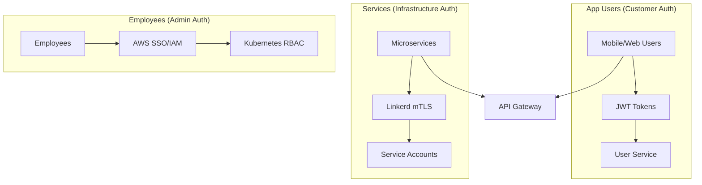

# IAM Architecture - Three-Tier Authentication System

This document describes Link's production-ready Identity and Access Management (IAM) architecture, implementing proper separation of concerns between different authentication domains.

## Overview

Link implements a **three-tier authentication system** that properly separates:

1. **App Users** (Customer Authentication) - Application-level identity
2. **Services** (Microservice Authentication) - Infrastructure-level identity  
3. **Employees** (Human Infrastructure Access) - Administrative identity

This separation ensures that a compromise in one domain cannot affect others, and each system can be optimized for its specific use case.

## Architecture Diagram



## 1. App Users (Customer Authentication)

### Purpose
Authenticate end users of the mobile/web application.

### Implementation
- **Service**: User Service (`user-svc`)
- **Technology**: JWT tokens with HMAC-SHA256
- **Storage**: Secure HTTP-only cookies
- **Lifetime**: 1 hour (configurable)
- **Roles**: `user`, `premium_user`, `community_moderator`, `banned`

### Token Flow
1. User logs in via `/api/auth/login`
2. User Service validates credentials
3. JWT token issued with user claims
4. API Gateway validates token on subsequent requests
5. User context propagated via headers to services

### Security Features
- Secure cookie storage (production)
- Session management with Redis
- Role-based access control
- Rate limiting by user type

## 2. Services (Infrastructure Authentication)

### Purpose
Authenticate service-to-service communication within the cluster.

### Implementation
- **Technology**: Linkerd service mesh with automatic mTLS
- **Identity**: Kubernetes ServiceAccounts
- **Certificates**: Automatically managed by Linkerd
- **Validation**: Linkerd proxy headers (`l5d-client-id`)

### Service Identity Flow
1. Each service deployed with dedicated ServiceAccount
2. Linkerd injects proxy sidecar automatically
3. mTLS certificates auto-generated and rotated (24h cycle)
4. **Key Insight**: mTLS handshake authenticates the service BEFORE request reaches application
5. `l5d-client-id` header provides identity info for authorization decisions
6. **No application-level validation needed** - if request arrives, it's already authenticated!

### ServiceAccount Mapping
```yaml
# Each service has its own ServiceAccount
api-gateway:    link-api-gateway-sa
user-svc:       link-user-service-sa
chat-svc:       link-chat-service-sa
ai-svc:         link-ai-service-sa
discovery-svc:  link-discovery-service-sa
search-svc:     link-search-service-sa
feature-svc:    link-feature-service-sa
```

### Security Features
- Automatic certificate rotation (24 hours)
- Zero-trust networking  
- Encryption by default
- Identity-based authorization
- No shared secrets

### Critical Difference from JWT Authentication

**JWT Model (What We Replaced):**
```go
// Application must validate tokens
token := extractJWT(request)
if !validateJWT(token) {
    return unauthorized
}
```

**Linkerd Model (Current Implementation):**
```go  
// NO validation needed - Linkerd already authenticated!
clientID := request.Header.Get("l5d-client-id")
serviceName := extractServiceName(clientID)
// Use serviceName for authorization decisions only
```

**Why This Works:**
- Linkerd proxy performs mTLS handshake BEFORE request reaches your application
- If request arrives at your service, the certificate was already validated
- `l5d-client-id` header is **informational only** - tells you WHO made the authenticated request
- Cannot be spoofed - header only set by Linkerd after successful mTLS

## 3. Employees (Administrative Access)

### Purpose
Provide infrastructure access for employees (developers, DevOps, support).

### Implementation
- **Technology**: AWS IAM roles mapped to Kubernetes RBAC
- **Access Method**: `kubectl` with AWS credentials
- **Authentication**: AWS SSO → IAM roles → K8s users
- **Authorization**: Kubernetes RBAC rules

### Employee Roles
```yaml
# AWS IAM Role → Kubernetes Role mapping
link-developer:  development environment access
link-devops:     full cluster administration
link-support:    read-only troubleshooting access
```

### Access Flow
1. Employee authenticates via AWS SSO
2. AWS IAM assumes appropriate role
3. `kubectl` configured with AWS IAM integration
4. Kubernetes RBAC enforces permissions
5. No direct application access

### Security Features
- Multi-factor authentication (AWS)
- Time-limited sessions
- Audit logging (CloudTrail + K8s)
- Principle of least privilege
- No shared credentials

## Security Boundaries

### Clear Separation
- **App users** cannot access infrastructure
- **Services** cannot access user credentials  
- **Employees** cannot access app user data directly

### Defense in Depth
1. **Network**: Linkerd service mesh encryption
2. **Application**: JWT validation at API Gateway
3. **Infrastructure**: K8s RBAC and network policies
4. **Database**: Per-service isolation with unique credentials

## Migration from Previous Architecture

### What Changed
- ✅ **Removed**: Service JWT tokens from User Service
- ✅ **Removed**: Service-to-service JWT validation
- ✅ **Added**: Kubernetes ServiceAccounts for each service
- ✅ **Added**: Linkerd identity-based authentication
- ✅ **Enhanced**: Employee access via AWS IAM integration

### Benefits of New Architecture
1. **Reduced Attack Surface**: No service credentials in User Service
2. **Improved Performance**: mTLS handled by sidecars, not application
3. **Better Auditability**: Clear identity boundaries  
4. **Kubernetes Native**: Uses built-in identity systems
5. **Zero Maintenance**: Automatic certificate management

## Configuration Files

### Kubernetes ServiceAccounts
- `k8s/access/service-accounts.yaml` - ServiceAccount definitions
- `k8s/access/rbac.yaml` - Employee RBAC mappings

### Linkerd Configuration  
- `k8s/linkerd/services-with-mtls.yaml` - Service mesh setup
- Automatic injection via `linkerd.io/inject: enabled`

### AWS Integration
- `k8s/helm/link-app/templates/external-secrets.yaml` - AWS Secrets Manager
- Employee access via AWS IAM roles (external configuration)

## Monitoring and Observability

### Authentication Events
- User authentication: API Gateway metrics
- Service communication: Linkerd observability
- Employee access: Kubernetes audit logs

### Key Metrics
- Authentication success/failure rates
- Service-to-service call success rates  
- Certificate rotation health
- Employee access patterns

## Security Testing

### Automated Tests
```bash
# Test service mesh identity
./scripts/test-security-boundaries.sh

# Verify RBAC configurations
kubectl auth can-i --list --as=arn:aws:iam::ACCOUNT:role/link-developer

# Test user authentication flow
npm run test:auth
```

### Manual Verification
1. Service-to-service calls work without JWT
2. Employee kubectl access respects RBAC
3. User authentication still functions normally
4. No service can access user credentials

## Troubleshooting

### Common Issues

#### Service Communication Failures
```bash
# Check Linkerd injection
kubectl get pods -n link-services -o jsonpath='{.items[*].metadata.annotations.linkerd\.io/inject}'

# Verify mTLS
linkerd viz stat -n link-services

# Check ServiceAccount binding
kubectl describe sa link-api-gateway-sa -n link-services
```

#### Employee Access Issues
```bash
# Verify AWS IAM integration
kubectl auth can-i create pods --as=arn:aws:iam::ACCOUNT:role/link-developer

# Check RBAC bindings
kubectl describe rolebinding link-developers -n link-services
```

## Best Practices

### For Developers
1. Never hardcode service authentication
2. Rely on Linkerd for service identity
3. Use `l5d-client-id` header for service identification
4. Test with mTLS enabled locally

### For DevOps
1. Rotate ServiceAccount tokens if compromised
2. Monitor certificate health via Linkerd
3. Use AWS IAM for all employee access
4. Never create shared service credentials

### For Security
1. Regular audit of RBAC permissions
2. Monitor authentication failure patterns
3. Verify certificate rotation occurs
4. Test disaster recovery procedures

This architecture provides enterprise-grade security with clear boundaries between different types of identities, making the system more secure, maintainable, and scalable.