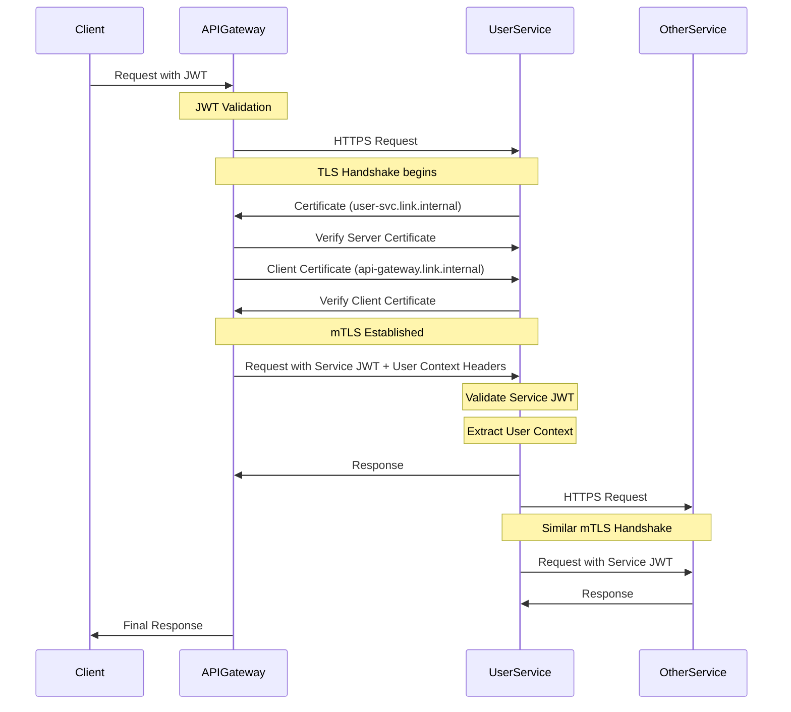
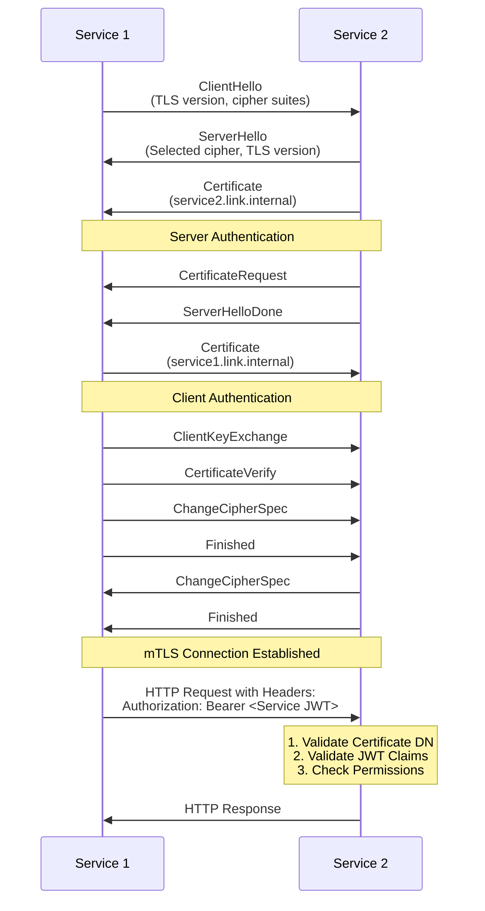

# mTLS-based Inter-Service Security Architecture

## Executive Summary

This document outlines the mTLS (mutual TLS) implementation architecture for securing service-to-service communication within the Link microservices platform. The design addresses critical security vulnerabilities identified in the [security gap analysis](gap-analysis.md), specifically:

1. Packet sniffing of unencrypted HTTP traffic
2. Service impersonation due to lack of mutual authentication
3. Man-in-the-middle (MITM) attacks within the container network
4. Header spoofing attacks that bypass authentication

By implementing mTLS, all service-to-service communications will be encrypted and mutually authenticated, ensuring that only authorized services can communicate with each other.

## Architecture Components

### 1. Certificate Authority (CA) Infrastructure

#### Option A: CFSSL (CloudFlare's SSL toolkit)

We will implement an internal PKI using CFSSL as our primary solution for the following reasons:

- **Lightweight**: Simple, purpose-built for PKI operations
- **Container-friendly**: Easy to deploy in Kubernetes/Docker
- **API-driven**: Offers REST API for certificate operations
- **Go-based**: Aligns with our primary development language
- **JSON-based configuration**: Simple to automate

**CFSSL Deployment**:
```yaml
cfssl:
  image: cfssl/cfssl:1.6.1
  command: ["serve", "-ca=ca.pem", "-ca-key=ca-key.pem", "-config=config.json", "-port=8888"]
  volumes:
    - ./cfssl-config:/etc/cfssl
    - cfssl-data:/var/lib/cfssl
  ports:
    - "8888:8888"  # Only exposed within internal network
  healthcheck:
    test: ["CMD", "curl", "-f", "http://localhost:8888/api/v1/cfssl/health"]
```

#### Option B: HashiCorp Vault (Alternative)

For future scaling or complex environments, HashiCorp Vault offers additional capabilities:

- **Comprehensive secrets management**: Beyond just PKI
- **Advanced access control**: Fine-grained policies
- **Secret rotation**: Built-in rotation mechanisms
- **Enterprise features**: HSM support, DR replication

**Vault PKI Setup**:
```hcl
# Example Vault PKI configuration
path "pki/root/generate/internal" {
  capabilities = ["update"]
}

path "pki/roles/service-cert" {
  capabilities = ["create", "update"]
}

path "pki/issue/service-cert" {
  capabilities = ["create", "update"]
}
```

### 2. Certificate Distribution

Certificate distribution will follow a **volume-based approach** for the initial proof-of-concept:

- **Central volume mount**: `/etc/link-certs` as the standardized path
- **Service-specific directories**: `/etc/link-certs/{service-name}/`
- **File structure**:
  - `/etc/link-certs/ca.pem` (CA public certificate)
  - `/etc/link-certs/{service-name}/cert.pem` (Service certificate)
  - `/etc/link-certs/{service-name}/key.pem` (Service private key)

**Docker Compose Configuration**:
```yaml
services:
  user-svc:
    # ... existing configuration ...
    volumes:
      - link-certs:/etc/link-certs
  
  search-svc:
    # ... existing configuration ...
    volumes:
      - link-certs:/etc/link-certs
  
  # Volume definition
volumes:
  link-certs:
    driver: local
    driver_opts:
      type: none
      device: ./certs
      o: bind
```

### 3. Certificate Architecture

We will implement a SPIFFE-like identity model for service certificates:

#### Naming Convention

- **Subject Common Name (CN)**: `{service-name}.link.internal`
- **Subject Alternative Names (SANs)**:
  - DNS: `{service-name}.link.internal`
  - DNS: `{service-name}`
  - DNS: `{service-name}.link.local`
  - URI: `spiffe://link.internal/service/{service-name}`

#### Example Certificate Structure

```
Certificate:
    Data:
        Version: 3 (0x2)
        Serial Number: 12345 (0x3039)
    Signature Algorithm: sha256WithRSAEncryption
    Issuer: C=US, O=Link Internal, CN=Link Service CA
    Validity:
        Not Before: Aug 13 12:00:00 2023 GMT
        Not After : Nov 13 12:00:00 2023 GMT  # 90-day validity
    Subject: C=US, O=Link Service, CN=user-svc.link.internal
    Subject Public Key Info:
        Public Key Algorithm: rsaEncryption
        RSA Public-Key: (2048 bit)
    X509v3 extensions:
        X509v3 Key Usage: Digital Signature, Key Encipherment
        X509v3 Extended Key Usage: TLS Web Server Authentication, TLS Web Client Authentication
        X509v3 Subject Alternative Name:
            DNS:user-svc.link.internal
            DNS:user-svc
            DNS:user-svc.link.local
            URI:spiffe://link.internal/service/user-svc
```

### 4. TLS Implementation Approach

For the proof-of-concept, we will implement **direct TLS termination in Go code** rather than a sidecar approach:

#### Direct TLS Termination (Selected Approach)

**Benefits**:
- **Reduced complexity**: No additional containers or proxies
- **Lower latency**: Direct TLS without proxy hops
- **Language-native**: Leverages Go's robust TLS support
- **Simplified deployment**: No additional infrastructure components

**Implementation**:
```go
// Example TLS Server configuration in Go
func createTLSConfig() *tls.Config {
    caCert, err := ioutil.ReadFile("/etc/link-certs/ca.pem")
    if err != nil {
        log.Fatalf("Failed to load CA certificate: %v", err)
    }
    
    caCertPool := x509.NewCertPool()
    caCertPool.AppendCertsFromPEM(caCert)
    
    cert, err := tls.LoadX509KeyPair(
        "/etc/link-certs/user-svc/cert.pem",
        "/etc/link-certs/user-svc/key.pem",
    )
    if err != nil {
        log.Fatalf("Failed to load service certificate: %v", err)
    }
    
    return &tls.Config{
        Certificates: []tls.Certificate{cert},
        ClientCAs:    caCertPool,
        ClientAuth:   tls.RequireAndVerifyClientCert,
        MinVersion:   tls.VersionTLS12,
        CipherSuites: []uint16{
            tls.TLS_ECDHE_ECDSA_WITH_AES_256_GCM_SHA384,
            tls.TLS_ECDHE_RSA_WITH_AES_256_GCM_SHA384,
            tls.TLS_ECDHE_ECDSA_WITH_CHACHA20_POLY1305,
            tls.TLS_ECDHE_RSA_WITH_CHACHA20_POLY1305,
        },
    }
}
```

#### Sidecar Approach (Alternative)

While not selected for the initial implementation, a sidecar proxy approach offers benefits for future consideration:

**Benefits**:
- **Language agnostic**: Works with any service language
- **Transparent**: No code changes needed in services
- **Advanced features**: Built-in retry, circuit breaking
- **Unified management**: Centralized control plane

**Downsides**:
- **Added complexity**: Additional container per service
- **Resource overhead**: Memory and CPU for proxy
- **Potential latency**: Additional network hop

### 5. Certificate Rotation & Revocation Strategy

We will implement short-lived certificates with automated rotation:

#### Certificate Lifecycle

- **Certificate validity**: 90 days (configurable)
- **Rotation frequency**: Every 30 days (1/3 of validity period)
- **Renewal threshold**: When 2/3 of validity period has elapsed
- **Revocation mechanism**: CRL publication and distribution

#### Automated Rotation Process

1. **Certificate generation**: Automated via CFSSL API
2. **Seamless rotation**: Hot reload without service disruption
3. **Validation**: Health checks ensure successful certificate replacement
4. **Metrics**: Expiration tracking and rotation success metrics

**Implementation**:
```go
// Certificate manager that handles rotation
type CertManager struct {
    certPath     string
    keyPath      string
    caCertPath   string
    renewBefore  time.Duration
    certLifetime time.Duration
    tlsConfig    *tls.Config
    lastRotation time.Time
}

func (cm *CertManager) StartRotationCheck() {
    ticker := time.NewTicker(24 * time.Hour) // Check daily
    go func() {
        for {
            select {
            case <-ticker.C:
                if cm.shouldRotateCertificate() {
                    if err := cm.rotateCertificates(); err != nil {
                        log.Printf("Certificate rotation failed: %v", err)
                    } else {
                        cm.lastRotation = time.Now()
                        log.Println("Certificate successfully rotated")
                    }
                }
            }
        }
    }()
}
```

#### Revocation Strategy

- **CRL Generation**: Updated Certificate Revocation List
- **CRL Distribution**: Via centralized endpoint
- **Regular Updates**: CRL refreshed hourly
- **Monitoring**: Automated alerts for CRL failures

## Security Enhancement: JWT + mTLS Integration

The service-to-service authentication approach will combine mTLS with JWT tokens:

### Multi-Layer Authentication

1. **Transport Layer (mTLS)**: Certificate-based mutual authentication
2. **Application Layer (JWT)**: Claims-based authorization
3. **Time Constraint**: Short-lived service tokens

### JWT Service Token Architecture

```go
type ServiceClaims struct {
    ServiceID  string   `json:"service_id"`
    Issuer     string   `json:"iss"`
    Audience   string   `json:"aud"`
    Roles      []string `json:"roles"`
    Scope      string   `json:"scope"`
    Expiration int64    `json:"exp"`
    IssuedAt   int64    `json:"iat"`
}
```

## Implementation Sequence Diagram



## Complete TLS Handshake + JWT Flow



## Infrastructure Updates

### Docker Compose Changes

```yaml
services:
  cfssl:
    image: cfssl/cfssl:1.6.1
    volumes:
      - ./cfssl-config:/etc/cfssl
      - cfssl-data:/var/lib/cfssl
    ports:
      - "8888:8888"  # Internal only
    healthcheck:
      test: ["CMD", "curl", "-f", "http://localhost:8888/api/v1/cfssl/health"]
  
  cert-manager:
    build: ./cert-manager
    volumes:
      - link-certs:/etc/link-certs
    depends_on:
      cfssl:
        condition: service_healthy
    environment:
      CFSSL_URL: http://cfssl:8888
      CERT_VALIDITY_DAYS: 90
      ROTATION_THRESHOLD_DAYS: 30
  
  user-svc:
    # ... existing config ...
    volumes:
      - link-certs:/etc/link-certs
    environment:
      # ... existing environment variables ...
      TLS_ENABLED: "true"
      TLS_CERT_DIR: "/etc/link-certs/user-svc"
      TLS_CA_FILE: "/etc/link-certs/ca.pem"
  
  # Similar updates for other services

volumes:
  link-certs:
  cfssl-data:
```

### Kubernetes Adaptation (Future)

For future Kubernetes deployment, this architecture can be adapted using:

- **cert-manager**: For certificate issuance and rotation
- **Kubernetes secrets**: For certificate storage
- **Volume mounts**: For certificate distribution
- **Service mesh**: For advanced mTLS management (Istio/Linkerd)

## Migration Strategy

### Phase 1: Infrastructure Setup (Week 1)

1. Deploy CFSSL as internal CA
2. Create certificate generation/distribution service
3. Set up volume mounts for certificates
4. Generate initial certificates for all services

### Phase 2: Dual Protocol Support (Week 2)

1. Update services to support both HTTP and HTTPS
2. Implement mTLS in Go HTTP clients and servers
3. Add TLS configuration to services but keep HTTP available
4. Validate mTLS connections through logging and testing

### Phase 3: Full Migration (Week 3)

1. Shift to mTLS-only communication
2. Remove HTTP endpoints for inter-service communication
3. Implement certificate rotation automation
4. Add monitoring for certificate expiration and rotation

### Phase 4: Hardening (Week 4)

1. Implement certificate revocation checking
2. Add JWT service authentication on top of mTLS
3. Enable strict transport security policies
4. Perform security testing and validation

## Service Implementation Changes

### Go HTTP Client Wrapper

```go
// mTLS HTTP client wrapper
func NewSecureHTTPClient(serviceName string) (*http.Client, error) {
    caCert, err := ioutil.ReadFile("/etc/link-certs/ca.pem")
    if err != nil {
        return nil, fmt.Errorf("failed to read CA cert: %w", err)
    }
    
    caCertPool := x509.NewCertPool()
    caCertPool.AppendCertsFromPEM(caCert)
    
    cert, err := tls.LoadX509KeyPair(
        fmt.Sprintf("/etc/link-certs/%s/cert.pem", serviceName),
        fmt.Sprintf("/etc/link-certs/%s/key.pem", serviceName),
    )
    if err != nil {
        return nil, fmt.Errorf("failed to load service certificate: %w", err)
    }
    
    tlsConfig := &tls.Config{
        Certificates: []tls.Certificate{cert},
        RootCAs:      caCertPool,
        MinVersion:   tls.VersionTLS12,
    }
    
    transport := &http.Transport{
        TLSClientConfig:     tlsConfig,
        MaxIdleConns:        100,
        MaxIdleConnsPerHost: 10,
        IdleConnTimeout:     90 * time.Second,
    }
    
    return &http.Client{
        Transport: transport,
        Timeout:   30 * time.Second,
    }, nil
}
```

### Go HTTP Server Integration

```go
// mTLS Server setup
func startSecureServer(router http.Handler, serviceName string, port int) error {
    caCert, err := ioutil.ReadFile("/etc/link-certs/ca.pem")
    if err != nil {
        return fmt.Errorf("failed to read CA cert: %w", err)
    }
    
    caCertPool := x509.NewCertPool()
    caCertPool.AppendCertsFromPEM(caCert)
    
    cert, err := tls.LoadX509KeyPair(
        fmt.Sprintf("/etc/link-certs/%s/cert.pem", serviceName),
        fmt.Sprintf("/etc/link-certs/%s/key.pem", serviceName),
    )
    if err != nil {
        return fmt.Errorf("failed to load service certificate: %w", err)
    }
    
    tlsConfig := &tls.Config{
        Certificates: []tls.Certificate{cert},
        ClientCAs:    caCertPool,
        ClientAuth:   tls.RequireAndVerifyClientCert,
        MinVersion:   tls.VersionTLS12,
    }
    
    server := &http.Server{
        Addr:         fmt.Sprintf(":%d", port),
        Handler:      router,
        TLSConfig:    tlsConfig,
        ReadTimeout:  15 * time.Second,
        WriteTimeout: 15 * time.Second,
    }
    
    return server.ListenAndServeTLS("", "")
}
```

## API Gateway Updates

### mTLS Client for Downstream Services

```go
func setupSecureClients(services map[string]*ServiceConfig) error {
    for name, service := range services {
        secureClient, err := NewSecureHTTPClient("api-gateway")
        if err != nil {
            return fmt.Errorf("failed to create secure client for %s: %w", name, err)
        }
        
        // Update URL scheme from http to https
        serviceURL, err := url.Parse(service.URL)
        if err != nil {
            return fmt.Errorf("invalid service URL for %s: %w", name, err)
        }
        serviceURL.Scheme = "https"
        service.URL = serviceURL.String()
        
        // Set the secure client
        service.Client = secureClient
    }
    
    return nil
}
```

## Monitoring and Alerting

1. **Certificate expiration monitoring**:
   - Alert when certificates approach expiration (30/15/7/1 days)
   - Track successful/failed rotation attempts

2. **mTLS connection metrics**:
   - Connection establishment success/failure rates
   - Handshake duration
   - Certificate validation errors

3. **Security anomaly detection**:
   - Unexpected certificate validation failures
   - Certificate revocation checks
   - Unauthorized access attempts

## Security Testing

1. **Positive testing**:
   - Valid service-to-service communication
   - Certificate rotation without downtime
   - Performance impact assessment

2. **Negative testing**:
   - Expired certificate rejection
   - Revoked certificate rejection
   - Invalid certificate rejection
   - Wrong service name rejection

3. **Penetration testing scenarios**:
   - Attempt to bypass mTLS with self-signed certificates
   - Attempt to use valid certificate with incorrect service name
   - Attempt direct service access without certificates

## Conclusion

This mTLS-based service mesh architecture provides a robust security foundation for service-to-service communication. By implementing mutual TLS authentication with a centralized PKI, we address the critical security vulnerabilities identified in the gap analysis while maintaining a relatively simple deployment model that doesn't require a full service mesh implementation.

The design follows security best practices:
- Strong authentication through certificate-based mTLS
- Short-lived certificates to minimize compromise impact
- Automated certificate rotation for operational simplicity
- Defense in depth by combining mTLS with JWT authentication
- Standard certificate structure with SPIFFE-like identities
- Robust certificate revocation and monitoring

For the POC implementation, we'll use direct TLS termination in the Go services rather than sidecars, with CFSSL as the certificate authority. This approach provides the best balance of security, simplicity, and performance for our current architecture.
