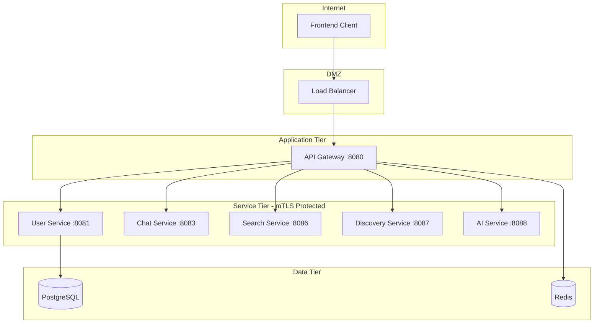

# Security Architecture Overview

This document provides a comprehensive overview of the security architecture and implementation for the Link social platform.

## 🛡️ Security Architecture

### Security Layers
1. **Network Security**: mTLS, network policies, ingress protection
2. **Identity & Access Management**: JWT authentication, RBAC authorization
3. **Data Protection**: Database isolation, encryption at rest/transit
4. **Application Security**: Input validation, secure coding practices
5. **Infrastructure Security**: Container security, secret management

### Trust Boundaries


## 🔐 Authentication & Authorization

### Authentication Flow
1. **User Registration/Login**: Frontend sends credentials to API Gateway
2. **Credential Validation**: API Gateway forwards to User Service
3. **JWT Generation**: User Service validates and returns JWT
4. **Token Storage**: API Gateway sets secure HTTP-only cookie
5. **Request Authentication**: API Gateway validates JWT on subsequent requests
6. **Service Context**: API Gateway adds user context headers for downstream services

### JWT Implementation
- **Algorithm**: HMAC-SHA256
- **Access Token TTL**: 1 hour
- **Refresh Token TTL**: 30 days
- **Storage**: Secure HTTP-only cookies
- **Validation**: Per-request at API Gateway

### Service Authentication
- **Service-to-Service**: mTLS certificates managed by Linkerd
- **Internal Endpoints**: Separate JWT secret for service authentication
- **Public Endpoints**: Health and metrics endpoints exempt from authentication

## 🏗️ Database Security

### Database Isolation
Each service has its own isolated database:
- `link_users`: User management and authentication
- `link_chat`: Chat messages and conversations
- `link_discovery`: User discovery and matching
- `link_search`: Search indexes and embeddings
- `link_ai`: AI conversation summaries

### Database Security Features
- **SSL/TLS Encryption**: All database connections encrypted
- **Unique Credentials**: 32-character unique passwords per service
- **Connection Pooling**: PgBouncer with connection limits
- **Network Isolation**: Database accessible only from application tier

## 🌐 Network Security

### mTLS with Linkerd Service Mesh
- **Automatic mTLS**: All inter-service communication encrypted
- **Certificate Management**: Automatic certificate rotation
- **Traffic Policies**: Fine-grained traffic control
- **Observability**: Metrics on mTLS success rates

### Network Policies
```yaml
# Default deny all traffic
apiVersion: networking.k8s.io/v1
kind: NetworkPolicy
metadata:
  name: default-deny
spec:
  podSelector: {}
  policyTypes:
  - Ingress
  - Egress
```

### Ingress Security
- **Rate Limiting**: Configurable per-endpoint rate limits
- **Security Headers**: HSTS, CSP, X-Frame-Options
- **DDoS Protection**: Cloud provider DDoS protection
- **TLS Termination**: TLS 1.3 with strong cipher suites

## 🔑 Secret Management

### Environment-Based Secret Strategy

#### Local Development
- `.env.local` files for development secrets
- LocalStack for AWS service simulation
- Weak passwords acceptable for local dev

#### Development/Staging
- Kubernetes secrets with development-grade values
- AWS Secrets Manager with dev keys
- Moderate security settings

#### Production
- External Secrets Operator with AWS Secrets Manager
- Production-grade secrets with high entropy
- Strict security policies

### Secret Types
- **Database Credentials**: Per-service database passwords
- **JWT Secrets**: Separate secrets for user and service tokens
- **Encryption Keys**: KMS keys for data encryption
- **API Keys**: Third-party service credentials (OpenAI, etc.)
- **TLS Certificates**: Service mesh and ingress certificates

## 🛡️ Container Security

### Pod Security Standards
```yaml
apiVersion: v1
kind: PodSecurityPolicy
metadata:
  name: restricted
spec:
  privileged: false
  allowPrivilegeEscalation: false
  requiredDropCapabilities:
    - ALL
  runAsNonRoot: true
  runAsUser:
    rule: 'MustRunAsNonRoot'
  seLinux:
    rule: 'RunAsAny'
  fsGroup:
    rule: 'RunAsAny'
```

### Container Hardening
- **Non-root User**: All containers run as non-root
- **Read-only Root Filesystem**: Filesystem mounted read-only where possible
- **Minimal Base Images**: Alpine or distroless base images
- **No Unnecessary Capabilities**: All Linux capabilities dropped

## 🔍 Security Monitoring & Auditing

### Security Metrics
- **Authentication Failures**: Failed login attempts and invalid tokens
- **Authorization Violations**: Attempts to access unauthorized resources  
- **mTLS Status**: Service mesh security health
- **Certificate Expiry**: Monitoring certificate rotation

### Audit Logging
- **Authentication Events**: Login, logout, token refresh
- **Authorization Decisions**: Access grants and denials
- **Data Access**: Sensitive data access patterns
- **Configuration Changes**: Security policy modifications

### Security Alerts
```yaml
# Critical security alerts
- AuthenticationFailures: >100 failures in 5 minutes
- UnauthorizedAccess: Any 401/403 responses to sensitive endpoints
- mTLSFailure: mTLS connection failures >5%
- CertificateExpiry: Certificates expiring within 7 days
```

## 🚨 Threat Model & Mitigations

### Identified Threats & Mitigations

#### 1. Authentication Bypass
- **Threat**: Attackers bypassing authentication mechanisms
- **Mitigation**: Mandatory authentication on all non-public endpoints
- **Controls**: JWT validation, secure token storage, token expiration

#### 2. Man-in-the-Middle Attacks
- **Threat**: Interception of service-to-service communication
- **Mitigation**: mTLS for all inter-service communication
- **Controls**: Automatic certificate rotation, encrypted connections

#### 3. Database Attacks
- **Threat**: SQL injection, unauthorized data access
- **Mitigation**: Database isolation, parameterized queries, connection pooling
- **Controls**: Service-specific databases, SSL connections, credential rotation

#### 4. Token Theft/Replay
- **Threat**: Stolen JWT tokens used by attackers
- **Mitigation**: Short token lifetimes, secure storage, refresh token rotation
- **Controls**: HTTP-only cookies, token expiration, refresh mechanisms

#### 5. Privilege Escalation
- **Threat**: Services gaining unauthorized access to other services
- **Mitigation**: RBAC policies, service authentication, network policies
- **Controls**: Least privilege access, service isolation, audit logging

## 🔧 Security Configuration

### Environment Security Levels

#### Development
```yaml
security:
  authentication:
    enabled: true
    debug: true
  encryption:
    level: "basic"
  monitoring:
    level: "verbose"
```

#### Production
```yaml
security:
  authentication:
    enabled: true
    debug: false
  encryption:
    level: "strict"
  monitoring:
    level: "essential"
```

## 🧪 Security Testing

### Automated Security Testing
- **Static Code Analysis**: Security linting and vulnerability scanning
- **Dependency Scanning**: Known vulnerability detection in dependencies
- **Container Scanning**: Image vulnerability assessments
- **Dynamic Testing**: Runtime security testing

### Security Test Categories
- **Authentication Testing**: Token validation, bypass attempts
- **Authorization Testing**: Access control verification
- **Input Validation**: Injection attack prevention
- **Network Security**: mTLS validation, network policy testing

## 📚 Security Best Practices

### Development Guidelines
- **Secure by Default**: Security controls enabled by default
- **Principle of Least Privilege**: Minimal required permissions
- **Defense in Depth**: Multiple security layers
- **Regular Updates**: Keep dependencies and images updated

### Operational Guidelines
- **Secret Rotation**: Regular rotation of credentials and keys
- **Security Monitoring**: Continuous monitoring of security metrics
- **Incident Response**: Defined procedures for security incidents
- **Regular Audits**: Periodic security assessments and penetration testing

## 📞 Security Contacts

### Security Team
- **Security Lead**: security-lead@linkapp.com
- **Security Engineer**: security-engineer@linkapp.com
- **Security Incident**: security-incident@linkapp.com (24/7)

### Escalation Procedures
1. **Low Severity**: Create ticket in security backlog
2. **Medium Severity**: Notify security team within 4 hours
3. **High Severity**: Immediate notification to security lead
4. **Critical Severity**: Activate incident response team immediately

For detailed implementation guides, see:
- [Authentication Implementation](authentication.md)
- [Database Security Setup](database.md)
- [mTLS Configuration](mtls.md)
- [Security Testing Procedures](testing.md)