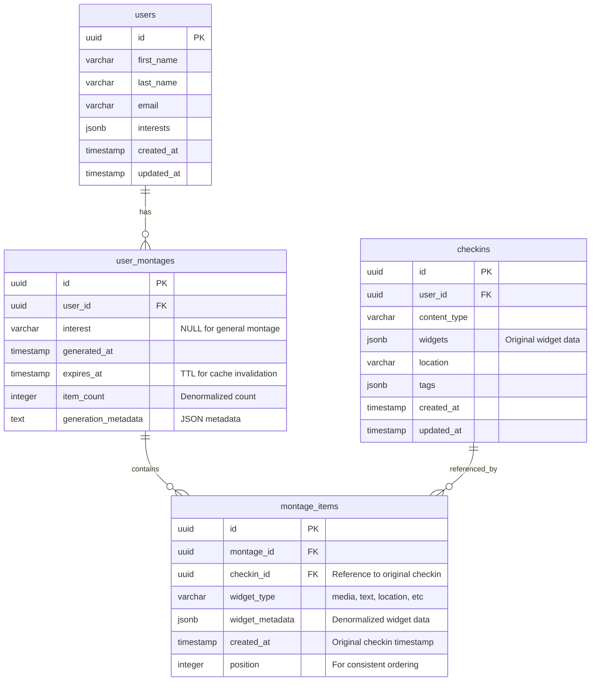
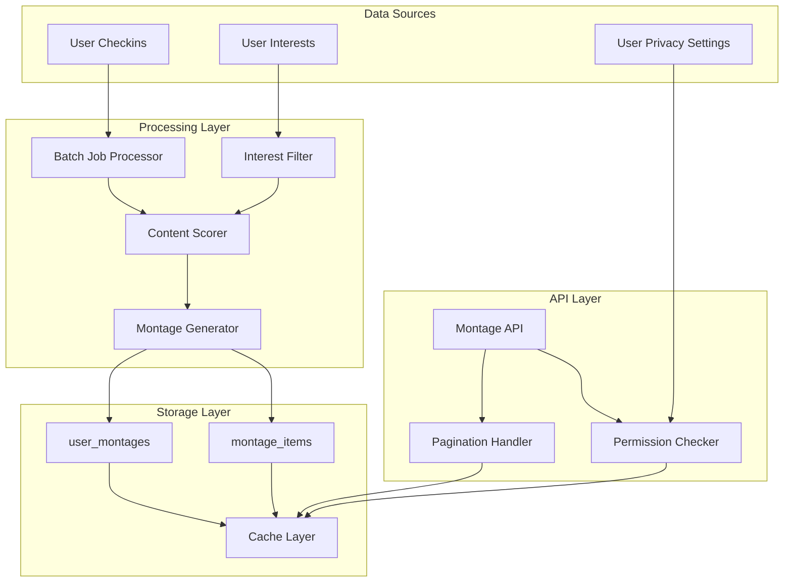
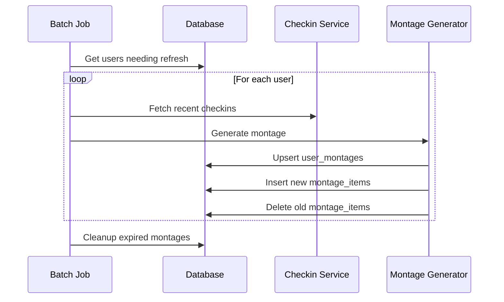
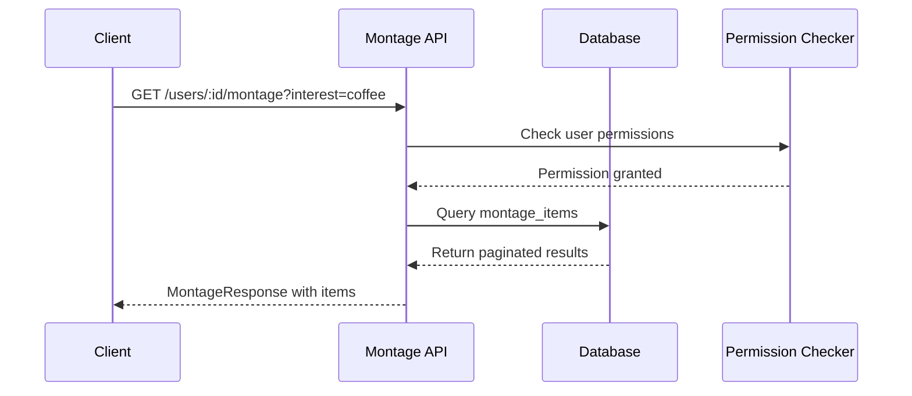

# Montage Feature - Entity Relationship Diagram

## Database Schema Overview

The montage feature uses a denormalized approach for optimal read performance while maintaining data integrity.

## ER Diagram



## Table Relationships

### Primary Relationships

1. **users → user_montages** (1:N)
   - One user can have multiple montages (general + interest-specific)
   - Cascade delete: When user is deleted, all their montages are deleted

2. **user_montages → montage_items** (1:N)
   - One montage contains multiple items
   - Cascade delete: When montage is deleted, all items are deleted

3. **checkins → montage_items** (1:N)
   - One checkin can appear in multiple montages (general + various interests)
   - No cascade: Montage items are regenerated, not dependent on checkin lifecycle

### Constraints and Indexes

#### user_montages
```sql
-- Unique constraint: one montage per user per interest
UNIQUE(user_id, interest)

-- Indexes for efficient queries
INDEX idx_user_montages_user_id (user_id)
INDEX idx_user_montages_expires (expires_at)
INDEX idx_user_montages_interest (user_id, interest)
```

#### montage_items
```sql
-- Indexes for efficient queries
INDEX idx_montage_items_montage_id (montage_id)
INDEX idx_montage_items_position (montage_id, position)
INDEX idx_montage_items_checkin (checkin_id)
```

## Data Flow Architecture



## Storage Strategy

### Denormalization Benefits

1. **Fast Reads**: Pre-computed montage items for instant API responses
2. **Reduced Joins**: All necessary data stored in montage_items table
3. **Consistent Ordering**: Position field ensures stable sort order
4. **Cache-Friendly**: TTL-based expiration with expires_at timestamp

### Trade-offs

1. **Storage Overhead**: Duplicated widget metadata across tables
2. **Consistency**: Manual synchronization when checkin data changes
3. **Complexity**: Batch job required for data freshness

### Cache Invalidation Strategy

```sql
-- Automatic cleanup of expired montages
DELETE FROM user_montages 
WHERE expires_at < NOW();

-- Cascade delete automatically removes montage_items
-- due to foreign key constraint with ON DELETE CASCADE
```

## Scalability Considerations

### Partitioning Strategy (Future)

```sql
-- Partition user_montages by user_id hash for horizontal scaling
CREATE TABLE user_montages (
    -- ... columns ...
) PARTITION BY HASH (user_id);

-- Create partitions
CREATE TABLE user_montages_p0 PARTITION OF user_montages
    FOR VALUES WITH (modulus 4, remainder 0);
CREATE TABLE user_montages_p1 PARTITION OF user_montages
    FOR VALUES WITH (modulus 4, remainder 1);
-- ... etc
```

### Read Replicas

- Primary database: Write operations (batch jobs, regeneration)
- Read replicas: API queries, user-facing operations
- Eventually consistent: Acceptable for montage use case

## Data Lifecycle

### Batch Processing Flow



### API Request Flow



## Performance Optimization

### Query Patterns

#### Fetch User Montage (Most Common)
```sql
-- Optimized query for API requests
SELECT mi.*, um.generated_at
FROM montage_items mi
JOIN user_montages um ON mi.montage_id = um.id
WHERE um.user_id = $1 
  AND (um.interest = $2 OR um.interest IS NULL AND $2 IS NULL)
  AND um.expires_at > NOW()
ORDER BY mi.position
LIMIT $3 OFFSET $4;
```

#### Check Cache Status
```sql
-- Fast cache validation
SELECT id, expires_at, item_count
FROM user_montages 
WHERE user_id = $1 AND interest = $2
  AND expires_at > NOW();
```

### Database Tuning

1. **Connection Pooling**: Manage database connections efficiently
2. **Query Caching**: Cache frequent query results
3. **Materialized Views**: Pre-compute complex aggregations
4. **Vacuum Strategy**: Regular maintenance for optimal performance

## Security Considerations

### Data Privacy

1. **User Consent**: Montage generation respects privacy settings
2. **Friend Visibility**: Only visible content included in montages
3. **Data Retention**: Automatic cleanup of expired montages
4. **Access Control**: Permission checks on every API request

### SQL Injection Prevention

```sql
-- All queries use parameterized statements
-- Example: Safe query parameter binding
SELECT * FROM montage_items 
WHERE montage_id = $1 AND position >= $2
ORDER BY position LIMIT $3;
```

## Monitoring and Alerting

### Key Metrics

1. **Storage Growth**: Monitor table sizes and partition efficiency
2. **Cache Hit Rate**: Track expires_at vs actual query patterns
3. **Query Performance**: Monitor slow query log
4. **Batch Job Health**: Success rate and processing time

### Database Health Queries

```sql
-- Table size monitoring
SELECT 
    schemaname,
    tablename,
    pg_size_pretty(pg_total_relation_size(schemaname||'.'||tablename)) as size
FROM pg_tables 
WHERE tablename LIKE 'montage_%';

-- Index usage statistics
SELECT 
    schemaname, 
    tablename, 
    attname, 
    n_distinct, 
    correlation 
FROM pg_stats 
WHERE tablename IN ('user_montages', 'montage_items');
```

## Backup and Recovery

### Backup Strategy

1. **Daily Full Backup**: Complete database backup
2. **Continuous WAL Archive**: Point-in-time recovery capability
3. **Cross-Region Replication**: Disaster recovery preparation

### Recovery Procedures

1. **Data Corruption**: Restore from backup and regenerate montages
2. **Partial Loss**: Use batch job to regenerate missing montages
3. **Schema Changes**: Migration scripts with rollback capability

This ER diagram and documentation provides a comprehensive view of the montage feature's data architecture, ensuring scalable and maintainable storage while optimizing for read performance.
