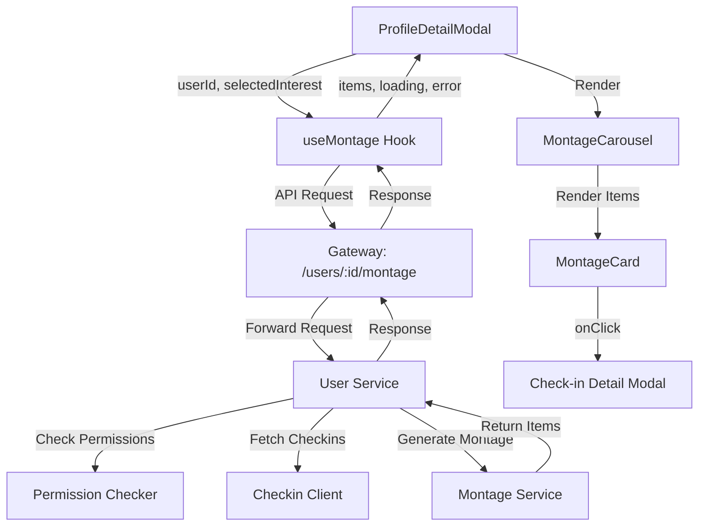
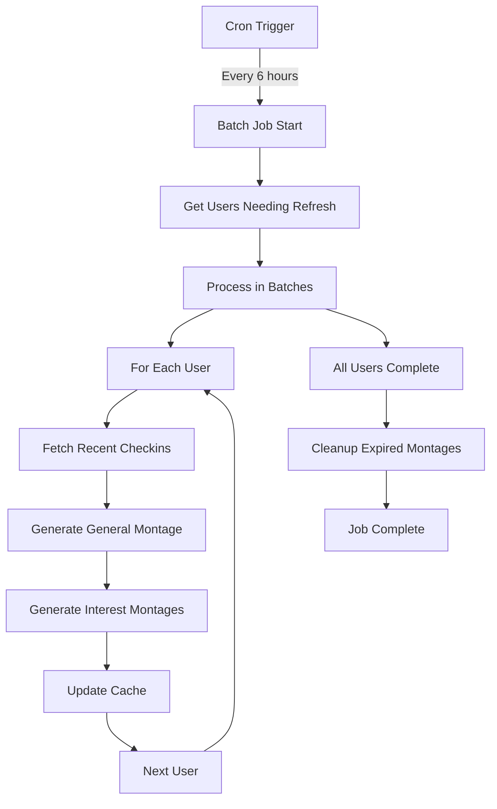

# Montage Feature Documentation

## Overview

The Montage feature provides users with curated collections of their check-in content, organized by interests and displayed in an engaging carousel format. It combines AI-powered content curation with a smooth, accessible user interface.

## Architecture

### Frontend Components

#### 1. `useMontage` Hook
**Location**: `src/hooks/useMontage.ts`

A powerful SWR-based hook for fetching and managing montage data with cursor-based pagination.

**Features**:
- Cursor-based pagination with infinite scroll
- Automatic caching and revalidation
- Interest-based filtering
- Error handling with user-friendly messages
- Loading states for initial load and pagination
- Regeneration and deletion operations

**Usage**:
```typescript
const {
  items,           // Array of MontageItem[]
  hasMore,         // boolean - more items available
  isLoading,       // boolean - initial loading state
  isLoadingMore,   // boolean - loading more items
  error,           // string | null - error message
  isPermissionError, // boolean - permission denied
  loadMore,        // () => Promise<void>
  refresh,         // () => Promise<void>
  regenerate,      // (interest?: string) => Promise<void>
  remove,          // (interest?: string) => Promise<void>
  isRegenerating,  // boolean
  isDeleting,      // boolean
} = useMontage(userId, selectedInterest, {
  initialPageSize: 20,
  errorRetryCount: 3,
  revalidateOnFocus: true,
});
```

#### 2. `MontageCard` Component
**Location**: `src/components/MontageCard.tsx`

Individual montage item display component with rich media support.

**Features**:
- Media thumbnail with lazy loading
- Video play indicators and duration display
- Tag chips with overflow handling (shows first 2, then +N)
- Time ago formatting (5m, 2h, 3d, 1w, 2mo, 1y)
- Location display
- Fallback thumbnails for non-media content
- Full keyboard navigation support
- Click handlers for opening check-in details

**Props**:
```typescript
interface MontageCardProps {
  item: MontageItem;
  onItemClick: (checkinId: string) => void;
  className?: string;
}
```

#### 3. `MontageCarousel` Component
**Location**: `src/components/MontageCarousel.tsx`

Horizontal scrolling carousel with smooth animations and accessibility features.

**Features**:
- Framer Motion animations with staggered entry
- Smooth horizontal scrolling with snap behavior
- Navigation arrows (show/hide based on scroll position)
- Keyboard arrow key navigation
- Infinite scroll with intersection observer
- Loading skeleton during initial load
- Error state with retry functionality
- Empty state for no content
- Loading more indicators
- Scroll position indicators
- Full ARIA compliance

**Props**:
```typescript
interface MontageCarouselProps {
  items: MontageItem[];
  onItemClick: (checkinId: string) => void;
  isLoading?: boolean;
  hasError?: boolean;
  errorMessage?: string;
  className?: string;
  onLoadMore?: () => void;
  hasMore?: boolean;
  isLoadingMore?: boolean;
}
```

#### 4. ProfileDetailModal Integration

The montage feature is seamlessly integrated into the existing ProfileDetailModal component.

**Features**:
- Toggle pills for "All" and top 5 user interests
- Dynamic filtering based on selected interest
- Independent loading states (doesn't interfere with profile loading)
- Error handling specific to montage data
- Responsive design within modal constraints

### Backend Integration

#### API Endpoints

**Base URL**: `/users/:userId/montage`

**GET `/users/:userId/montage`**
- Fetch user's montage items
- Supports cursor-based pagination
- Optional interest filtering
- Returns paginated MontageResponse

**Query Parameters**:
```
?interest=coffee        # Filter by specific interest
?cursor=eyJpZCI6...    # Pagination cursor
?limit=20              # Page size (optional)
```

**POST `/users/:userId/montage/regenerate`**
- Trigger montage regeneration
- Optional interest-specific regeneration
- Async operation with immediate response

**DELETE `/users/:userId/montage`**
- Delete user's montage
- Optional interest-specific deletion
- Immediate response

#### Request/Response Formats

**MontageResponse**:
```typescript
{
  type: "general" | "interest-based";
  items: MontageItem[];
  metadata: {
    total_count: number;
    page_size: number;
    generated_at: string; // ISO timestamp
    next_cursor?: string;
    has_more: boolean;
  };
  user_id: string;
  interest?: string; // Present for interest-based montages
}
```

**MontageItem**:
```typescript
{
  checkin_id: string;
  widget_type: "media" | "text" | "location" | "activity" | "mood";
  widget_metadata: {
    media_url?: string;
    media_type?: "image" | "video";
    thumbnail_url?: string;
    duration?: number; // For videos, in seconds
    tags?: string[];
    description?: string;
    location?: string;
    timestamp?: string; // ISO timestamp
    [key: string]: unknown; // Extensible for future metadata
  };
  created_at: string; // ISO timestamp
}
```

#### Error Responses

**Permission Denied (403)**:
```json
{
  "error": "permission_denied",
  "message": "You don't have permission to view this user's montage",
  "code": "MONTAGE_PERMISSION_DENIED"
}
```

**User Not Found (404)**:
```json
{
  "error": "not_found", 
  "message": "User not found",
  "code": "USER_NOT_FOUND"
}
```

**No Content Available (404)**:
```json
{
  "error": "no_montage_content",
  "message": "No montage content available for this user",
  "code": "MONTAGE_NO_CONTENT"
}
```

### Data Flow



## User Experience

### Loading States

1. **Initial Loading**: Shows skeleton cards with shimmer animation
2. **Loading More**: Shows spinning indicator at end of carousel
3. **Error State**: Shows error message with retry option
4. **Empty State**: Shows friendly message with camera emoji

### Interactions

1. **Interest Filtering**: Toggle pills at top of montage section
2. **Horizontal Scrolling**: Mouse drag, touch swipe, or arrow keys
3. **Item Selection**: Click/tap any montage card to view check-in details
4. **Infinite Scroll**: Automatically loads more as user scrolls
5. **Navigation Arrows**: Appear when content overflows container

### Accessibility Features

- **Keyboard Navigation**: Full arrow key support for carousel
- **Screen Reader Support**: Proper ARIA labels and roles
- **Focus Management**: Clear focus indicators and logical tab order
- **High Contrast**: WCAG AA compliant color ratios
- **Reduced Motion**: Respects user's motion preferences

## Backend Architecture

### Services

#### 1. Montage Service
**Location**: Backend montage domain

**Responsibilities**:
- Generate montage from user's check-ins
- Apply interest-based filtering
- Handle pagination logic
- Cache generated montages
- Manage regeneration and deletion

#### 2. Checkin Client Interface
**Purpose**: Fetch user's check-in data from checkin service

**Methods**:
- `GetUserCheckins(userID, filters) []CheckinData`
- Handles service-to-service communication
- Applies permission filtering

#### 3. Permission Checker
**Purpose**: Validate user access to montage content

**Validations**:
- User exists and is not blocked
- Privacy settings allow montage viewing
- Friend relationship requirements
- Content visibility permissions

### Database Schema

```sql
-- Montage metadata table
CREATE TABLE user_montages (
    id UUID PRIMARY KEY DEFAULT gen_random_uuid(),
    user_id UUID NOT NULL REFERENCES users(id),
    interest VARCHAR(100), -- NULL for general montage
    generated_at TIMESTAMP NOT NULL DEFAULT NOW(),
    expires_at TIMESTAMP NOT NULL DEFAULT NOW() + INTERVAL '24 hours',
    item_count INTEGER NOT NULL DEFAULT 0,
    
    UNIQUE(user_id, interest),
    INDEX idx_user_montages_user_id (user_id),
    INDEX idx_user_montages_expires (expires_at)
);

-- Montage items (denormalized for performance)
CREATE TABLE montage_items (
    id UUID PRIMARY KEY DEFAULT gen_random_uuid(),
    montage_id UUID NOT NULL REFERENCES user_montages(id) ON DELETE CASCADE,
    checkin_id UUID NOT NULL,
    widget_type VARCHAR(20) NOT NULL,
    widget_metadata JSONB NOT NULL,
    created_at TIMESTAMP NOT NULL,
    position INTEGER NOT NULL, -- For ordering
    
    INDEX idx_montage_items_montage_id (montage_id),
    INDEX idx_montage_items_position (montage_id, position)
);
```

### Batch Job Configuration

#### Environment Variables

**Required**:
- `MONTAGE_BATCH_CRON` - Cron schedule for montage generation (default: "0 */6 * * *" - every 6 hours)
- `MONTAGE_BATCH_ENABLED` - Enable/disable batch job (default: true)
- `MONTAGE_CACHE_TTL` - Cache TTL in hours (default: 24)

**Optional**:
- `MONTAGE_BATCH_BATCH_SIZE` - Number of users per batch (default: 100)
- `MONTAGE_BATCH_MAX_RETRIES` - Max retry attempts (default: 3)
- `MONTAGE_BATCH_TIMEOUT` - Timeout per user in seconds (default: 30)

#### Batch Job Flow



## Testing

### Unit Tests

#### Frontend Tests
**Location**: `src/components/__tests__/`

- `MontageCard.test.tsx` - Component rendering, interactions, accessibility
- `MontageCarousel.test.tsx` - Carousel behavior, navigation, loading states
- `useMontage.test.ts` - Hook functionality, caching, error handling

#### Backend Tests
**Location**: Backend test directories

- Repository tests for data access
- Service tests for business logic
- Handler tests for HTTP endpoints
- Integration tests for full flow

### Test Coverage Requirements

- **Frontend**: Minimum 80% line coverage
- **Backend**: Minimum 60% overall coverage
- **Critical Paths**: 100% coverage for authentication and permissions

### E2E Tests (Cypress)

```typescript
describe('Montage Feature', () => {
  it('displays user montage in profile modal', () => {
    cy.visit('/discovery');
    cy.get('[data-testid="user-card"]').first().click();
    cy.get('[data-testid="montage-carousel"]').should('be.visible');
    cy.get('[data-testid="montage-card"]').should('have.length.greaterThan', 0);
  });

  it('filters montage by interest', () => {
    cy.get('[data-testid="interest-pill-coffee"]').click();
    cy.get('[data-testid="montage-card"]').should('contain', 'coffee');
  });

  it('navigates carousel with keyboard', () => {
    cy.get('[data-testid="montage-carousel"]').focus();
    cy.get('[data-testid="montage-carousel"]').type('{rightarrow}');
    cy.get('[data-testid="montage-card"]').first().should('be.visible');
  });
});
```

## Performance Considerations

### Frontend Optimizations

1. **Image Lazy Loading**: Only load images when they enter viewport
2. **Virtual Scrolling**: For large datasets (future enhancement)
3. **SWR Caching**: Intelligent caching with revalidation strategies
4. **Intersection Observer**: Efficient infinite scroll implementation
5. **Staggered Animations**: Smooth entrance animations without blocking

### Backend Optimizations

1. **Denormalized Storage**: Pre-computed montage items for fast retrieval
2. **Cursor Pagination**: Efficient large dataset navigation
3. **Background Generation**: Async montage creation via batch jobs
4. **CDN Integration**: Cached thumbnail serving
5. **Database Indexing**: Optimized queries for user and interest lookups

## Monitoring and Analytics

### Metrics to Track

#### Frontend Metrics
- Carousel scroll depth and engagement time
- Interest filter usage patterns
- Error rates by error type
- Loading performance (LCP, FID)

#### Backend Metrics
- API response times (p50, p95, p99)
- Cache hit rates
- Batch job success rates
- Database query performance

### Error Monitoring

#### Frontend Errors
- Component render failures
- Image loading failures
- Network request failures
- Accessibility violations

#### Backend Errors
- Permission check failures
- Database connection issues
- Batch job failures
- Service communication errors

## Migration Guide

### For Existing Deployments

#### 1. Database Migration
```sql
-- Run migration scripts to create montage tables
-- See backend migration files for complete SQL

-- 1. Create montage metadata table
CREATE TABLE user_montages (...);

-- 2. Create montage items table  
CREATE TABLE montage_items (...);

-- 3. Create necessary indexes
CREATE INDEX idx_user_montages_user_id ON user_montages(user_id);
-- ... other indexes
```

#### 2. Environment Configuration
```bash
# Add to your environment configuration
MONTAGE_BATCH_CRON="0 */6 * * *"
MONTAGE_BATCH_ENABLED=true
MONTAGE_CACHE_TTL=24
```

#### 3. Service Registration
- Register montage routes in API Gateway
- Configure service-to-service communication
- Update authentication middleware for new endpoints

#### 4. Frontend Integration
- Import new components in ProfileDetailModal
- Add montage-specific error handling
- Test in staging environment

### Rollback Plan

#### Frontend Rollback
1. Remove montage imports from ProfileDetailModal
2. Hide montage section with feature flag
3. Deploy previous version if needed

#### Backend Rollback
1. Disable batch job with environment variable
2. Return 404 for montage endpoints
3. Maintain database tables for future re-enable

## Future Enhancements

### Planned Features

1. **Smart Notifications**: Notify users when new montage content is available
2. **Sharing**: Allow users to share montage items or entire montages
3. **Customization**: User preferences for montage generation frequency
4. **Analytics Dashboard**: Personal insights about content patterns
5. **AI Improvements**: Better content curation with user feedback

### Technical Improvements

1. **Virtual Scrolling**: Handle thousands of montage items efficiently
2. **Offline Support**: Cache montages for offline viewing
3. **Progressive Loading**: Load thumbnails first, full images on demand
4. **Real-time Updates**: WebSocket updates for new content
5. **Advanced Filters**: Date ranges, content types, engagement levels

## Support and Troubleshooting

### Common Issues

#### "No montage content available"
- **Cause**: User has insufficient check-ins or privacy restrictions
- **Solution**: Ensure user has recent check-ins with media content

#### Slow loading performance
- **Cause**: Large images or network issues
- **Solution**: Implement thumbnail optimization and CDN

#### Permission denied errors
- **Cause**: User blocking or privacy settings
- **Solution**: Check friend relationships and privacy configurations

### Debug Mode

Enable debug logging for development:
```typescript
// Frontend
const { items } = useMontage(userId, interest, {
  debug: true, // Logs API calls and cache operations
});
```

```bash
# Backend
LOG_LEVEL=debug # Enables detailed montage service logging
```

### Contact

For technical support or questions:
- **Frontend Issues**: Frontend team
- **Backend Issues**: Backend team
- **Design Questions**: Design team
- **Product Questions**: Product team
