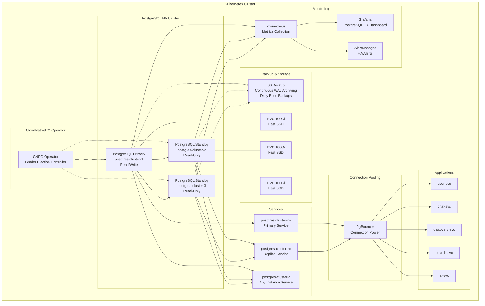

# CloudNativePG PostgreSQL High Availability

This directory contains the CloudNativePG implementation for PostgreSQL high availability with automatic leader election and failover.

## 🏗️ Architecture



## 📁 Files Overview

| File | Purpose | Dependencies |
|------|---------|-------------|
| `00-operator-install.yaml` | CloudNativePG operator installation | Kubernetes 1.25+ |
| `01-postgres-cluster.yaml` | PostgreSQL HA cluster with integrated S3 backup | Operator, StorageClass, S3 |
| `02-backup-configuration.yaml` | Scheduled backups, credentials, and verification | Main cluster, AWS credentials |
| `03-monitoring.yaml` | Prometheus monitoring and Grafana dashboards | Prometheus Operator |
| `README.md` | Architecture and operations documentation | - |

## 🚀 Quick Start

### 1. Prerequisites
```bash
# Verify Kubernetes cluster
kubectl get nodes
kubectl get storageclass fast-ssd

# Verify namespaces
kubectl create namespace cnpg-system --dry-run=client -o yaml | kubectl apply -f -
kubectl create namespace link-services --dry-run=client -o yaml | kubectl apply -f -

# Verify S3 access
aws s3 ls s3://link-app-backups-production/
```

### 2. Deploy in Order
```bash
# 1. Install operator (wait for ready)
kubectl apply -f 00-operator-install.yaml
kubectl wait --for=condition=Available deployment/cnpg-controller-manager -n cnpg-system --timeout=300s

# 2. Deploy PostgreSQL cluster (wait for primary)
kubectl apply -f 01-postgres-cluster.yaml
kubectl wait --for=condition=Ready cluster/postgres-cluster -n link-services --timeout=600s

# 3. Configure backups
kubectl apply -f 02-backup-configuration.yaml

# 4. Setup monitoring
kubectl apply -f 03-monitoring.yaml
```

### 3. Verify Installation
```bash
# Check cluster status
kubectl get cluster postgres-cluster -n link-services

# Verify primary instance
kubectl get cluster postgres-cluster -n link-services -o jsonpath='{.status.currentPrimary}'

# Test connectivity
kubectl exec -it postgres-cluster-1 -n link-services -- psql -U linkuser -d linkdb -c "SELECT version();"
```

## 🔧 Configuration

### Cluster Settings

| Parameter | Value | Description |
|-----------|--------|-------------|
| `instances` | 3 | Number of PostgreSQL instances |
| `primaryUpdateStrategy` | `unsupervised` | Automatic primary updates |
| `failoverDelay` | `30s` | Failover timeout |
| `switchoverDelay` | `15s` | Planned switchover timeout |

### PostgreSQL Configuration

| Parameter | Value | Purpose |
|-----------|--------|---------|
| `max_connections` | `200` | Connection limit |
| `shared_buffers` | `512MB` | Memory for data caching |
| `wal_level` | `replica` | Replication support |
| `synchronous_commit` | `on` | Data consistency |
| `synchronous_standby_names` | `FIRST 1 (*)` | Sync replication |

### Backup Configuration

| Parameter | Value | Description |
|-----------|--------|-------------|
| `retentionPolicy` | `30d` | Backup retention period |
| `schedule` | `0 2 * * *` | Daily backup at 2 AM UTC |
| `compression` | `gzip` | Backup compression |
| `encryption` | `AES256` | S3 server-side encryption |

## 🔍 Monitoring

### Key Metrics

#### Cluster Health
- `cnpg_pg_replication_is_replica == 0` - Primary instance count
- `up{job="postgres-cluster"}` - Instance availability
- `cnpg_clusters_total` - Total clusters managed

#### Replication Health  
- `cnpg_pg_stat_replication_flush_lag` - Replication lag in bytes
- `cnpg_pg_stat_replication_sent_lsn` - WAL sent to replicas
- `cnpg_pg_replication_in_recovery` - Instance in recovery mode

#### Performance
- `cnpg_pg_stat_database_numbackends` - Active connections
- `cnpg_pg_stat_database_tup_returned` - Rows returned by queries
- `rate(cnpg_pg_xlog_position_bytes[5m])` - WAL generation rate

#### Backup Health
- `cnpg_pg_backup_last_successful_timestamp` - Last successful backup
- `cnpg_pg_stat_archiver_archived_count` - Archived WAL files
- `cnpg_pg_stat_archiver_failed_count` - Failed WAL archives

### Alerts

#### Critical Alerts
- **PostgreSQLNoPrimary** - No primary instance (leader election failed)
- **PostgreSQLMultiplePrimaries** - Split-brain scenario detected
- **PostgreSQLInstanceDown** - Instance unavailable for >30s
- **PostgreSQLBackupFailed** - No successful backup in 24h

#### Warning Alerts
- **PostgreSQLReplicationLag** - Replication lag >16MB
- **PostgreSQLConnectionsHigh** - Connection usage >80%
- **PostgreSQLLongRunningQueries** - Queries running >1h

### Grafana Dashboard

The PostgreSQL HA dashboard provides:
- Cluster overview and instance roles
- Real-time replication lag monitoring
- Connection and performance metrics
- Backup status and WAL archiving health
- Alert status and historical trends

Access at: `http://grafana:3000/d/postgres-ha/postgresql-ha-cloudnativepg`

## 🔄 Operations

### Leader Election

CloudNativePG uses a distributed consensus algorithm for leader election:

1. **Automatic Election**: When cluster starts, instances negotiate to elect a primary
2. **Failure Detection**: Health checks detect primary failures within 10-15 seconds  
3. **Failover Process**: Operator promotes most up-to-date replica as new primary
4. **Client Redirection**: Service endpoints automatically route to new primary

### Manual Operations

#### Force Failover
```bash
# Delete current primary pod to trigger failover
kubectl delete pod $(kubectl get cluster postgres-cluster -n link-services -o jsonpath='{.status.currentPrimary}') -n link-services
```

#### Backup Operations
```bash
# Trigger manual backup
kubectl create -f - <<EOF
apiVersion: postgresql.cnpg.io/v1
kind: Backup
metadata:
  name: manual-backup-$(date +%Y%m%d-%H%M%S)
  namespace: link-services
spec:
  cluster:
    name: postgres-cluster
EOF

# List backups
kubectl get backups -n link-services
```

#### Scaling
```bash
# Scale to 5 instances (not recommended in production)
kubectl patch cluster postgres-cluster -n link-services --type='merge' -p='{"spec":{"instances":5}}'
```

#### Maintenance Mode
```bash
# Switch to supervised mode for maintenance
kubectl patch cluster postgres-cluster -n link-services --type='merge' -p='{"spec":{"primaryUpdateStrategy":"supervised"}}'

# Return to automatic mode
kubectl patch cluster postgres-cluster -n link-services --type='merge' -p='{"spec":{"primaryUpdateStrategy":"unsupervised"}}'
```

## 🚨 Troubleshooting

### Common Issues

#### Operator Not Starting
```bash
# Check operator logs
kubectl logs -n cnpg-system deployment/cnpg-controller-manager

# Verify RBAC permissions
kubectl auth can-i create clusters.postgresql.cnpg.io --as=system:serviceaccount:cnpg-system:cnpg-manager
```

#### Cluster Bootstrap Failure
```bash
# Check cluster events
kubectl describe cluster postgres-cluster -n link-services

# Check pod logs
kubectl logs postgres-cluster-1 -n link-services -c postgres
```

#### Backup Failures
```bash
# Check backup status
kubectl describe backup -n link-services

# Verify S3 credentials
kubectl get secret backup-credentials -n link-services -o yaml

# Test S3 connectivity
kubectl run aws-test --rm -it --image=amazon/aws-cli -- aws s3 ls s3://link-app-backups-production/
```

#### Replication Lag
```bash
# Check replication status
kubectl exec postgres-cluster-1 -n link-services -- psql -U linkuser -d linkdb -c "SELECT * FROM pg_stat_replication;"

# Check network connectivity between instances
kubectl exec postgres-cluster-1 -n link-services -- ping postgres-cluster-2.postgres-cluster.link-services.svc.cluster.local
```

### Recovery Procedures

#### Restore from Backup
```bash
kubectl apply -f - <<EOF
apiVersion: postgresql.cnpg.io/v1
kind: Cluster
metadata:
  name: postgres-cluster-restored
  namespace: link-services
spec:
  instances: 3
  bootstrap:
    recovery:
      backup:
        name: postgres-cluster-daily-backup-20240315
      recoveryTargetTime: "2024-03-15 14:30:00"
EOF
```

#### Split-Brain Recovery
```bash
# Identify and stop duplicate primaries
kubectl get pods -n link-services -l postgresql.cnpg.io/instanceRole=primary

# Manually set single primary
kubectl patch cluster postgres-cluster -n link-services --type='merge' -p='{"spec":{"primaryUpdateStrategy":"supervised"}}'
```

## 🔒 Security

### Network Security
- All connections use TLS encryption
- Pod-to-pod communication encrypted via Linkerd service mesh
- Network policies restrict access to PostgreSQL ports

### Authentication
- SCRAM-SHA-256 password encryption
- Service-specific database users
- Least privilege access patterns

### Storage Security
- Encrypted EBS volumes (gp3 with encryption)
- S3 server-side encryption (AES256)
- WAL files encrypted during archiving

## 📚 Resources

- [CloudNativePG Official Documentation](https://cloudnative-pg.io/)
- [PostgreSQL High Availability](https://www.postgresql.org/docs/current/high-availability.html)
- [Kubernetes Operator Pattern](https://kubernetes.io/docs/concepts/extend-kubernetes/operator/)
- [Link App Architecture Documentation](../docs/architecture.md)

## 🆘 Support

For issues with this CloudNativePG implementation:

1. **Check troubleshooting section above**
2. **Review CloudNativePG logs**: `kubectl logs -n cnpg-system deployment/cnpg-controller-manager`
3. **Consult monitoring dashboards**: Grafana PostgreSQL HA dashboard
4. **File issue**: Create issue in project repository with logs and cluster status
5. **Emergency**: Contact on-call engineer for production issues

---

**CloudNativePG Implementation Status: ✅ Production Ready**

This implementation provides enterprise-grade PostgreSQL high availability with:
- Automatic leader election and failover
- Continuous backup and point-in-time recovery  
- Comprehensive monitoring and alerting
- Zero-downtime maintenance capabilities